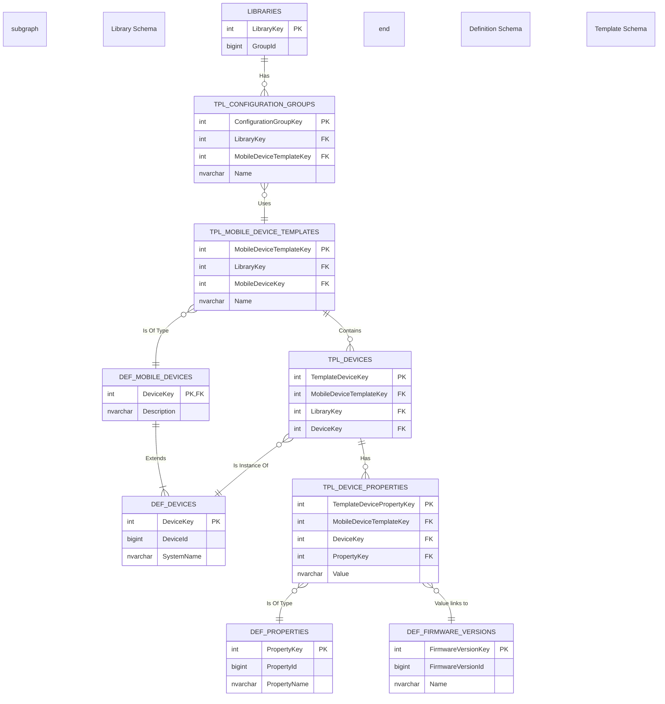

Here is a diagram representing the key table relationships based on the database schema files. This diagram illustrates how the tables are connected, which should clarify the joins required in the stored procedure.

### How to Read the Diagram:

*   **Boxes:** Each box represents a database table, grouped by schema (`library`, `template`, `definition`).
*   **Columns:** Inside each box, `PK` denotes a Primary Key and `FK` denotes a Foreign Key.
*   **Lines and Crows' Feet:** The lines show the relationships between tables.
    *   `||--||`: One-to-one relationship
    *   `||--o{`: One-to-many relationship
    *   `}o--o{`: Many-to-many relationship (though not explicitly shown here, it would be through a linking table)

### Key Joins from the Stored Procedure:

1.  **`ConfigurationGroups` -> `MobileDeviceTemplates`:**
    *   `TPL_CONFIGURATION_GROUPS.MobileDeviceTemplateKey` -> `TPL_MOBILE_DEVICE_TEMPLATES.MobileDeviceTemplateKey`

2.  **`MobileDeviceTemplates` -> `definition.MobileDevices` (To get the main device type):**
    *   `TPL_MOBILE_DEVICE_TEMPLATES.MobileDeviceKey` -> `DEF_MOBILE_DEVICES.DeviceKey`

3.  **`MobileDeviceTemplates` -> `template.Devices` (To get all devices in the template):**
    *   `TPL_MOBILE_DEVICE_TEMPLATES.MobileDeviceTemplateKey` -> `TPL_DEVICES.MobileDeviceTemplateKey`

4.  **`template.Devices` -> `definition.Devices` (To get the definition of a device in the template):**
    *   `TPL_DEVICES.DeviceKey` -> `DEF_DEVICES.DeviceKey`

5.  **`template.Devices` -> `template.DeviceProperties` (To get properties for a device in the template):**
    *   `TPL_DEVICES.MobileDeviceTemplateKey` -> `TPL_DEVICE_PROPERTIES.MobileDeviceTemplateKey`
    *   `TPL_DEVICES.DeviceKey` -> `TPL_DEVICE_PROPERTIES.DeviceKey`

6.  **`template.DeviceProperties` -> `definition.Properties` & `definition.FirmwareVersions`:**
    *   `TPL_DEVICE_PROPERTIES.PropertyKey` joins to `DEF_PROPERTIES.PropertyKey`.
    *   When the property is the "Preferred Firmware", the `TPL_DEVICE_PROPERTIES.Value` column contains the `FirmwareVersionId` that links to the `DEF_FIRMWARE_VERSIONS` table.

This confirms the logic we arrived at in the last step: to get the correct firmware, you must join from the `MobileDeviceTemplate` to `template.Devices` and **filter that join** to only include the "main device" (where `template.Devices.DeviceKey` matches `MobileDeviceTemplates.MobileDeviceKey`) before joining to `template.DeviceProperties`.
