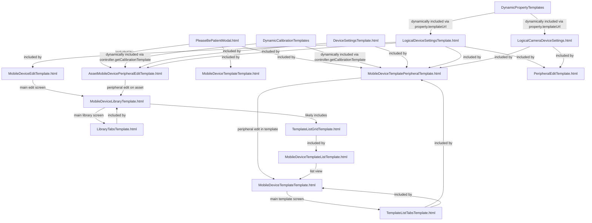

```mermaid
graph TD
    %% Core Shared Content & Utility Templates (Level 0)
    A[PleaseBePatientModal.html] -->|included by| B[MobileDeviceTemplatePeripheralTemplate.html]
    A -->|included by| C[AssetMobileDevicePeripheralEditTemplate.html]
    A -->|included by| D[MobileDeviceTemplateTemplate.html]
    N[DynamicCalibrationTemplates] -->|dynamically included via controller.getCalibrationTemplate| B
    N -->|dynamically included via controller.getCalibrationTemplate| C
    O[DynamicPropertyTemplates] -->|dynamically included via property.templateUrl| P[LogicalDeviceSettingsTemplate.html]
    O -->|dynamically included via property.templateUrl| Q[LogicalCameraDeviceSettings.html]

    %% Device/Setting Specific Shared Templates (Level 1)
    R[DeviceSettingsTemplate.html] -->|included by| B
    R -->|included by| C
    P -->|included by| B
    P -->|included by| C
    P -->|included by| S[MobileDeviceEditTemplate.html]
    P -->|included by| T[PeripheralEditTemplate.html]
    Q -->|included by| B
    Q -->|included by| T

    %% Shared Navigation/Layout Templates (Level 2)
    U[TemplateListTabsTemplate.html] -->|included by| B
    U -->|included by| V[MobileDeviceTemplateTemplate.html]
    Z[LibraryTabsTemplate.html] -->|included by| AA[MobileDeviceLibraryTemplate.html]
    AH[TemplateListGridTemplate.html] -->|included by| AI[MobileDeviceTemplateListTemplate.html]

    %% Main Edit/Container Screens (Level 3) - Mobile Devices Area
    S -->|main edit screen| AA
    B -->|peripheral edit in template| V
    C -->|peripheral edit on asset| AA
    AI -->|list view| V
    AA -->|main library screen| Z
    AA -->|likely includes| AH
    V -->|main template screen| U
```

