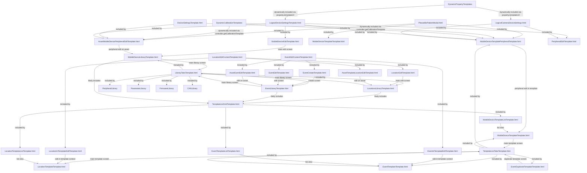

```mermaid
graph TD
    %% Core Shared Content & Utility Templates (Level 0)
    A[PleaseBePatientModal.html] -->|included by| B[MobileDeviceTemplatePeripheralTemplate.html]
    A -->|included by| C[AssetMobileDevicePeripheralEditTemplate.html]
    A -->|included by| D[MobileDeviceTemplateTemplate.html]
    E[EventEditContentTemplate.html] -->|included by| F[EventCreateTemplate.html]
    E -->|included by| G[EventEditTemplate.html]
    E -->|included by| H[EventInTemplateEditTemplate.html]
    E -->|included by| I[AssetEventEditTemplate.html]
    J[LocationEditContentTemplate.html] -->|included by| K[LocationEditTemplate.html]
    J -->|included by| L[LocationInTemplateEditTemplate.html]
    J -->|included by| M[AssetTemplateLocationEditTemplate.html]
    N[DynamicCalibrationTemplates] -->|dynamically included via controller.getCalibrationTemplate| B
    N -->|dynamically included via controller.getCalibrationTemplate| C
    O[DynamicPropertyTemplates] -->|dynamically included via property.templateUrl| P[LogicalDeviceSettingsTemplate.html]
    O -->|dynamically included via property.templateUrl| Q[LogicalCameraDeviceSettings.html]

    %% Device/Setting Specific Shared Templates (Level 1)
    R[DeviceSettingsTemplate.html] -->|included by| B
    R -->|included by| C
    P -->|included by| B
    P -->|included by| C
    P -->|included by| S[MobileDeviceEditTemplate.html]
    P -->|included by| T[PeripheralEditTemplate.html]
    Q -->|included by| B
    Q -->|included by| T

    %% Shared Navigation/Layout Templates (Level 2)
    U[TemplateListTabsTemplate.html] -->|included by| B
    U -->|included by| V[MobileDeviceTemplateTemplate.html]
    U -->|included by| W[LocationTemplateTemplate.html]
    U -->|included by| X[EventTemplateTemplate.html]
    U -->|included by| Y[EventDuplicateTemplateTemplate.html]
    Z[LibraryTabsTemplate.html] -->|included by| AA[MobileDeviceLibraryTemplate.html]
    Z -->|included by| AB[LocationsLibraryTemplate.html]
    Z -->|included by| AC[EventLibraryTemplate.html]
    Z -->|included by| AD[PeripheralLibrary]
    Z -->|included by| AE[ParameterLibrary]
    Z -->|included by| AF[FirmwareLibrary]
    Z -->|included by| AG[CANLibrary]
    AH[TemplateListGridTemplate.html] -->|included by| AI[MobileDeviceTemplateListTemplate.html]
    AH -->|included by| AJ[LocationTemplateListTemplate.html]
    AH -->|included by| AK[EventTemplateListTemplate.html]

    %% Main Edit/Container Screens (Level 3)
    %% Locations Area
    K -->|main edit screen| AB
    L -->|edit in template context| W
    M -->|edit on asset| AB
    AJ -->|list view| W
    AB -->|main library screen| Z
    AB -->|likely includes| AH

    %% Events Area
    F -->|create screen| AC
    G -->|edit screen| AC
    H -->|edit in template context| X
    I -->|edit on asset| AC
    AK -->|list view| X
    AC -->|main library screen| Z
    AC -->|likely includes| AH
    X -->|main template screen| U
    Y -->|duplicate template screen| U

    %% Mobile Devices Area
    S -->|main edit screen| AA
    B -->|peripheral edit in template| V
    C -->|peripheral edit on asset| AA
    AI -->|list view| V
    AA -->|main library screen| Z
    AA -->|likely includes| AH
    V -->|main template screen| U
```
