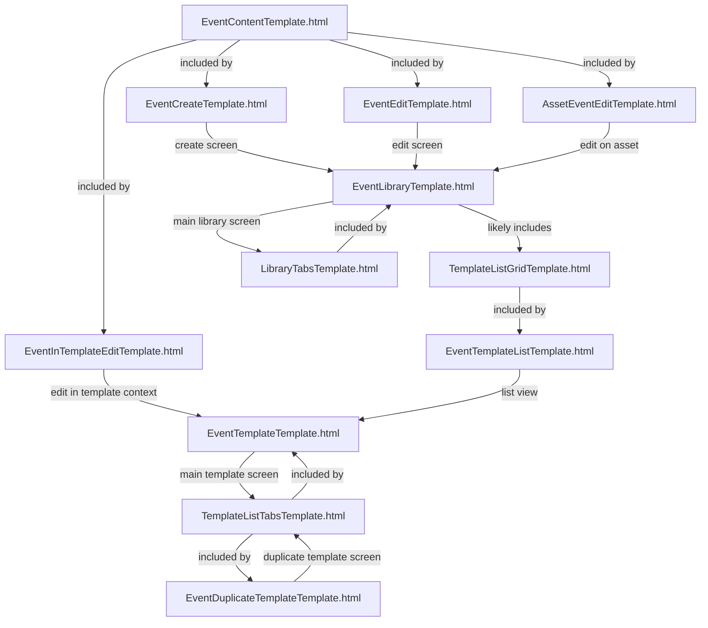

Scope: The chart includes all templates directly related to the Events area (EventCreateTemplate.html, EventEditTemplate.html, EventInTemplateEditTemplate.html, AssetEventEditTemplate.html, EventTemplateListTemplate.html, EventLibraryTemplate.html, EventTemplateTemplate.html, EventDuplicateTemplateTemplate.html) and their dependencies (EventEditContentTemplate.html, TemplateListTabsTemplate.html, TemplateListGridTemplate.html, LibraryTabsTemplate.html), as specified in the original input.