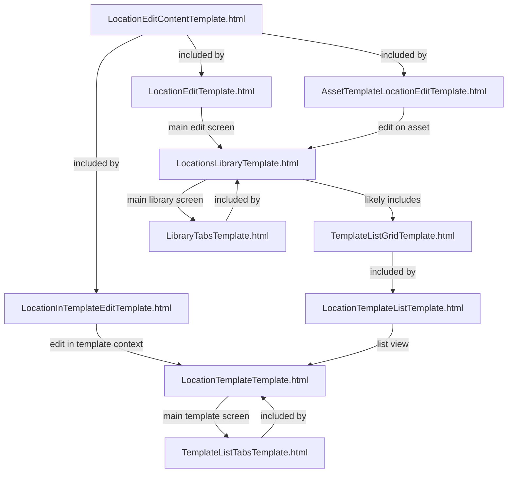

Scope: The chart includes all templates directly related to the Locations area (LocationEditTemplate.html, LocationInTemplateEditTemplate.html, AssetTemplateLocationEditTemplate.html, LocationTemplateListTemplate.html, LocationsLibraryTemplate.html, LocationTemplateTemplate.html) and their dependencies (LocationEditContentTemplate.html, TemplateListTabsTemplate.html, TemplateListGridTemplate.html, LibraryTabsTemplate.html), as specified in the original input.
