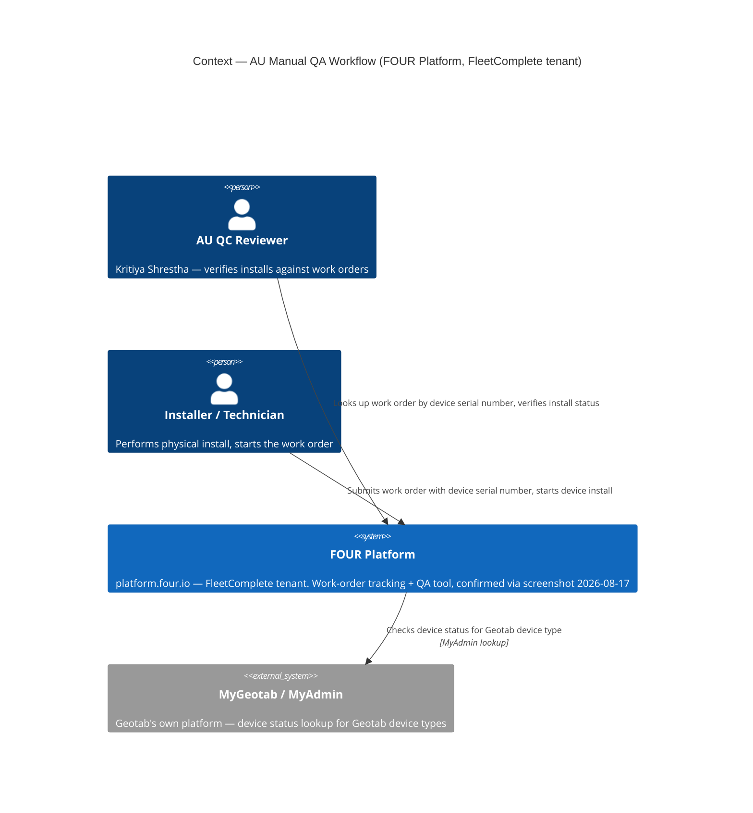
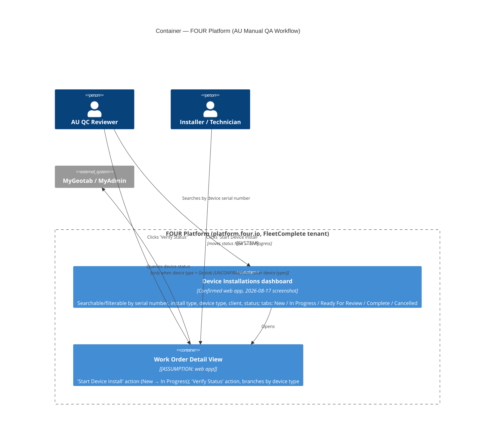

# GeoTab Manual QA Workflow — C4 (from call transcript)

Retro-documented from [[GeoTab Overview Transcript]] via the `c4-model` skill (document-prose mode). This diagrams the **existing manual QA/work-order system** AU uses today — a different system from the one in [[GeoTab System Map]] (OPEN-3192, the automation tool being built to eventually reduce reliance on this manual process).

> [!warning] Source is thin
> The transcript has a large gap (3:20→56:07) covering most of the actual call. This diagram is built from the ~3.5 minutes of intro that survived transcription, cross-checked against [[GeoTab]]'s AU Installation Test Procedure doc extract. Assumptions are tagged explicitly — validate with Kameel/Kritiya before treating as fact.

## C1 — Context

**Confirmed 2026-08-17 via screenshot (see [[GeoTab]] "Screenshot evidence"):** the transcript's "four platform" was not a mis-transcription — the system is literally called **FOUR** (`platform.four.io`), tenant-branded as FleetComplete (`/a/fleetc/fleetcomplete/device_installation`). The `[ASSUMPTION]` tag below is resolved; diagram not yet redrawn to rename the system, but treat "FC Platform" throughout this doc as "FOUR Platform (FleetComplete tenant)."

**What this shows:** FOUR Platform is the system of record for install QA — it doesn't hold Geotab device data itself, it reaches out to MyGeotab/MyAdmin when the work order is for a Geotab device type. For other device types (Hub cameras, FT1, MGS, Guardian — per the AU spec doc), it presumably reaches out elsewhere, but that branch isn't confirmed by this transcript (see Assumptions).

## C2 — Container

**Confirmed 2026-08-17 via screenshot:** real status tabs are **All, New, In Progress, Ready For Review, Complete, Cancelled** — not the guessed "Reviewed/Wrapped"/"Done." Real dashboard columns: Work Order #, Install Type (Install/Refit/Removal × Standard/Intermediate/Complex complexity), Device Type (e.g. `GO9 (Geotab)`, `FT1 (FleetComplete)`, `Vision (Mitac)`), Client, Serial Number, Vehicle (rego + model), Responsible Person, Installer, Status Updated At, Updated At.

**What this shows:** the one confirmed integration point is Work Order Detail View → MyGeotab, gated specifically on device type. Everything else about internal container structure is inferred from UI behavior described verbally, not from any technical documentation — this is a thinner, more provisional diagram than [[GeoTab System Map]].

## Legend
- `[ASSUMPTION: ...]` = inferred, not confirmed by the source.
- `[UNCONFIRMED for other device types]` = the transcript only verbally confirms the Geotab branch; the AU doc describes other branches (Master Portal, Vision AI Hub, Guardian) but this call transcript doesn't independently corroborate them.

## Assumptions
- ~~"FC Platform" name and identity (Fleet Complete / Unity Hub) — inferred from AU doc terminology, not stated explicitly in the transcript itself.~~ **Resolved 2026-08-17:** confirmed via screenshot — `platform.four.io`, FleetComplete tenant.
- No technology stack confirmed beyond "web app, Chrome-based" (screenshot shows a standard browser tab, no further stack detail).
- ~~Terminal work-order status (Pass/Fail/Complete) not confirmed~~ **Resolved 2026-08-17:** confirmed via screenshot — full status set is New, In Progress, Ready For Review, Complete, Cancelled.
- Container-level split (Dashboard vs Detail View) — the Dashboard is now confirmed (see Container level above); Detail View's internal behavior ("start device install", "verify status" buttons) is still inferred from the transcript's verbal description, not yet seen directly in a screenshot.

## Open question

Does the missing 3:20→56:07 portion of the call walk through the other device-type branches (Hub camera, FT1, MGS, Guardian) the way the AU doc describes? If a fuller transcript or recording becomes available, re-run this extraction against it to firm up the Container level.

**Partially answered (2026-08-17):** Marthinus's handwritten notes from watching that gap live are transcribed in [[GeoTab Handwritten Meeting Notes]]. Confirms the work-order status lifecycle extends beyond New/In Progress: **New → In Progress → Reviewed/Wrapped [low-confidence exact word] → Done / Cancelled**. Also newly confirms a Master Portal branch (camera/asset lookups keyed by IMEI + duty type, via a Data Aggregation layer, distinct serial-number scheme from Geotab GO units) and a named LightMetrics system (`master.lightmetrics.co`, device ID → asset ID) for the Vision AI Hub branch previously only known by its generic name. Still not independently verified against a full recording — treat as strong secondary evidence, not primary source.

---
See [[GeoTab]] for the full write-up, [[GeoTab Overview Transcript]] for the source transcript, and [[GeoTab System Map]] for the C4 of the automation tool this manual workflow feeds into.
