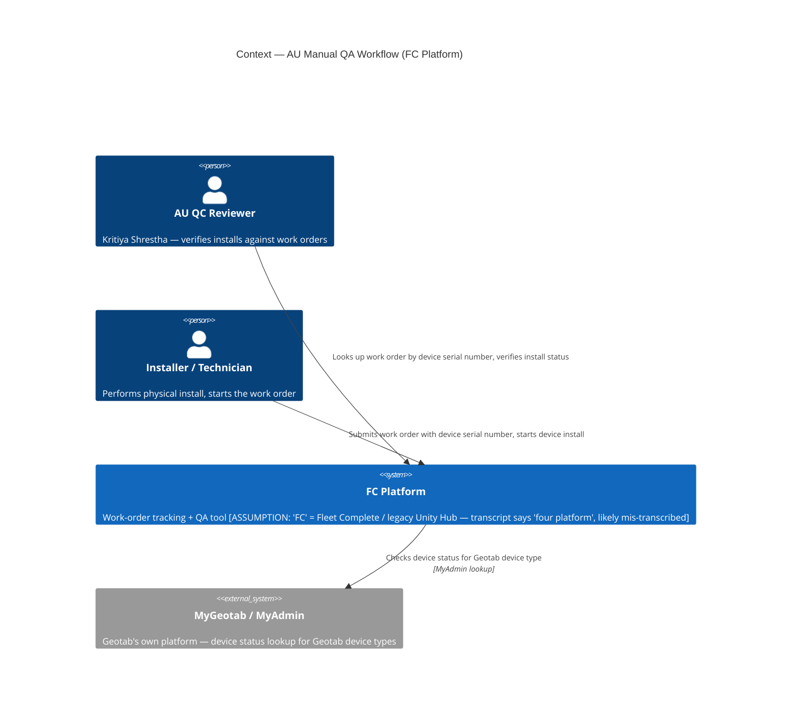
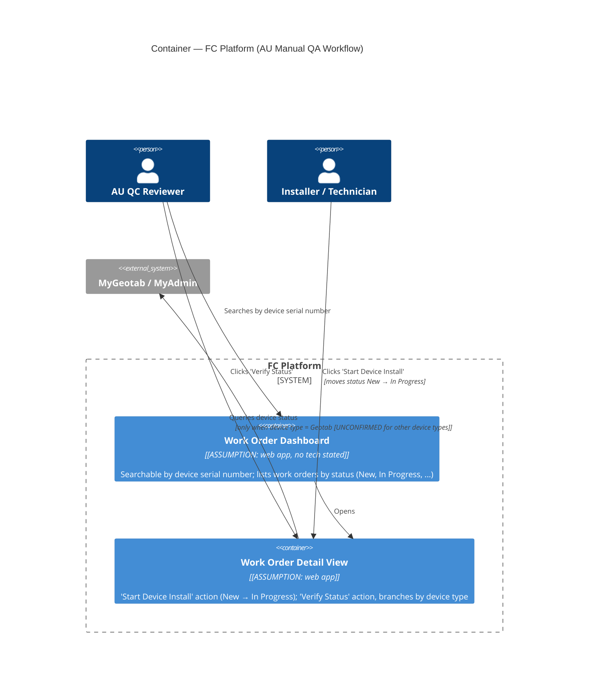

# GeoTab Manual QA Workflow — C4 (from call transcript)

Retro-documented from [[GeoTab Overview Transcript]] via the `c4-model` skill (document-prose mode). This diagrams the **existing manual QA/work-order system** AU uses today — a different system from the one in [[GeoTab System Map]] (OPEN-3192, the automation tool being built to eventually reduce reliance on this manual process).

> [!warning] Source is thin
> The transcript has a large gap (3:20→56:07) covering most of the actual call. This diagram is built from the ~3.5 minutes of intro that survived transcription, cross-checked against [[GeoTab]]'s AU Installation Test Procedure doc extract. Assumptions are tagged explicitly — validate with Kameel/Kritiya before treating as fact.

## C1 — Context

**What this shows:** FC Platform is the system of record for install QA — it doesn't hold Geotab device data itself, it reaches out to MyGeotab/MyAdmin when the work order is for a Geotab device type. For other device types (Hub cameras, FT1, MGS, Guardian — per the AU spec doc), it presumably reaches out elsewhere, but that branch isn't confirmed by this transcript (see Assumptions).

## C2 — Container

**What this shows:** the one confirmed integration point is Work Order Detail View → MyGeotab, gated specifically on device type. Everything else about internal container structure is inferred from UI behavior described verbally, not from any technical documentation — this is a thinner, more provisional diagram than [[GeoTab System Map]].

## Legend
- `[ASSUMPTION: ...]` = inferred, not confirmed by the source.
- `[UNCONFIRMED for other device types]` = the transcript only verbally confirms the Geotab branch; the AU doc describes other branches (Master Portal, Vision AI Hub, Guardian) but this call transcript doesn't independently corroborate them.

## Assumptions
- "FC Platform" name and identity (Fleet Complete / Unity Hub) — inferred from AU doc terminology, not stated explicitly in the transcript itself.
- No technology stack confirmed anywhere in the source — pure functional/business description.
- Terminal work-order status (Pass/Fail/Complete) not confirmed — only New and In Progress are mentioned before the transcript gap.
- Container-level split (Dashboard vs Detail View) is inferred from described UI behavior ("search by serial", "start device install" button, "verify status" button), not from seeing the actual system.

## Open question
Does the missing 3:20→56:07 portion of the call walk through the other device-type branches (Hub camera, FT1, MGS, Guardian) the way the AU doc describes? If a fuller transcript or recording becomes available, re-run this extraction against it to firm up the Container level.

---
See [[GeoTab]] for the full write-up, [[GeoTab Overview Transcript]] for the source transcript, and [[GeoTab System Map]] for the C4 of the automation tool this manual workflow feeds into.
