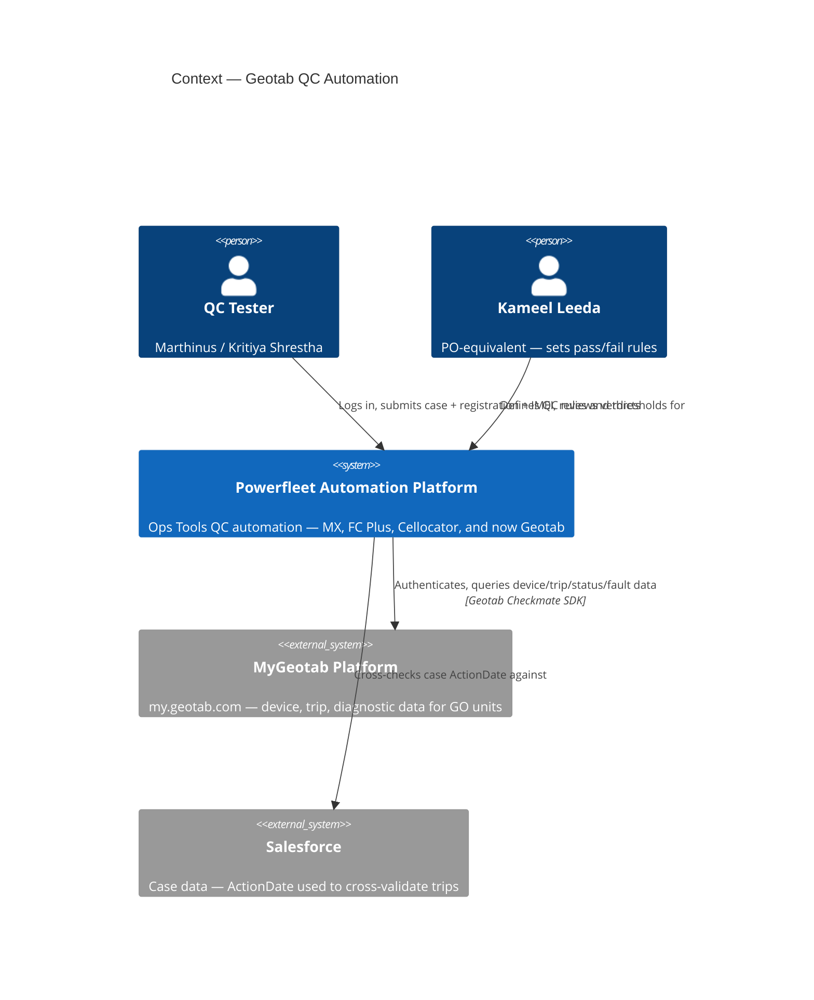
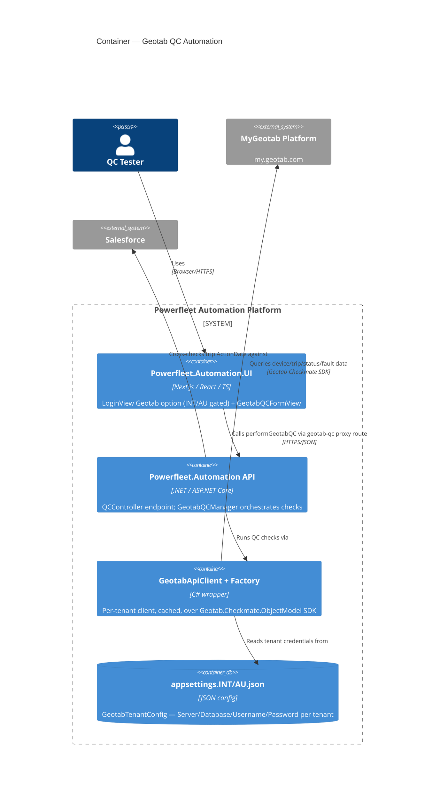

# Geotab QC Automation — System Map

C4 draft (Context + Container) of what's already built, drawn from live code on `origin/integration` — not the boss's description, the actual repos. See [[GeoTab]] for the full write-up, raw messages, and the Kameel question list.

**Repos:** Powerfleet.Automation (API) · Powerfleet.Automation.UI · MyGeotab SDK · Salesforce
**Epic:** OPEN-3192 — Geotab Installation QC Automation, Phase 3
**Checked:** 2026-08-06

> [!note] Rendering note
> Mermaid marks C4 diagrams (`C4Context`/`C4Container`) as experimental — if either diagram below doesn't render in your Obsidian Mermaid plugin version, tell me and I'll convert them to plain flowcharts instead.

## C1 — Context

*Who touches this system, and what it talks to. Readable by anyone — technical or not.*

**What this shows:** the platform sits between a human tester and two external systems it doesn't control — Geotab (the data source being QC'd) and Salesforce (the case record used to validate trip data). Kameel shapes the rules; he doesn't operate the platform directly.

## C2 — Container

*The runtime pieces inside the platform boundary, and the protocol each hop uses. Readable by the dev/ops team.*

**What this shows:** the UI never talks to Geotab directly — every call is proxied through the API, which is the only container holding tenant credentials. That's the one hop the whole QC run depends on.

## Verdict states a run can end in

| Verdict | Meaning |
|---|---|
| 🟢 **Pass** | Check succeeded |
| 🔴 **Fail** | Check failed |
| 🟡 **Pending** | Inconclusive / awaiting data |
| ⚪ **NotTested** | Stubbed — not implemented yet |

Precedence when a case has several checks: **Fail beats Pending beats Pass beats NotTested.** Four of the fourteen planned checks (digital inputs, exception events, video peripheral, video recordings) still ship as `NotTested` stubs.

> [!danger] Scope gap — confirmed against the real spec doc
> The AU Installation Test Procedure doc covers 8 unit types across 4 platforms. What's actually built (OPEN-3192) is **Geotab GO units only** — everything below is unbuilt, not just undocumented:
> - **Vision AI camera** (Geotab-integrated + Hub/Unity) — linkage, live view, mounting sign-off, all unbuilt
> - **Asset trackers (81/85/86/87)** — Geotab platform, but a *different device serial than the physical unit*. No serial-matching step exists in the built code.
> - **FT1 / MGS** — legacy Unity Hub platform, entirely separate integration
> - **Guardian, MiX units** — explicitly out of scope per the doc itself

> [!question] Still genuinely open
> - Whether `GeotabAsset.SerialNumber` assumes a 1:1 match with the Geotab-platform serial — confirmed unsafe for asset trackers, unconfirmed for base GO units
> - Whether "exception events"/"harsh driving" (OPEN-3199's wording) maps to the doc's duress/buzzer/GoTalk output-triggered events, or is a distinct, still-undocumented check
> - Whether a separate HDOP pass/fail threshold is real — the doc only describes satellite count as a non-gating diagnostic aid
> - Exact mechanism of the Salesforce cross-check — inferred from epic notes, not independently verified this session

**Resolved since first draft:** real INT/AU Geotab credentials (OPEN-3254) confirmed Done as of the 2026-08-06 Jira check — no longer a placeholder/open item.

## Full people roster

| Person | Role | Relationship to this system |
|---|---|---|
| **William King** | Boss/sponsor | Requested this work get tested; not a direct system user. Assigned to OPEN-1531 (Done spike) — "Review spec for Advanced Geotab QC with Zoe, Olivier and Neil" — likely the origin of this whole initiative |
| **Marthinus Raath** | QC tester (this write-up's author) | Operations Tools — runs the manual functional test pass against the built tool |
| **Kameel Leeda** | PO-equivalent, our side | Defines pass/fail business rules; primary point of contact for every open question below |
| **Kritiya Shrestha** | AU-side QC | Operates the *existing manual* work-order system today (see [[GeoTab Manual QA Workflow]]); the person whose manual verdicts this tool's automated verdicts must be cross-validated against |
| **Zoe / Olivier / Neil** | Named in OPEN-1531 spec review | Subject-matter reviewers of the original Advanced Geotab QC spec — involvement since then unconfirmed |
| **Grant** | Developer | Owns the currently-open follow-up tickets touching this same feature: OPEN-3363 (E2E preflight gap), OPEN-3362 (route hardening), OPEN-3351 (bookkeeping) |

## Full systems roster

**In scope — built, OPEN-3192:**

| System | Role |
|---|---|
| Powerfleet.Automation.UI | Tester-facing form + verdict display |
| Powerfleet.Automation API | Orchestrates all QC checks (`GeotabQCManager`) |
| MyGeotab Platform (external) | Source of device/trip/diagnostic/fault data, via Geotab Checkmate SDK |
| Salesforce (external) | Source of case `ActionDate`, used to cross-validate trip data |

**Out of scope — named in the AU spec doc, nothing built against them:**

| System | Would cover |
|---|---|
| Master Portal | Camera provisioning/linkage (Geotab-integrated cameras) |
| Vision AI Hub | Camera live-view streaming |
| Unity Hub / FC Legacy Platform | Legacy Hub cameras, FT1, MGS — **also the platform behind the existing manual work-order system**, see [[GeoTab Manual QA Workflow]] |
| Guardian platform (Seeing Machine) | Guardian Gen 3 units — doc itself scopes this to online/offline check only |
| MiX platform | MiX units — explicitly out of scope per the doc |

## Units in scope (device types)

| Unit type | Platform | Built in OPEN-3192? |
|---|---|---|
| Geotab GO unit | Geotab (MyGeotab) | **Yes** — the epic's entire scope |
| Vision AI camera (Geotab-integrated) | Geotab + Master Portal + Vision AI Hub | No |
| Vision camera (Hub/Unity) | Unity Hub (legacy FC) | No |
| FT1 | Unity Hub (legacy FC) | No |
| MGS | Unity Hub (legacy FC) | No |
| Asset trackers (81/85/86/87) | Geotab, different device serial than the physical unit | Unclear — likely no, no serial-matching step exists |
| Guardian (Gen. 3) | Guardian platform | No — online/offline check only, out of scope per doc |
| MiX units | MiX platform | No — explicitly out of scope |

## Parameters / checks — implemented vs stub vs placeholder

All in `GeotabQCManager.cs` (`Powerfleet.Automation.Logic/Managers/QC/`, `origin/integration`):

| Check | Line | Status |
|---|---|---|
| Voltage (external ≥11.0V / battery ≥3.5V) | ~250 | Implemented — **placeholder thresholds**, confirm with Kameel |
| FaultCodes (active, non-dismissed) | ~303 | Implemented |
| GpsQuality / HDOP | ~337 | Implemented — **placeholder threshold**; AU doc only describes satellite count as a non-gating diagnostic, not a pass/fail HDOP gate |
| IgnitionSource vs InstallType | ~391 | Implemented — **placeholder KnownId constant** |
| NfcDriverId / BuzzerOutput / GoTalkOutput / IridiumDuress / WifiPresence | 463–595 | Implemented |
| DeviceActive | ~600 | Implemented |
| Firmware | ~635 | Implemented |
| Trips vs Salesforce ActionDate (7-day fallback) | ~663 | Implemented |
| Odometer | ~687 | Implemented |
| Driver assignment | ~715 | Implemented |
| LastCommunication (24h recency) | ~741 | Implemented |
| DigitalInputs (Aux 1–8 mapping) | 204–236 | **Stub — always `NotTested`** |
| ExceptionEvents ("harsh driving") | 204–236 | **Stub — always `NotTested`** |
| VideoPeripheral | 204–236 | **Stub — always `NotTested`** |
| VideoRecordings | 204–236 | **Stub — always `NotTested`** |

TODO markers at lines 37, 49, 54, 241, 398, 489 — all unconfirmed KnownId constants/thresholds feeding the "placeholder" rows above.

## Test scope

Full test plan: [[GeoTab Test Plan]]. Automated coverage that already exists (NUnit + UI unit tests) is listed there — this file stays architecture-only.

---
Full write-up, raw messages, and the Kameel question list: [[GeoTab]]
