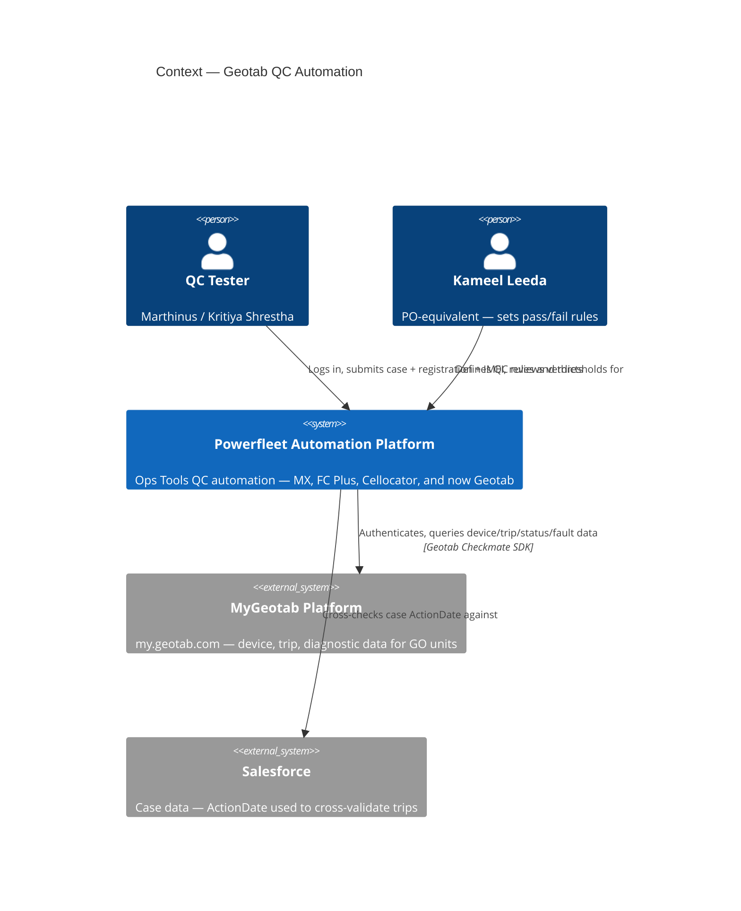
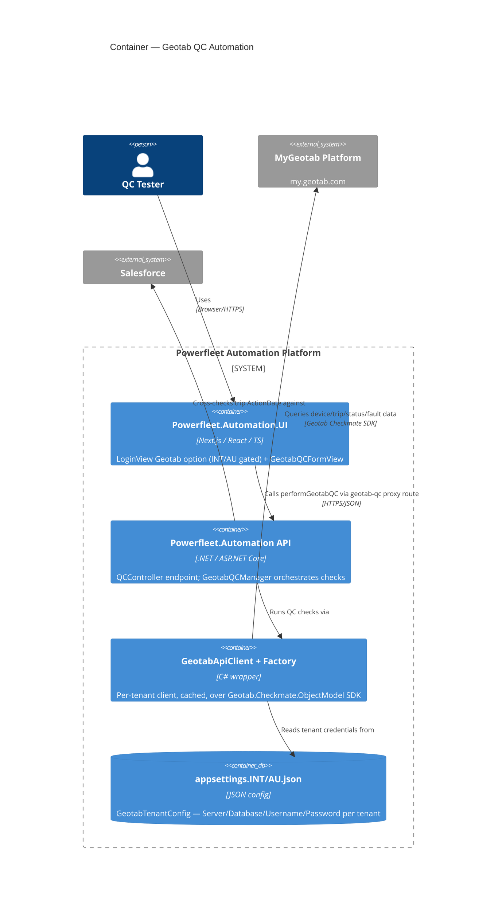

# Geotab QC Automation — System Map

C4 draft (Context + Container) of what's already built, drawn from live code on `origin/integration` — not the boss's description, the actual repos. See [[GeoTab]] for the full write-up, raw messages, and the Kameel question list.

**Repos:** Powerfleet.Automation (API) · Powerfleet.Automation.UI · MyGeotab SDK · Salesforce
**Epic:** OPEN-3192 — Geotab Installation QC Automation, Phase 3
**Checked:** 2026-08-06

> [!note] Rendering note
> Mermaid marks C4 diagrams (`C4Context`/`C4Container`) as experimental — if either diagram below doesn't render in your Obsidian Mermaid plugin version, tell me and I'll convert them to plain flowcharts instead.

## C1 — Context

*Who touches this system, and what it talks to. Readable by anyone — technical or not.*

**What this shows:** the platform sits between a human tester and two external systems it doesn't control — Geotab (the data source being QC'd) and Salesforce (the case record used to validate trip data). Kameel shapes the rules; he doesn't operate the platform directly.

## C2 — Container

*The runtime pieces inside the platform boundary, and the protocol each hop uses. Readable by the dev/ops team.*

**What this shows:** the UI never talks to Geotab directly — every call is proxied through the API, which is the only container holding tenant credentials. That's the one hop the whole QC run depends on.

## Verdict states a run can end in

| Verdict | Meaning |
|---|---|
| 🟢 **Pass** | Check succeeded |
| 🔴 **Fail** | Check failed |
| 🟡 **Pending** | Inconclusive / awaiting data |
| ⚪ **NotTested** | Stubbed — not implemented yet |

Precedence when a case has several checks: **Fail beats Pending beats Pass beats NotTested.** Four of the fourteen planned checks (digital inputs, exception events, video peripheral, video recordings) still ship as `NotTested` stubs.

> [!danger] Scope gap — confirmed against the real spec doc
> The AU Installation Test Procedure doc covers 8 unit types across 4 platforms. What's actually built (OPEN-3192) is **Geotab GO units only** — everything below is unbuilt, not just undocumented:
> - **Vision AI camera** (Geotab-integrated + Hub/Unity) — linkage, live view, mounting sign-off, all unbuilt
> - **Asset trackers (81/85/86/87)** — Geotab platform, but a *different device serial than the physical unit*. No serial-matching step exists in the built code.
> - **FT1 / MGS** — legacy Unity Hub platform, entirely separate integration
> - **Guardian, MiX units** — explicitly out of scope per the doc itself

> [!question] Still genuinely open
> - Whether `GeotabAsset.SerialNumber` assumes a 1:1 match with the Geotab-platform serial — confirmed unsafe for asset trackers, unconfirmed for base GO units
> - Whether real INT/AU credentials have replaced the placeholder values (tracked separately as OPEN-3254)
> - Whether "exception events"/"harsh driving" (OPEN-3199's wording) maps to the doc's duress/buzzer/GoTalk output-triggered events, or is a distinct, still-undocumented check
> - Whether a separate HDOP pass/fail threshold is real — the doc only describes satellite count as a non-gating diagnostic aid
> - Exact mechanism of the Salesforce cross-check — inferred from epic notes, not independently verified this session

---
Full write-up, raw messages, and the Kameel question list: [[GeoTab]]
