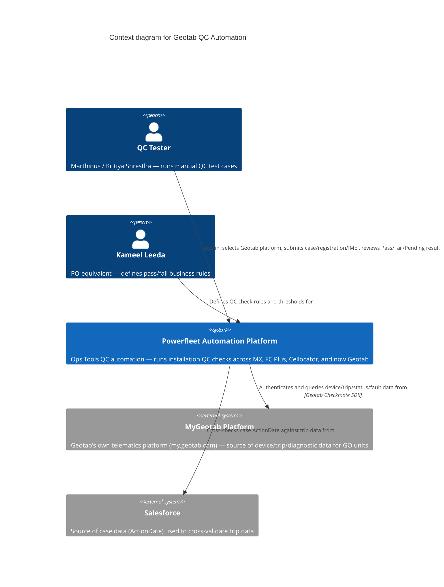
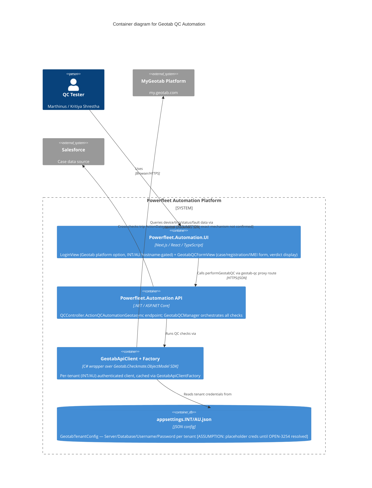

# GeoTab

Status: intake, no plan yet. Raw dump of boss messages below. Jira/planning discussion comes after user done pasting.

## Context

Boss want focus shift to GeoTab work. Code available, UI login wired. Needs testing now. Boss expect rough road — "erg verwarrend" (very confusing). Neither boss nor user know how GeoTab suppose to work or how tests pass — learning curve for both.

## Raw messages (chronological)

### Boss, initial ask
> Hi, kan ek jou vra om te fokus op die Geotab goed asb? Die kode is als beskikbaar, en die UI se login is gewire. Ons moet dit nou net getoets kry. Ek voorsien vaarthobbels hiermee, want hierdie is erg verwarrend.

Teams recording link (blob, likely expired/session-scoped):
`blob:https://teams.microsoft.com/e8de0d89-3c20-47c5-b384-15181cdcef5a`

GeoTab site: https://my.geotab.com/
> MyGeotab - hierdie is na Geotab se site. Jy kan opsttools se access inligting gebruik.
> Die QC aan die voorkant is dieselfde, maar agterkant verskil.

(Use OpsTools access info to log in. Front-end QC same, backend differs.)

### User reply
> OK cool - maak so - waar kry ek meer inligting oor als:
> 1) Hoe weet ek hoe dit moet werk
> 2) Hoe weet ek toetse slaag?
> Ken glad nie dit nie

### Boss reply
> Op daai Geotab site is daar assets wat jy kan probeer - ek vermoed ons gaan serial number gebruik
>
> 1 - ek stuur jou video
> 2 -
>
> Ek ken dit ook nie - Claude ken meer as ons almal saam, so hierdie is learning curve ...

(Assets on GeoTab site to try testing against — suspect serial number used as key identifier. Boss sending a video. Boss admits he doesn't know this either — "Claude knows more than all of us combined," treat as learning curve.)

### Kameel Leeda — meeting recap link
Teams meeting recap (AU Test Steps recording):
`https://teams.microsoft.com/l/meetingrecap?driveId=b%21i7NJic_bBUORIqoCVwQ8vTqmZEgl-2pAvwOcybYsdA1koNKplylWSJtGoEL0QwSR&driveItemId=0175Z7RHAQ4UVUZK6EK5F2PQKT5R7JWDVD&sitePath=https%3A%2F%2Fmixtelematics-my.sharepoint.com%2F%3Av%3A%2Fg%2Fpersonal%2Fleedak_pointersa_com%2FIQAQ5StMq8RXS6fBU-x-mw6jAW-n24croPqlMy-547v3Crw&fileUrl=https%3A%2F%2Fmixtelematics-my.sharepoint.com%2Fpersonal%2Fleedak_pointersa_com%2FDocuments%2FRecordings%2FAU+Test+Steps-20260709_060816-Meeting+Recording.mp4%3Fweb%3D1&iCalUid=040000008200E00074C5B7101A82E0080000000010E27B4DCA0EDD01000000000000000010000000C5EBDA841AB6864799BB72941C22F2E2&threadId=19%3Ameeting_ZmJlNzgyNzMtYTU5MS00MzIwLTk5M2EtZGQ3NzI5ODU1NDQ1%40thread.v2&organizerId=e12b05c8-2db2-4a43-b4d0-eb8775065db6&tenantId=d19b542a-1500-4712-a713-be8d79882cb5&callId=f0e5b5d5-4d2d-4c6f-8327-17e1d234512a&threadType=Meeting&meetingType=Scheduled&subType=RecapSharingLink_RecapCore`

Video titled "AU Test Steps" — 2026-07-09 recording.

### Reference doc shared (from someone to William, forwarded)
> Hi William, Trust you well, I have only managed to get the following information from the team thus far. Let me know what specific detail you looking for.
> https://internal-kb.powerfleet.dev/protected-files/files/Tech%20Support/Global%20FC%20Legacy%20Support/FC%20Legacy%20AU/1.Standard%20Operation%20Procedures/General%20Support/Basic%20QA%20Process/

Basic QA Process SOP — FC Legacy AU / Global FC Legacy Support KB.

### SharePoint doc (Kameel's OneDrive, likely test steps/spec doc)
`https://mixtelematics-my.sharepoint.com/:w:/g/personal/leedak_pointersa_com/IQAls44peosOQ5OqLIQUOhXJAZPRisBEtRTvBfpWLlEDTxU?e=yODbcV`

Word doc, needs SSO to open — not fetched yet.

### Boss follow-up
> Daai is als wat ek beskikbaar het. Jy kan met Kameel Leeda connect of in AU met Kritiya Shrestha (sy doen QC daai kant op die stelsel wat jy sien in die video)
>
> Kameel is soos PO aan ons kant

(That's everything boss has available. Contacts: Kameel Leeda — connect for general info, acts as PO equivalent on our side. Kritiya Shrestha — AU-side, does QC on the system shown in the video.)

## People
- **William King** — the boss, sender of every message above. Got the KB SOP forward addressed to him ("Hi William...") from someone else on the team, then relayed it to user.
- **Kameel Leeda** — PO-equivalent, our side.
- **Kritiya Shrestha** — AU side, does QC on the system.

## MAJOR FINDING: this is already OPEN-3192 (built by this same SDLC agent system)

Cross-checked against this repo's own memory + live code — William's "focus on GeoTab, code's available, UI login's wired, needs testing" maps directly onto an epic this Claude-driven SDLC orchestrator already built over 2026-07-13→27:

- **Epic:** OPEN-3192 "Geotab Installation QC Automation Phase 3" — 4th QC platform after MX, FC Plus, Cellocator. Geotab GO units only, INT+AU envs only.
- **Repos (confirmed on `origin/integration`, live 2026-08-06):**
  - `Powerfleet.Automation` (API, .NET) — `GeotabQCManager.cs`, `GeotabAsset.cs`, `IGeotabApiClient.cs`/`GeotabApiClient.cs` (wraps Geotab's own `Geotab.Checkmate.ObjectModel` SDK), `GeotabApiClientFactory.cs` (per-tenant client cache), `GeotabTenantConfig.cs`, `GeotabInstallType.cs`. Local checkout here is stale (on an unrelated feature branch, behind `origin/integration`) — confirmed existence via `git ls-tree origin/integration`, not a local file read.
  - `Powerfleet.Automation.UI` (Next.js/React/TS) — `LoginView.tsx` (Platform selector gets a `Geotab` option, hostname-gated to INT/AU automation URLs), `GeotabQCFormView.tsx` (case number/registration/action date/IMEI fields, renders Pass/Fail/Pending/NotTested verdicts), `ApiService.ts` `performGeotabQC()`, `src/app/api/proxy/geotab-qc/route.ts`. Local checkout here is on `integration` but a few commits behind `origin/integration` (has OPEN-3203 only, missing 3202/3204/3195/3196+) — confirmed the newer commits exist via `git log origin/integration`.
- **This directly explains William's phrasing:** "die kode is als beskikbaar" = this epic's code, mostly merged. "die UI se login is gewire" = literally OPEN-3202 (Geotab login selector). "ons moet dit nou net getoets kry" = manual QC/UAT of what the agents built. "agterkant verskil" = the Geotab backend uses Geotab's own MyGeotab SDK + per-tenant creds, unlike MX/FCPlus/Cellocator's different data sources — genuinely a different backend per platform, same as he said.
- **Epic status as of last memory update (2026-07-27, 10 days stale — verify current status live via Jira/`my-tickets-status.json` before relying on it):** most of the 14 child stories (3193-3198, 3201-3204, 3223) merged to integration, Ready for QA or later. 3199 partial (NotTested stubs — DIN-to-Aux wiring, video peripheral unconfirmed). 3200 (unit tests)/3205 (docs) likely done alongside. **3254** (real INT/AU Geotab password placeholders → real credentials) was the one ticket explicitly blocked on getting real credentials — this may be exactly why William can't get you logged in yet, or why sign-in failed.
- See `.agent/shared-memory/memory/project_open_3192_geotab_phase3.md` and `project_open_3202_3204_geotab_completed_20260717.md` in the SDLC repo for the full build history if you want the blow-by-blow.

## Original 5 gaps — answered from repo evidence (2026-08-06)

1. **"OpsTools" = `Powerfleet.Automation` (API) + `Powerfleet.Automation.UI`.** QC logic: `GeotabQCManager.cs` (API side), `GeotabQCFormView.tsx`/`LoginView.tsx` (UI side). See MAJOR FINDING above.
2. **What it calls:** Geotab's own MyGeotab SDK (`Geotab.Checkmate.ObjectModel` NuGet package) via `IGeotabApiClient` — `GetDeviceAsync`, `GetTripsAsync`, `GetLogRecordsAsync`, `GetStatusDataAsync`, `GetFaultDataAsync`, `GetExceptionEventsAsync`, `GetIoxAddOnsAsync`, `GetMediaFilesAsync`. Not a generic REST call — the official SDK, per-tenant authenticated (INT/AU each have own Server/Database/Username/Password).
3. **"Backend differs" = confirmed:** Geotab uses its own SDK/auth per tenant; MX/FCPlus/Cellocator each use different data sources. Real, already-built architectural difference, not a vague worry.
4. **Serial number:** `GeotabAsset.SerialNumber` field exists in the model (confirmed via unit tests). Whether it's the raw Geotab device serial or needs mapping from a MiX asset serial — **not confirmed, ask Kameel** (see Questions section below).
5. **Pass/fail criteria:** each check returns Pass/Fail/Pending/NotTested, precedence Fail > Pending > Pass > NotTested. Concrete rules already coded: device active, firmware version, trips vs Salesforce case ActionDate (7-day fallback), odometer, driver assignment, last-comms recency (24h), GPS/HDOP + ignition source, voltage (≥11.0V ext/≥3.5V battery, placeholder thresholds), active non-dismissed fault codes, NFC/buzzer/GoTalk/Iridium-duress/WiFi presence. Several thresholds are explicitly still placeholder/TBD (see Questions section).

Bottom line: the earlier "no idea" answers were mostly already implemented in code — remaining real unknowns are credentials, exact thresholds, and serial-number mapping, all pushed to the Questions section for Kameel.

## AU Installation Test Procedure — the actual spec doc (obtained 2026-08-06)

William got this from Kameel via SharePoint; user pulled it locally to `C:\Users\MarthinusR\Downloads\AU Installation test procedure.docx` and it was extracted directly (no SSO needed once it's a local file). This is the real target spec — answers most of the earlier gaps, and reveals the built epic (OPEN-3192) is a **narrower slice** of it, not the full thing.

**Goal (doc's own words):** given a device serial number, the tool queries the relevant platform (Geotab / Hub / Master Portal) and reports pass/fail against a checklist, replacing what's currently a manual installation-QA process.

### 1. Unit types in scope (doc), vs what's actually built (OPEN-3192)

| Unit type | Platform | Built in OPEN-3192? |
|---|---|---|
| Geotab GO unit | Geotab (MyGeotab) | **Yes** — this is the epic's whole scope |
| Vision AI camera (Geotab-integrated) | Geotab + Master Portal + Vision AI Hub | **No** — not mentioned anywhere in the epic |
| Vision camera (Hub/Unity) | Unity Hub (legacy FC) | No — different platform entirely |
| FT1 | Unity Hub (legacy FC) | No |
| MGS | Unity Hub (legacy FC) | No |
| Asset trackers (81/85, 86, 87) | Geotab, but **different device serial than the physical unit** | **Unclear — likely no.** Epic talks about "GO units" specifically; no mention of a serial-mismatch resolution step. Real gap to flag.
| Guardian (Gen. 3) | Guardian platform (Seeing Machine) | No — online/offline check only, out of scope per doc itself |
| MiX units | MiX platform | No — explicitly out of scope for this team |

**So: what's built only covers Geotab GO units + their direct accessories. Camera QC, legacy Hub/FT1/MGS, asset-tracker serial-mismatch handling, Guardian, and MiX are all outside OPEN-3192 as it stands.**

### 2. Install config fields (drive which tests apply)
- **Install method:** OBD (via CAN/OBD-II port) or Wired (3-wire: constant power, earth, ignition).
- **Harness type (if OBD):** Standard 16-pin, 6-pin, 9-pin, or Other (free text, e.g. Caterpillar-specific).
- **Accessories flagged on work order:** NFC/key housing + location, primary aux (Aux 1-4), secondary aux (Aux 5-8, custom-labelled), duress button(s) (dash/remote/both), external buzzer, GoTalk, Iridium, Wi-Fi harness (Santos-specific), other/legacy IOX, camera + which platform.

### 3. Basic checks — every installation
1. **Ignition ON/OFF** — both an on and off event present in the log window (ignition source may be RPM-based or another input).
2. **GPS position** — valid non-null current/last-known coordinate.
3. **Satellite count** — present/reported, but explicitly a **diagnostic aid, not a strict pass/fail**. (Resolves the "HDOP threshold" ambiguity partially — satellite count itself isn't gated; a separate HDOP quality check, if it exists in the built code, isn't described in this doc at all.)

**Gotcha called out in the doc itself:** Geotab's web UI caps log results at 2,499 rows/filter — any check needing a full day+ of activity should pull the exported report, not the paginated view, or it can silently miss events. Directly relevant to the trip-vs-Salesforce-ActionDate check already built.

### 4. CAN/OBD-derived checks — conditional, NOT standard QA
Fuel level and RPM, sourced via OBD-II only, **only surfaced when the customer specifically requests them** — not part of standard pass/fail. No separate CAN-bus check exists. Not mentioned anywhere in OPEN-3192 — likely genuinely out of scope for what's built.

### 5. Accessory mapping — Geotab GO unit (5.1, the part that matches what's built)
| Accessory | Test | Notes |
|---|---|---|
| NFC/key housing | IOX NFC status = present + driver-ID tap event logged | matches OPEN-3223's NFC check |
| Aux 1 (handbrake or PTO) | on/off event present | **this is the DIN-to-Aux mapping that was an open TODO — now answered** |
| Aux 2 (4-wheel drive) | on/off event present | ″ |
| Aux 3 (seatbelt) | on/off event present | ″ |
| Aux 4 (duress: dash and/or remote) | on/off event present per duress input fitted — expect 2 pairs if both fitted | ″ |
| Aux 5-8 (secondary, custom-labelled) | on/off event per customer-agreed label | non-standard, customer-specific |
| External buzzer | output-triggered event logged (e.g. on unrecognised NFC tap) | audible volume is a physical check, firing is log-verifiable |
| GoTalk (voice) | output-triggered event logged | same — spoken content is physical, firing is log-verifiable |
| Iridium (satellite) | trigger duress, confirm "Emergency Data Success" event via satellite | works ignition on or off; test every duress input fitted |
| Wi-Fi harness (Santos-specific) | IOX Wi-Fi status = present | only reports while in configured zone — **allow delayed reporting, don't fail immediately if vehicle's out of zone** |
| Other/legacy IOX (relay kit) | manual verification only | no standard log field |

**This table directly resolves the "harsh-driving rule names" and "DIN-to-Aux wiring" unknowns for the accessories it covers** — but note the doc never uses the term "harsh driving" or "exception events" the way OPEN-3199's ticket text does. That ticket's framing may not map 1:1 onto this doc — worth clarifying with Kameel whether "exception events" means the duress/buzzer/GoTalk triggers above, or something else entirely.

### 6. Camera checks (5.2/5.3) — entirely unbuilt
Geotab-integrated camera: must be linked to a host GO unit's asset ID (Master Portal) — cannot exist standalone. Checks: linkage, communication (recent "last data"), live view (screenshot as evidence), mounting/safe-zone (**explicitly manual/visual sign-off, not automatable** — head/torso in zone, horizon mid-frame). Hub/Unity camera: same idea but assigned as its own asset, no host GO unit, viewed via Vision AI Hub > Trips > Live Stream.

### 7. Dev-team notes (doc's own section 6)
- Target flow: serial number in → tool identifies unit type + accessories → runs applicable Section-5 checks → pass/fail summary per check.
- Multiple platforms needed: Geotab (MyAdmin/MyGeotab), Master Portal (camera provisioning), Vision AI Hub (camera live view), Unity Hub (legacy FC + Hub cameras).
- Manual sign-off items (camera mounting) should let the reviewer attach evidence (screenshot), not force an automated pass/fail.
- **Asset trackers (81/85/86/87) and some legacy-integrated devices (e.g. GPS on locomotives) have a different Geotab-platform serial than the physical unit serial — the tool needs a serial-matching/lookup step, not a 1:1 assumption.** This is the concrete answer to gap #4 (serial number) — for GO units it's likely 1:1, but for asset trackers it explicitly is not, and nothing in OPEN-3192 appears to handle this resolution step.

## Live Jira status — Operations Tools team only (checked 2026-08-06, direct REST — MCP unavailable this session, per standing fallback approval)

Full unfiltered search hit 51 tickets containing "Geotab" — most belong to other teams (Config, DynaMiX, POS, etc.) and aren't relevant. Filtered to **Operations Tools** (verified via the Team custom field, `customfield_10001`, not just the AUTO- prefix guess):

Corrects the 10-day-stale memory: **all 14 original OPEN-3192 child stories are now Done**, including OPEN-3254 (real INT/AU credentials — resolved, no longer a login blocker) and OPEN-3223. The epic OPEN-3192 itself is still showing **In Progress** despite that — looks like a bookkeeping gap (epic never formally closed), not unfinished work.

**New find:** **OPEN-1531** — Spike, Done, assigned to **William King himself** — "Review spec for Advanced Geotab QC with Zoe, Olivier and Neil." Likely the origin of this whole initiative — may reference the same spec doc, or an earlier/different version of it. Worth asking William directly about this one.

**Genuinely open (Ready for Sprint / Proposed), Operations Tools team, relevant to testing:**
- **OPEN-3363** (Grant) — "Resolve coverage_gap: backend-unreachable Playwright E2E preflight." Test coverage gap on the exact feature being tested.
- **OPEN-3362** (Grant) — "Harden qc/route.ts: error exposure, logging, unparsable-body policy." Proxy route not yet hardened — errors during testing may not surface cleanly.
- **OPEN-3351** (Grant) — "Backfill missing self_review_gate entry for OPEN-3200." Pure bookkeeping.
- **OPEN-3256** — "Remove hardcoded secrets from settings/.env files." Could touch the same appsettings that just got real Geotab creds via OPEN-3254 — watch it doesn't get merged in a way that breaks login mid-testing.
- **OPEN-3262** — "SDLC - strengthen PR-time secrets warning." Process-only, low relevance.
- **OPEN-3255** (Epic, Proposed) — parent of 3256/3262, "Hardcoded Secrets Remediation."

**Confirmed NOT our team (Config team), despite being Geotab-related:** OPEN-3420 (Onboard Geotab to Compiler Service), OPEN-3421 (Digital Input Observation parameters for Geotab custom events), OPEN-3422 (AreMobileUnitsTachoEnabled). These looked relevant by name but belong to a different team — don't chase them as "our" open items, though OPEN-3421 may still be worth a cross-team question if it turns out to define the same Aux/digital-input parameters this epic's checks depend on.

**Already Done, newly confirmed (not in prior memory):**
- OPEN-3333 (Defect) — fixed Iridium/Panic QC checks silently excluding events with null `StartDateTime`.
- OPEN-3404 / OPEN-3409 (Defects) — fixed unhandled proxy errors from resourcedata DNS resolution failures, INT and AU respectively.
- OPEN-3353 — synced missing GEO scenario test cases into `test-suite.json`.

## Questions for Kameel (revised — most originals now answered by the doc)

- **Scope confirmation:** is OPEN-3192 intentionally GO-unit-only for now (cameras/legacy Hub/asset-trackers as later phases), or did the epic miss scope that was supposed to be included?
- **Asset-tracker serial mismatch:** does anything in the built code resolve the Geotab-platform serial vs physical unit serial for 81/85/86/87 trackers? If not, is that a known gap or a future ticket?
- **"Exception events"/"harsh driving"** (OPEN-3199's own wording) — does this map to the duress/buzzer/GoTalk output-triggered events in section 5.1, or is it a distinct check the doc doesn't cover?
- **HDOP-specific threshold** — the doc only mentions satellite count (diagnostic, non-gating); does a separate HDOP pass/fail check exist by design, or was that assumption from the epic's own code comments not actually part of the real spec?
- **Real INT/AU Geotab credentials** — still needed to actually log in and test. (OPEN-3254 tracks this — was it ever unblocked?)
- Does Kameel know this build (OPEN-3192) already exists, or is he expecting this from scratch?

## Login attempts
- 2026-08-06: user tried https://my.geotab.com/ with OpsTools access info — sign-in failed. Cause not yet diagnosed.

## Video review
- User watching AU Test Steps video (Kameel recap link) themselves.
- User asked Claude to watch + transcribe. Claude cannot access Teams/SharePoint protected video (needs SSO, same tenant login) and has no audio/video ingestion tool anyway.
- Plan: user pastes transcript (Teams auto-transcript export, or manual notes) into chat/file once available; Claude adds key takeaways here after.

## Diagramming approach
- User plans Excalidraw diagram of GeoTab system, researched diagramming methods first.
- Recommendation: **C4 model** (Context → Container → Component layers) for understanding/mapping the system before drawing. Sequence diagrams (UML) good add-on later for specific flows (e.g. login/auth handshake, serial-number lookup call chain), not a replacement.
- Claude Code skill option if wanted: [c4-model-skill (cheriftj)](https://github.com/cheriftj/c4-model-skill) — mode-driven, outputs Mermaid/Structurizr/PlantUML.
- This session already has `artifact-diagramming` skill available (Artifact tool diagram mechanics/mermaid) — usable directly, no install needed.
- Not yet started: actual Excalidraw diagram of GeoTab (blocked on video/access understanding first).

### Skill choice decided
- **Chosen: [cheriftj/c4-model-skill](https://github.com/cheriftj/c4-model-skill)** (MIT, free) — interactive `/c4m` mode-driven Q&A, builds Context→Container→Component→Code layers from conversation. Outputs Mermaid/Structurizr/PlantUML. Fits GeoTab case (building understanding from video/docs, no codebase to scan yet).
- Alt for later: [bitsmuggler/c4-skill](https://github.com/bitsmuggler/c4-skill) — scans existing codebase, auto-generates C4 model. Use once GeoTab integration code is in hand.
- **Excalidraw output — not native to either skill.** Two workarounds:
  1. Output plain Mermaid flowchart syntax (not special `C4Context` mermaid type — that one only renders as static image in Excalidraw) → paste into Excalidraw's built-in Mermaid importer → real editable shapes.
  2. Install [excalidraw-skill (yctimlin, MCP)](https://skillsmp.com/skills/yctimlin-mcp-excalidraw-skills-excalidraw-skill-skill-md) — draws directly to live Excalidraw canvas, has built-in Mermaid→Excalidraw conversion, skips copy-paste.

## C4 draft (2026-08-06) — what we DO understand

Full rendered version with verdict legend + scope-gap callout: [[GeoTab System Map]]

C4 = **Context, Containers, Components, Code** — Simon Brown's 4-level way of zooming into a software system, each level for a different audience (Context for anyone, down to Code for developers of that one component). Levels 1-2 (Context, Container) are usually enough; going to Component/Code level is optional, only when it earns its keep.

Draft below is Context + Container. Marked assumptions are NOT yet confirmed — see Questions for Kameel above.

### Level 1 — Context

### Level 2 — Container

### Legend
- Solid box = internal to Powerfleet Automation Platform. `System_Ext` = external, out of our control.
- `[ASSUMPTION: ...]` tags = inferred from repo/code, not yet confirmed by Kameel or docs.

### Assumptions in this draft
- Serial-number lookup mechanics (raw Geotab serial vs mapped MiX serial) — unconfirmed, see Questions.
- Real INT/AU credentials status (OPEN-3254) — unconfirmed whether resolved.
- Exact Salesforce cross-check mechanism (direct call vs pre-existing `SalesforceCase` data already in the API) — inferred from epic notes, not independently verified this session.
- Placeholder thresholds (HDOP, ignition KnownId, DIN-to-Aux, harsh-driving rules, camera/media mapping) — explicitly still open per the epic itself, not this session's guess.

### To go further (optional)
Component-level diagram of `GeotabQCManager`'s internal check methods, or a Dynamic diagram of one QC run's call sequence — only worth doing once the above assumptions are confirmed, so we're not diagramming guesses.

## Open questions (for later planning discussion)
- What's the actual Jira ticket(s) covering this work?
- Serial number as primary test key — confirmed or guess?
- Access to blob Teams link — likely expired, need re-share or use recap link instead.
- Video from boss (step 1) — separate from Kameel's AU Test Steps recap link, or same thing?
