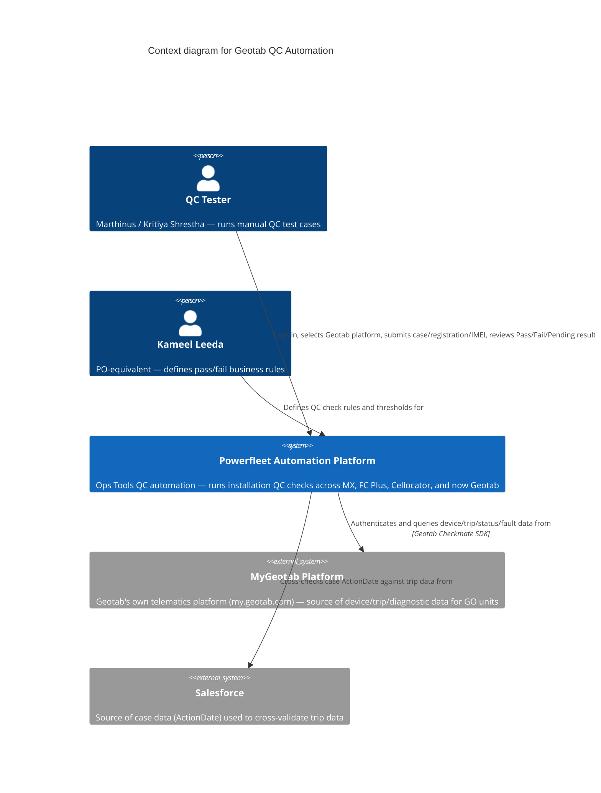
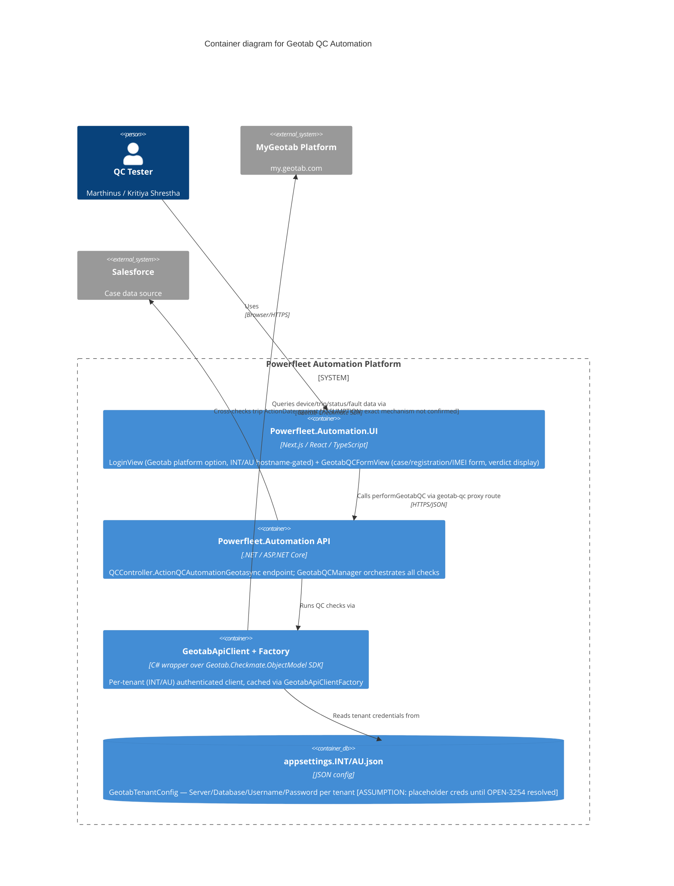

# GeoTab

## Video timecode index (AU Test Steps, 56:40 total — updated as screenshots come in)

Built from the timecode burned into each screenshot's video-player overlay. Use this to jump to a topic directly instead of scrubbing — send a screenshot from anywhere I haven't indexed yet and I'll add it.

| Timecode | What's on screen |
|---|---|
| 2:04 | FleetComplete/FOUR dashboard, "Ready For Review" tab |
| 3:25 | Device install record, BM Alliance Coal, serial `G9W4Z4F027UF` |
| 3:35 | MyAdmin device detail + list, Terra Cat / `G9FVH0K0YFNT` (the 119-day-stale example) |
| 7:59 | `santos`/`638PC8` install record, Geotab tab — IOX accessory checkboxes (Primary Aux/WiFi/NFC/Buzzer checked) |
| 9:49 | Same `santos` record — Auxiliaries section, Aux1-8 fields |
| ~35:5x (just before 35:58) | MyGeotab Measurements — IOX diagnostic filter, typing/selecting "iox" |
| 35:58 | MyGeotab Measurements — IOX presence results for `santos`/`638PC8` |
| ~34:1x | `santos` record revisited — Harness Type dropdown (Standard OBD/Heavy 6 pin/Heavy 9 pin/Other) |
| 34:15 | Same moment — Installation Method dropdown (OBD/Wired) |
| 32:55 | Same `santos`/`638PC8` record, scrolled to top — **Serial Number found** (see below) |

**Resolved 2026-08-18 — `santos`/`638PC8`/`U-25071` full record, top section (WO138227, Position 7):**
- **Serial Number: `G7842118AB16`** (read from a highlighted/selected field — worth a second look against the video if precision matters, easy to confuse `1`/`l`/`I` or `8`/`B` from a screenshot)
- Device Type: **`GO7 (Geotab)`** — not GO9. Every serial collected so far encodes the model in its prefix: `G9...` for GO9 units, `G7...` for this GO7 one — consistent across every example.
- Client: **Santos** (capital-S, a literal field value — alongside, not necessarily overriding, the "sounds more like an area" read from the video's spoken audio)
- Status **Complete**, installed 03-07-2026 01:33 PM, installer Edwin Novino (self-install)
- Additional Info confirms **Asset: U-25071** — directly cross-confirms this is the same vehicle as the MyGeotab Measurements page (35:58 timecode, "santos 638PC8 (U-25071)")
- Shipping destination: Tait Toyota, Goondiwindi QLD — consistent with Santos Ltd's real Queensland gas-field operations, if that connection matters later

![[Attachments/GeoTab/geotab-screenshot-12-santos-serial-number.png|600]]
*Screenshot 12 — `santos`/`638PC8` record, top of page, Serial Number field highlighted (32:55).*

**This is now a complete, ready-to-run test case:** confirmed serial + confirmed OBD install type (34:15) + confirmed real-world asset. Use it directly with `test-geotab-qc.ps1`:
```powershell
.\test-geotab-qc.ps1 -Env AU -SerialOrImei "G7842118AB16" -InstallType OBD
```

**Quick links:** [[GeoTab Test Plan#5. Test case table (implemented checks — one row per check, verified against `GeotabQCManager.cs` @ `origin/integration` 2026-08-14)|Test case table]] (full per-check Pass/Fail/Placeholder breakdown — lives in [[GeoTab Test Plan]], linked here rather than duplicated) · [[GeoTab Code Audit]] · [[GeoTab System Map]] · [[GeoTab Manual QA Workflow]] · [[GeoTab System Map.excalidraw|Diagram]]

Status: intake, no plan yet. Raw dump of boss messages below. Jira/planning discussion comes after user done pasting.

## Context

Boss want focus shift to GeoTab work. Code available, UI login wired. Needs testing now. Boss expect rough road — "erg verwarrend" (very confusing). Neither boss nor user know how GeoTab suppose to work or how tests pass — learning curve for both.

## Raw messages (chronological)

### Boss, initial ask
> Hi, kan ek jou vra om te fokus op die Geotab goed asb? Die kode is als beskikbaar, en die UI se login is gewire. Ons moet dit nou net getoets kry. Ek voorsien vaarthobbels hiermee, want hierdie is erg verwarrend.

Teams recording link (blob, likely expired/session-scoped):
`blob:https://teams.microsoft.com/e8de0d89-3c20-47c5-b384-15181cdcef5a`

GeoTab site: https://my.geotab.com/
> MyGeotab - hierdie is na Geotab se site. Jy kan opsttools se access inligting gebruik.
> Die QC aan die voorkant is dieselfde, maar agterkant verskil.

(Use OpsTools access info to log in. Front-end QC same, backend differs.)

### User reply
> OK cool - maak so - waar kry ek meer inligting oor als:
> 1) Hoe weet ek hoe dit moet werk
> 2) Hoe weet ek toetse slaag?
> Ken glad nie dit nie

### Boss reply
> Op daai Geotab site is daar assets wat jy kan probeer - ek vermoed ons gaan serial number gebruik
>
> 1 - ek stuur jou video
> 2 -
>
> Ek ken dit ook nie - Claude ken meer as ons almal saam, so hierdie is learning curve ...

(Assets on GeoTab site to try testing against — suspect serial number used as key identifier. Boss sending a video. Boss admits he doesn't know this either — "Claude knows more than all of us combined," treat as learning curve.)

### Kameel Leeda — meeting recap link
Teams meeting recap (AU Test Steps recording):
`https://teams.microsoft.com/l/meetingrecap?driveId=b%21i7NJic_bBUORIqoCVwQ8vTqmZEgl-2pAvwOcybYsdA1koNKplylWSJtGoEL0QwSR&driveItemId=0175Z7RHAQ4UVUZK6EK5F2PQKT5R7JWDVD&sitePath=https%3A%2F%2Fmixtelematics-my.sharepoint.com%2F%3Av%3A%2Fg%2Fpersonal%2Fleedak_pointersa_com%2FIQAQ5StMq8RXS6fBU-x-mw6jAW-n24croPqlMy-547v3Crw&fileUrl=https%3A%2F%2Fmixtelematics-my.sharepoint.com%2Fpersonal%2Fleedak_pointersa_com%2FDocuments%2FRecordings%2FAU+Test+Steps-20260709_060816-Meeting+Recording.mp4%3Fweb%3D1&iCalUid=040000008200E00074C5B7101A82E0080000000010E27B4DCA0EDD01000000000000000010000000C5EBDA841AB6864799BB72941C22F2E2&threadId=19%3Ameeting_ZmJlNzgyNzMtYTU5MS00MzIwLTk5M2EtZGQ3NzI5ODU1NDQ1%40thread.v2&organizerId=e12b05c8-2db2-4a43-b4d0-eb8775065db6&tenantId=d19b542a-1500-4712-a713-be8d79882cb5&callId=f0e5b5d5-4d2d-4c6f-8327-17e1d234512a&threadType=Meeting&meetingType=Scheduled&subType=RecapSharingLink_RecapCore`

Video titled "AU Test Steps" — 2026-07-09 recording.

### Reference doc shared (from someone to William, forwarded)
> Hi William, Trust you well, I have only managed to get the following information from the team thus far. Let me know what specific detail you looking for.
> https://internal-kb.powerfleet.dev/protected-files/files/Tech%20Support/Global%20FC%20Legacy%20Support/FC%20Legacy%20AU/1.Standard%20Operation%20Procedures/General%20Support/Basic%20QA%20Process/

Basic QA Process SOP — FC Legacy AU / Global FC Legacy Support KB.

### SharePoint doc (Kameel's OneDrive, likely test steps/spec doc)
`https://mixtelematics-my.sharepoint.com/:w:/g/personal/leedak_pointersa_com/IQAls44peosOQ5OqLIQUOhXJAZPRisBEtRTvBfpWLlEDTxU?e=yODbcV`

Word doc, needs SSO to open — not fetched yet.

### Boss follow-up
> Daai is als wat ek beskikbaar het. Jy kan met Kameel Leeda connect of in AU met Kritiya Shrestha (sy doen QC daai kant op die stelsel wat jy sien in die video)
>
> Kameel is soos PO aan ons kant

(That's everything boss has available. Contacts: Kameel Leeda — connect for general info, acts as PO equivalent on our side. Kritiya Shrestha — AU-side, does QC on the system shown in the video.)

## People
- **William King** — the boss, sender of every message above. Got the KB SOP forward addressed to him ("Hi William...") from someone else on the team, then relayed it to user.
- **Kameel Leeda** — PO-equivalent, our side.
- **Kritiya Shrestha** — AU side, does QC on the system.

## MAJOR FINDING: this is already OPEN-3192 (built by this same SDLC agent system)

Cross-checked against this repo's own memory + live code — William's "focus on GeoTab, code's available, UI login's wired, needs testing" maps directly onto an epic this Claude-driven SDLC orchestrator already built over 2026-07-13→27:

- **Epic:** OPEN-3192 "Geotab Installation QC Automation Phase 3" — 4th QC platform after MX, FC Plus, Cellocator. Geotab GO units only, INT+AU envs only.
- **Repos (confirmed on `origin/integration`, live 2026-08-06):**
  - `Powerfleet.Automation` (API, .NET) — `GeotabQCManager.cs`, `GeotabAsset.cs`, `IGeotabApiClient.cs`/`GeotabApiClient.cs` (wraps Geotab's own `Geotab.Checkmate.ObjectModel` SDK), `GeotabApiClientFactory.cs` (per-tenant client cache), `GeotabTenantConfig.cs`, `GeotabInstallType.cs`. Local checkout here is stale (on an unrelated feature branch, behind `origin/integration`) — confirmed existence via `git ls-tree origin/integration`, not a local file read.
  - `Powerfleet.Automation.UI` (Next.js/React/TS) — `LoginView.tsx` (Platform selector gets a `Geotab` option, hostname-gated to INT/AU automation URLs), `GeotabQCFormView.tsx` (case number/registration/action date/IMEI fields, renders Pass/Fail/Pending/NotTested verdicts), `ApiService.ts` `performGeotabQC()`, `src/app/api/proxy/geotab-qc/route.ts`. Local checkout here is on `integration` but a few commits behind `origin/integration` (has OPEN-3203 only, missing 3202/3204/3195/3196+) — confirmed the newer commits exist via `git log origin/integration`.
- **This directly explains William's phrasing:** "die kode is als beskikbaar" = this epic's code, mostly merged. "die UI se login is gewire" = literally OPEN-3202 (Geotab login selector). "ons moet dit nou net getoets kry" = manual QC/UAT of what the agents built. "agterkant verskil" = the Geotab backend uses Geotab's own MyGeotab SDK + per-tenant creds, unlike MX/FCPlus/Cellocator's different data sources — genuinely a different backend per platform, same as he said.
- **Epic status as of last memory update (2026-07-27, 10 days stale — verify current status live via Jira/`my-tickets-status.json` before relying on it):** most of the 14 child stories (3193-3198, 3201-3204, 3223) merged to integration, Ready for QA or later. 3199 partial (NotTested stubs — DIN-to-Aux wiring, video peripheral unconfirmed). 3200 (unit tests)/3205 (docs) likely done alongside. **3254** (real INT/AU Geotab password placeholders → real credentials) was the one ticket explicitly blocked on getting real credentials — this may be exactly why William can't get you logged in yet, or why sign-in failed.
- See `.agent/shared-memory/memory/project_open_3192_geotab_phase3.md` and `project_open_3202_3204_geotab_completed_20260717.md` in the SDLC repo for the full build history if you want the blow-by-blow.

## Original 5 gaps — answered from repo evidence (2026-08-06)

1. **"OpsTools" = `Powerfleet.Automation` (API) + `Powerfleet.Automation.UI`.** QC logic: `GeotabQCManager.cs` (API side), `GeotabQCFormView.tsx`/`LoginView.tsx` (UI side). See MAJOR FINDING above.
2. **What it calls:** Geotab's own MyGeotab SDK (`Geotab.Checkmate.ObjectModel` NuGet package) via `IGeotabApiClient` — `GetDeviceAsync`, `GetTripsAsync`, `GetLogRecordsAsync`, `GetStatusDataAsync`, `GetFaultDataAsync`, `GetExceptionEventsAsync`, `GetIoxAddOnsAsync`, `GetMediaFilesAsync`. Not a generic REST call — the official SDK, per-tenant authenticated (INT/AU each have own Server/Database/Username/Password).
3. **"Backend differs" = confirmed:** Geotab uses its own SDK/auth per tenant; MX/FCPlus/Cellocator each use different data sources. Real, already-built architectural difference, not a vague worry.
4. **Serial number:** `GeotabAsset.SerialNumber` field exists in the model (confirmed via unit tests). Whether it's the raw Geotab device serial or needs mapping from a MiX asset serial — **not confirmed, ask Kameel** (see Questions section below).
5. **Pass/fail criteria:** each check returns Pass/Fail/Pending/NotTested, precedence Fail > Pending > Pass > NotTested. Concrete rules already coded: device active, firmware version, trips vs Salesforce case ActionDate (7-day fallback), odometer, driver assignment, last-comms recency (24h), GPS/HDOP + ignition source, voltage (≥11.0V ext/≥3.5V battery, placeholder thresholds), active non-dismissed fault codes, NFC/buzzer/GoTalk/Iridium-duress/WiFi presence. Several thresholds are explicitly still placeholder/TBD (see Questions section).

Bottom line: the earlier "no idea" answers were mostly already implemented in code — remaining real unknowns are credentials, exact thresholds, and serial-number mapping, all pushed to the Questions section for Kameel.

## AU Installation Test Procedure — the actual spec doc (obtained 2026-08-06)

William got this from Kameel via SharePoint; user pulled it locally to `C:\Users\MarthinusR\Downloads\AU Installation test procedure.docx` and it was extracted directly (no SSO needed once it's a local file). This is the real target spec — answers most of the earlier gaps, and reveals the built epic (OPEN-3192) is a **narrower slice** of it, not the full thing.

**Goal (doc's own words):** given a device serial number, the tool queries the relevant platform (Geotab / Hub / Master Portal) and reports pass/fail against a checklist, replacing what's currently a manual installation-QA process.

### 1. Unit types in scope (doc), vs what's actually built (OPEN-3192)

| Unit type | Platform | Built in OPEN-3192? |
|---|---|---|
| Geotab GO unit | Geotab (MyGeotab) | **Yes** — this is the epic's whole scope |
| Vision AI camera (Geotab-integrated) | Geotab + Master Portal + Vision AI Hub | **No** — not mentioned anywhere in the epic |
| Vision camera (Hub/Unity) | Unity Hub (legacy FC) | No — different platform entirely |
| FT1 | Unity Hub (legacy FC) | No |
| MGS | Unity Hub (legacy FC) | No |
| Asset trackers (81/85, 86, 87) | Geotab, but **different device serial than the physical unit** | **Unclear — likely no.** Epic talks about "GO units" specifically; no mention of a serial-mismatch resolution step. Real gap to flag.
| Guardian (Gen. 3) | Guardian platform (Seeing Machine) | No — online/offline check only, out of scope per doc itself |
| MiX units | MiX platform | No — explicitly out of scope for this team |

**So: what's built only covers Geotab GO units + their direct accessories. Camera QC, legacy Hub/FT1/MGS, asset-tracker serial-mismatch handling, Guardian, and MiX are all outside OPEN-3192 as it stands.**

### 2. Install config fields (drive which tests apply)
- **Install method:** OBD (via CAN/OBD-II port) or Wired (3-wire: constant power, earth, ignition).
- **Harness type (if OBD):** Standard 16-pin, 6-pin, 9-pin, or Other (free text, e.g. Caterpillar-specific).
- **Accessories flagged on work order:** NFC/key housing + location, primary aux (Aux 1-4), secondary aux (Aux 5-8, custom-labelled), duress button(s) (dash/remote/both), external buzzer, GoTalk, Iridium, Wi-Fi harness (Santos-specific), other/legacy IOX, camera + which platform.

### 3. Basic checks — every installation
1. **Ignition ON/OFF** — both an on and off event present in the log window (ignition source may be RPM-based or another input).
2. **GPS position** — valid non-null current/last-known coordinate.
3. **Satellite count** — present/reported, but explicitly a **diagnostic aid, not a strict pass/fail**. (Resolves the "HDOP threshold" ambiguity partially — satellite count itself isn't gated; a separate HDOP quality check, if it exists in the built code, isn't described in this doc at all.)

**Gotcha called out in the doc itself:** Geotab's web UI caps log results at 2,499 rows/filter — any check needing a full day+ of activity should pull the exported report, not the paginated view, or it can silently miss events. Directly relevant to the trip-vs-Salesforce-ActionDate check already built.

### 4. CAN/OBD-derived checks — conditional, NOT standard QA
Fuel level and RPM, sourced via OBD-II only, **only surfaced when the customer specifically requests them** — not part of standard pass/fail. No separate CAN-bus check exists. Not mentioned anywhere in OPEN-3192 — likely genuinely out of scope for what's built.

### 5. Accessory mapping — Geotab GO unit (5.1, the part that matches what's built)
| Accessory | Test | Notes |
|---|---|---|
| NFC/key housing | IOX NFC status = present + driver-ID tap event logged | matches OPEN-3223's NFC check |
| Aux 1 (handbrake or PTO) | on/off event present | **this is the DIN-to-Aux mapping that was an open TODO — now answered** |
| Aux 2 (4-wheel drive) | on/off event present | ″ |
| Aux 3 (seatbelt) | on/off event present | ″ |
| Aux 4 (duress: dash and/or remote) | on/off event present per duress input fitted — expect 2 pairs if both fitted | ″ |
| Aux 5-8 (secondary, custom-labelled) | on/off event per customer-agreed label | non-standard, customer-specific |
| External buzzer | output-triggered event logged (e.g. on unrecognised NFC tap) | audible volume is a physical check, firing is log-verifiable |
| GoTalk (voice) | output-triggered event logged | same — spoken content is physical, firing is log-verifiable |
| Iridium (satellite) | trigger duress, confirm "Emergency Data Success" event via satellite | works ignition on or off; test every duress input fitted |
| Wi-Fi harness (Santos-specific) | IOX Wi-Fi status = present | only reports while in configured zone — **allow delayed reporting, don't fail immediately if vehicle's out of zone** |
| Other/legacy IOX (relay kit) | manual verification only | no standard log field |

**This table directly resolves the "harsh-driving rule names" and "DIN-to-Aux wiring" unknowns for the accessories it covers** — but note the doc never uses the term "harsh driving" or "exception events" the way OPEN-3199's ticket text does. That ticket's framing may not map 1:1 onto this doc — worth clarifying with Kameel whether "exception events" means the duress/buzzer/GoTalk triggers above, or something else entirely.

**Correction (2026-08-14, [[GeoTab Code Audit]]):** the line above — "now answered" for DIN-to-Aux wiring — turned out to be wrong once actually checked against the code. `GeotabQCManager.cs` never implements Aux 1-4 as distinct checks; all four are folded into a single `DigitalInputs` stub that always returns `NotTested`, with a comment saying the wiring mapping still needs technical-team confirmation. The doc reading it as "resolved" doesn't match what got built.

### 6. Camera checks (5.2/5.3) — entirely unbuilt
Geotab-integrated camera: must be linked to a host GO unit's asset ID (Master Portal) — cannot exist standalone. Checks: linkage, communication (recent "last data"), live view (screenshot as evidence), mounting/safe-zone (**explicitly manual/visual sign-off, not automatable** — head/torso in zone, horizon mid-frame). Hub/Unity camera: same idea but assigned as its own asset, no host GO unit, viewed via Vision AI Hub > Trips > Live Stream.

### 7. Dev-team notes (doc's own section 6)
- Target flow: serial number in → tool identifies unit type + accessories → runs applicable Section-5 checks → pass/fail summary per check.
- Multiple platforms needed: Geotab (MyAdmin/MyGeotab), Master Portal (camera provisioning), Vision AI Hub (camera live view), Unity Hub (legacy FC + Hub cameras).
- Manual sign-off items (camera mounting) should let the reviewer attach evidence (screenshot), not force an automated pass/fail.
- **Asset trackers (81/85/86/87 — spoken as AT1/AT5/AT6/AT7 in the video, likely the same models, see "MGS, Surfside..." note above) and some legacy-integrated devices (e.g. GPS on locomotives) have a different Geotab-platform serial than the physical unit serial — the tool needs a serial-matching/lookup step, not a 1:1 assumption.** This is the concrete answer to gap #4 (serial number) — for GO units it's likely 1:1, but for asset trackers it explicitly is not, and nothing in OPEN-3192 appears to handle this resolution step.

## Live Jira status — Operations Tools team only (checked 2026-08-06, direct REST — MCP unavailable this session, per standing fallback approval)

Full unfiltered search hit 51 tickets containing "Geotab" — most belong to other teams (Config, DynaMiX, POS, etc.) and aren't relevant. Filtered to **Operations Tools** (verified via the Team custom field, `customfield_10001`, not just the AUTO- prefix guess):

Corrects the 10-day-stale memory: **all 14 original OPEN-3192 child stories are now Done**, including OPEN-3254 (real INT/AU credentials — resolved, no longer a login blocker) and OPEN-3223. The epic OPEN-3192 itself is still showing **In Progress** despite that — looks like a bookkeeping gap (epic never formally closed), not unfinished work.

**New find:** **OPEN-1531** — Spike, Done, assigned to **William King himself** — "Review spec for Advanced Geotab QC with Zoe, Olivier and Neil." Likely the origin of this whole initiative — may reference the same spec doc, or an earlier/different version of it. Worth asking William directly about this one.

**Genuinely open (Ready for Sprint / Proposed), Operations Tools team, relevant to testing:**
- **OPEN-3363** (Grant) — "Resolve coverage_gap: backend-unreachable Playwright E2E preflight." Test coverage gap on the exact feature being tested.
- **OPEN-3362** (Grant) — "Harden qc/route.ts: error exposure, logging, unparsable-body policy." Proxy route not yet hardened — errors during testing may not surface cleanly.
- **OPEN-3351** (Grant) — "Backfill missing self_review_gate entry for OPEN-3200." Pure bookkeeping.
- **OPEN-3256** — "Remove hardcoded secrets from settings/.env files." Could touch the same appsettings that just got real Geotab creds via OPEN-3254 — watch it doesn't get merged in a way that breaks login mid-testing.
- **OPEN-3262** — "SDLC - strengthen PR-time secrets warning." Process-only, low relevance.
- **OPEN-3255** (Epic, Proposed) — parent of 3256/3262, "Hardcoded Secrets Remediation."

**Confirmed NOT our team (Config team), despite being Geotab-related:** OPEN-3420 (Onboard Geotab to Compiler Service), OPEN-3421 (Digital Input Observation parameters for Geotab custom events), OPEN-3422 (AreMobileUnitsTachoEnabled). These looked relevant by name but belong to a different team — don't chase them as "our" open items, though OPEN-3421 may still be worth a cross-team question if it turns out to define the same Aux/digital-input parameters this epic's checks depend on.

**Already Done, newly confirmed (not in prior memory):**
- OPEN-3333 (Defect) — fixed Iridium/Panic QC checks silently excluding events with null `StartDateTime`.
- OPEN-3404 / OPEN-3409 (Defects) — fixed unhandled proxy errors from resourcedata DNS resolution failures, INT and AU respectively.
- OPEN-3353 — synced missing GEO scenario test cases into `test-suite.json`.

## NotebookLM outputs (2026-08-06)

Created a "GeoTab" NotebookLM notebook (source: [[GeoTab Overview Transcript]]), generated a video explainer and slide deck from it. Both downloaded into the vault:
- ![[GeoTab Explainer Video.mp4]]
- Slide deck: [[GeoTab Slide Deck.pptx]] (also available as `Geotab_QA_Protocol.pdf` in the NotebookLM notebook itself)

Note: `notebooklm-py`'s CLI in this venv crashes (`ModuleNotFoundError: No module named 'difflib'`) whenever a short flag (`-n`, `-a`) is passed with a UUID value — the venv's Python install is missing the stdlib `difflib` module, which click's arg-parser needs for its "did you mean" suggestions. Workaround: never pass `-n`/`-a`; rely on `notebooklm use <id>` context + `--latest` default instead.

## Podcast-style AI transcript (secondary source, 2026-08-06)

Full file: [[GeoTab Podcast Transcript]]. This is an AI-synthesized "podcast" recap of the same call as [[GeoTab Overview Transcript]] — **secondary/derived, not verbatim.** Per instruction: where it conflicts with the primary doc or raw transcript, the primary sources win.

Mostly corroborates the AU spec doc closely (CAN/OBD-on-request, GO self-reporting, serial-number lookup, duress dual-input, log export cap, Wi-Fi/Santos behavior, legacy FT1/MGS/asset-tracker/Guardian handling, automation vision). **New claims not found elsewhere — unconfirmed, need Kameel to verify:**
- "RideView app" as the named installer camera-alignment tool
- IMEI-vs-billing-system fallback for camera verification through Master Portal
- Camera assignment also depends on "duty type"/heavy-vehicle classification
- Framing serial-number-only lookup as a workaround for skipped forms (doc/raw transcript describe it as the normal flow, not a fallback)

## William conversation (2026-08-17)

Talked to William directly about the questions raised in [[GeoTab Code Audit]]/[[GeoTab Test Plan]]. Key points:

- **Flow confirmed:** Kameel showed William the AU Test Steps video/recap → William took that info and created all the Jira tickets himself → the Coding Agent (AI) wrote the code from those tickets. Matches this file's earlier "MAJOR FINDING" — no separate hidden requirements source, the tickets are the whole spec as William understood it from Kameel's video.
- **Next: talk to Kritiya directly** to confirm (1) scope really is GO-units-only for now, and (2) what should actually be tested on those units. See "Questions for Kritiya" below — **don't lead with "only GPS and ignition," that undersells what the transcript/doc actually describe.**
- **William's ask:** add breakpoints in the built code to inspect the actual JSON/data shapes MyGeotab returns for a real unit (Device, Trip, StatusData, IoxAddOn, ExceptionEvent, FaultData) — this is exactly the data needed to resolve the audit's "keyword match unconfirmed" and "HDOP/threshold unconfirmed" open items. Debugging guide with exact breakpoint locations: [[GeoTab Code Audit]] §5.

## Questions for Kritiya (before asking her, fact-checked against transcript + doc, 2026-08-17)

1. **"For now it's only GO units"** — checks out. Confirmed scope in code, doc, and Jira: OPEN-3192 builds nothing for cameras, FT1, MGS, asset trackers, Guardian, or MiX units. Safe to confirm with her as-is.
2. **"What should be tested — only GPS and ignition?"** — **this undersells it, correct before asking her.** The transcript has Kritiya herself say GPS + ignition is the *"basic thing we check"* for a straightforward install — not the *only* thing. Full picture per transcript + doc:
   - GPS + ignition (RPM-based or other source) — the baseline, her words
   - A separate **"verify status"** step against MyAdmin/MyGeotab for device status (transcript, 3:20) — distinct from GPS/ignition
   - Whichever accessories are actually on that unit's work order (NFC, Aux 1-4, buzzer, GoTalk, Iridium, Wi-Fi) — "depending on other accessories connected, it would be a bit more complex" (her words, 1:04-1:19)
   - CAN/OBD data (fuel, RPM, handbrake, lights) **only if the customer specifically asks** — not standard
   - Better question for her: *"Beyond GPS and ignition as the baseline, what else do you actually check, and does it scale with which accessories are on the work order?"* — and since the transcript has a 53-minute gap (3:20→56:07) where the detailed walkthrough likely happened, worth asking her to fill that gap directly rather than assuming the doc covers it exactly.

## Master identifier reference (all real units seen across screenshots, updated as new ones come in)

Every device/vehicle identifier collected so far, in one place — for MFM lookups, API test cases, or anything else needing a real value to search on. Serial-prefix pattern holding across every example so far: `G9...` = GO9 device, `G7...` = GO7 device.

| Client/Org | Work Order | Device Type | Serial Number | Vehicle | Other IDs |
|---|---|---|---|---|---|
| Santos | WO138227, Pos 7 | GO7 (Geotab) | `G7842118AB16` | 638PC8, Toyota Landcruiser, VIN `JTELRL1J10B007700` | Asset `U-25071`, Database `santos` |
| BM Alliance Coal Operations Pty Limited | WO146889-1, Pos 44 | GO9 (Geotab) | `G9W4Z4F027UF` | (not captured) | Kit `BMA-A01474`, Self Install |
| Terra Cat - Mike Sankey | (not captured) | GO9 (Geotab) | `G9FVH0K0YFNT` (Hardware ID `568851839`) | (not captured) | Account `SECU01`, Database `terra_cat` — ⚠️ address on file is Whangarei, NZ, not AU |
| Jeff Rowe Transport | WO160701 | GO9 (Geotab) | `G95Z3H8RC67` | XS86KD Hino 700 (install) / XS90AN Hino 500 (removal, same WO#) | — |
| Watco WA Rail Pty Ltd | WO165277 | GO9 (Geotab) | `G9W0AV96750Z` | 1IHP987, Mitsubishi Triton | — |
| Endeavour Energy | WO91478-SELF | GO9 (Geotab) | `G9U76EV2EXUK` | DS50FQ, Kia EV5 | Self Install |
| Cummins South Pacific | WO164336 | GO9 (Geotab) | `G91A0E3XD1CV` | 2FD5BQ, Ford Ranger | — |
| Trident Building Surveying | WO162212 | FT1 (FleetComplete) | `015405004033928` | M42YK, Subaru Outback | Legacy/non-Geotab — useful as a control case |
| Plastering Supplies Tasmania Pty Ltd | WO157229 | Vision (Mitac) | `E7425331340` | H24HV, Isuzu FRR | Camera unit, not a GO device |
| Northpoint Fleet Management | WO164840 | GO9 (Geotab) | `G9B5P733ACBJ` | XF173K, Toyota Landcruiser | — |
| St Michael's Assoc Inc | WO165254 | GO9 (Geotab) | `G9HURMENV527` | N88DO, MG ZS | — |

## Screenshot evidence (2026-08-17)

Marthinus is re-watching the AU Test Steps video and sending screenshots as he goes; updating docs/diagram incrementally as each one adds something. First screenshot: Kritiya's FleetComplete work-order dashboard, timestamp 2:04 (within the transcript's already-captured 0:00-3:20 window — visual confirmation of what the transcript describes in words, not new gap content, but concrete detail the text alone never gave).

**Resolved:**
- **"Four platform" was never a mishearing** — the system is literally called **FOUR** (`platform.four.io`), FleetComplete-branded tenant (`/a/fleetc/fleetcomplete/device_installation`). [[GeoTab Manual QA Workflow]] updated — its `[ASSUMPTION]` tag on this is now resolved.
- **Real work-order statuses:** New, In Progress, **Ready For Review**, Complete, Cancelled — corrects the handwritten-notes guess of "Reviewed/Wrapped"/"Done."
- **Device type naming, concrete for the first time:** Geotab GO units show as `GO9 (Geotab)` in the system (GO9 = the specific model). `FT1` shows as `(FleetComplete)` — it's a FleetComplete-branded device, not a Geotab one, correcting an earlier loose assumption that FT1 sat entirely under "legacy Unity Hub" as a Geotab-adjacent thing. The camera device type shows as `Vision (Mitac)` — MiTAC is the actual camera hardware vendor, not just "Vision AI Hub" as a generic label.
- **Real serial-number formats, direct evidence for the IMEI-vs-serial-number risk in [[GeoTab Code Audit]]:** `GO9 (Geotab)` serials look like `G957Z3H8RC67` — alphanumeric, clearly not an IMEI format. `FT1 (FleetComplete)` serials look like `015405004033928` (numeric, IMEI-length). `Vision (Mitac)` serials look like `E7425331340`. This is concrete evidence the "Serial Number" tracked per device type is genuinely not a uniform IMEI — reinforces (doesn't yet fully resolve) the audit's flagged risk.
- **New vendor, not previously known:** "Digital Matter" appears as a bookmarked link folder in Kritiya's browser alongside LightMetrics/Guardian/Unity Platforms — a real telematics hardware vendor. Role in this workflow not yet understood; flag for Kameel/Kritiya.
- Also bookmarked: a "Geotab harness identification" reference link — suggests a real harness-ID reference doc/tool exists that hasn't been located yet.

![[Attachments/GeoTab/geotab-screenshot-01-fleetcomplete-dashboard.png|600]]
*Screenshot 1 — FleetComplete/FOUR work-order dashboard, "Ready For Review" tab (2:04 in video).*

### Screenshots 2-4 — device install record, MyAdmin device status

Marthinus's own framing: "if it's a Geotab item, you can check in MyAdmin for device status" — screenshot 3 shows *where*, screenshot 4 shows the *device detail* once opened, screenshot 2 shows the FleetComplete-side install record for a Geotab device. Kritiya also mentioned **IOX and NFC** by name in this part of the video (already in scope — matches the code's IOX add-on architecture and driver-ID tap check).

![[Attachments/GeoTab/geotab-screenshot-02-device-install-complex.png|600]]
*Screenshot 2 — `Device - Install (Complex)` record in FleetComplete/FOUR (`platform.four.io/a/fleetc/fleetcomplete/device_installation/{guid}/edit`).*

**New findings from this record:**
- The install record has a **`Geotab` tab** alongside `General`/`Photos` — device-type-specific extra section, starts with **Connection Status / Database / Database Override** fields (cut off in the screenshot, but the field names confirm the Primary Database flow below).
- A **"Public Link"** field (`fleetcomplete-1-public.four.io/device_installation/{guid}/edit`) — a separate customer/installer-facing sub-portal, no login shown.
- **"Fulfillment Notes (Auto-updated)"** and **"Installer Comments"** are explicitly noted as *"Updated from the installer portal"* — confirms a distinct **Installer Portal** system feeds data into FleetComplete/FOUR automatically, not just manual entry by Kritiya's team.
- Confirms `Serial Number` (`G9W4Z4F027UF`) and `Device Type` (`GO9 (Geotab)`) as the two key identifying fields on this record — consistent with screenshot 1.

![[Attachments/GeoTab/geotab-screenshot-04-myadmin-device-list.png|600]]
*Screenshot 3 — MyAdmin Device Management list view (`myadmin.geotab.com/deviceadministration`) — "where to check status."*

![[Attachments/GeoTab/geotab-screenshot-03-myadmin-device-detail.png|600]]
*Screenshot 4 — MyAdmin device detail for one device, opened from the list above — "general image."*

**New findings from MyAdmin:**
- **Three distinct identifiers per device, not one:** `Serial number` (`G9FVH0K0YFNT`), `Hardware ID` (`568851839` — 9 digits, clearly not an IMEI), and a hardware-variant code shown in parentheses on the detail page (`GO9LTMTENO`). None of these visually resemble a 15-digit IMEI. Strengthens (with more precision than before) the audit's flagged IMEI-vs-serial-number risk — there isn't just one alternate identifier to worry about, there are at least three candidate fields, and the QC tool's UI only asks for "IMEI."
- **Status tiles validate a real code distinction:** device shows **"GO: Live"** (provisioning status) *and separately* **"Last Device Communication: 119 day(s) ago"** with **"Last GPS Record: No data"** / **"Last Engine Record: No data"**. This is a device that's provisioned/active but has been silent for months — confirms `GeotabQCManager`'s `DeviceActive` check (reads provisioning status, `GoDevice.ActiveTo`) and `LastCommunication` check (reads actual data recency) are correctly modeling **two genuinely different real-world states**, not a redundant pair of checks.
- **Primary Database confirmed as the field that flows into FleetComplete:** MyAdmin shows `Primary database: terra_cat` for this device — per Marthinus, "it will then get populated into the FC system," matching the `Database`/`Database Override` fields seen on the FleetComplete Geotab tab in screenshot 2. Real, confirmed cross-system data flow.
- Real Geotab billing plan name seen: `Rate Plan Code: POWERPLAY`.

### Screenshots 5-6 — Aux 1-8 and IOX accessory fields

Marthinus asked me to check [[GeoTab Overview Transcript]] for what she says Aux 1-4 usually connect to. **Checked — it's not there.** The saved transcript only covers 0:00-3:20 (intro chat about GPS/ignition basics) plus the last few seconds; the Aux 1-4 explanation happens inside the untranscribed 3:20→56:07 gap, so there's no text record of her exact words on this. The AU Installation Test Procedure doc's mapping (Aux1=handbrake/PTO, Aux2=4WD, Aux3=seatbelt, Aux4=duress dash/remote) is still the only documented source for this and remains a **convention, not a hard rule** — confirmed by screenshot 5 below, where the real system just has free-text "Other AuxN" override fields per slot, meaning installers can wire anything to any Aux slot.

![[Attachments/GeoTab/geotab-screenshot-05-aux-1-8-fields.png|600]]
*Screenshot 5 — FleetComplete "Auxiliaries" section: Aux1-8, each with a dropdown + free-text "Other AuxN" override.*

**Confirms what Kritiya described:** Aux1-4 (primary) and Aux5-8 (secondary) are structurally identical fields — the doc's "primary vs secondary aux harness" distinction is a physical-harness thing, not a different field type. Also new on this same form: **Install Locations** section — `Unit Location`, `Key Housing Location`, `Duress Location`, and **`Serial Sticker Location`** (new — where the physical serial sticker is placed on the vehicle, useful for a future visual-verification check).

![[Attachments/GeoTab/geotab-screenshot-06-iox-accessories.png|600]]
*Screenshot 6 — the Geotab tab's IOX accessory checklist, with real Geotab part codes.*

**This is the single most useful screenshot yet for the code audit's "unconfirmed keyword match" findings.** Real Geotab IOX product codes, direct from the install form:

| Accessory | Real IOX part code |
|---|---|
| Primary Aux Harness | `IOX-AUXM` |
| Secondary Aux Harness (opens up Aux 5-8) | `IOX-AUXM` (same part, a second one) |
| Iridium Modem | `IOX-SATIRDV2` |
| Wi-Fi Harness | `IOX-WIFI` |
| NFC Key Reader | `IOX-NFCREADERA` |
| External Buzzer | `IOX-BUZZ` |
| GoTalk | `IOX-TTS` |
| Camera | separate checkbox + its own **Camera IMEI** field |

This is exactly what's needed to close [[GeoTab Code Audit]]'s §2 "keyword-substring match unconfirmed" findings for NFC/Buzzer/GoTalk/Iridium properly — instead of guessing at `KnownIoxAddOnType` from Rule.Name keywords, these real part codes (`IOX-NFCREADERA`, `IOX-BUZZ`, `IOX-TTS`, `IOX-SATIRDV2`, `IOX-WIFI`, `IOX-AUXM`) can be looked up directly against the Geotab SDK's `KnownIoxAddOnType` reference to get the correct typed constant. Also confirms cameras carry their own separate IMEI, distinct from the host GO unit's identifier — another entry in the "more than one ID per install" pile from screenshots 3-4.

### Video walkthrough progress tracker (running, update as we go)

Marthinus is working through the AU Test Steps video section by section, sending screenshots/notes as he goes. Tracking sequence here so later messages ("now they talk about X") have context without re-deriving it:

1. ✅ Basics — GPS + ignition, "verify status" workflow intro
2. ✅ FleetComplete/FOUR dashboard + work-order statuses (screenshot 1)
3. ✅ Device install record + MyAdmin device status lookup (screenshots 2-4)
4. ✅ Aux 1-8 fields + IOX accessory codes (screenshots 5-6)
5. ✅ Iridium duress + report-vs-web-UI visibility gap (Emergency Data Success)
6. ✅ Cameras (Geotab branch) — Mitac Vision, RideView (field), LightMetrics (office), FleetComplete Operations Dynamics 365 (Serial#→IMEI), Path B for Hub customers (plus.fleetcomplete.com, app.fleetcomplete.com, impersonation)
7. ✅ Wi-Fi/Santos verification (IOX presence diagnostics), OBD harness types, Installation Method (OBD/Wired)
8. 🔄 **In progress:** Cameras in Hub (starting now)

### Advanced testing / exported-report workflow (2026-08-17, voice-dictated note)

Marthinus's note here reads as voice-to-text with a couple of likely mis-transcriptions (flagged, not silently corrected): **"fleetcomplete.com"** was a mis-transcription of **my.geotab.com** — "uranium success" a few words later is "Emergency Data Success." **Confirmed 2026-08-17:** these are two separate screens in the same video, not one URL — "FleetComplete" generically = `platform.four.io` (work orders), while the actual advanced report-checking (Ignition/Aux4/Emergency Data Success) happens on `my.geotab.com` (device telemetry). Matches the architecture already mapped elsewhere in this vault — FOUR never held that kind of data to begin with.

**What this confirms, high-confidence regardless of the domain-name question:**
- **The 2,499-row web cap + export-report workflow (already in [[GeoTab Test Plan]] §6) is real, current practice, not just something the AU doc warns about** — this is literally how Kritiya does "advanced" testing today: web UI for basic checks, exported report when she needs the full picture.
- **On the exported report, she checks: Ignition (=1 when on), Aux 4 (whether the button was pressed), and "Emergency Data Success" events.**
- **This resolves one of [[GeoTab Code Audit]]'s "unconfirmed keyword match" findings for real:** the code's `IridiumDuressEventKeyword = "emergency data success"` is **not a guess that needs checking — it's exactly the term Kritiya herself looks for**. Upgrade this from "unconfirmed placeholder" to "confirmed correct, matches real QC practice" in the audit and test plan.
- **Raises the stakes on the Aux 1-4 stub gap.** This isn't just the AU doc describing a check that should exist — Kritiya actively, manually checks Aux 4 today via exported reports. The automation tool's `DigitalInputs` stub (always `NotTested`) is a gap in something she genuinely relies on, not a theoretical one.
- **New operational caveat (2026-08-17):** the Iridium "Emergency Data Success" event **only shows up in the exported report, not in the my.geotab.com web UI** — a visibility difference, not just the 2,499-row truncation issue already flagged. (One phrase in Marthinus's note here — "which is a lot reason" — wasn't clear enough to transcribe confidently; flagging rather than guessing.) **Practical effect:** anyone manually cross-checking the automated tool's `IridiumDuress` verdict must use the exported report — checking the live web UI alone, even for a small/recent window well under the row cap, may show nothing even when the event genuinely occurred.

### Camera verification — two different paths depending on customer type (2026-08-17)

Everything logged so far in [[GeoTab System Map]] (Serial# → `fleetcomplete.operations.dynamics.com` → IMEI → `master.lightmetrics.co`) is **one path**. Marthinus's latest notes describe a **second, separate path** for customers who aren't in that Dynamics database at all — "Hub" customers (legacy Unity Hub side, not the newer FOUR/Dynamics side). Keeping both paths clearly separated here rather than merging them, since they're genuinely different systems for a different customer segment.

**Path A — standard customers (already documented):** FOUR/FleetComplete → `fleetcomplete.operations.dynamics.com` (Serial# → IMEI) → `master.lightmetrics.co`.

**Path B — "Hub" customers not in the Dynamics DB (new, 2026-08-17):**

1. Start from the **Client/customer name** (already have this from the FOUR work order).
2. Log into **`plus.fleetcomplete.com`** — a third FleetComplete-family domain, the **legacy "FC Plus" database**.
3. Search for the organisation by that customer name.
4. **Can't open the organisation directly anymore** — first have to **impersonate a user**.
   - *This directly connects to the "legacy FC impersonate → lost data" risk already flagged in [[GeoTab Handwritten Meeting Notes]] on 2026-08-17 — impersonation isn't an edge case, it's a required, routine step in this workflow.*
5. Click **Devices**, search by **IMEI** — Marthinus flagged his own uncertainty here and it's carried forward rather than resolved: *"it seems like it asks for a serial and she gives the IMEI??"* — the field may be **labelled** "serial" while what's actually entered is the IMEI. Needs a direct confirm from Kritiya/Kameel, not a guess.
6. If installed, a **"Last data"** field shows a value → confirms the camera is transmitting/working.

**Then, a further step (still Path B, possibly always done, not only when Path B applies — unclear yet):**

7. Impersonate an **admin** user this time, go to a **fourth** FleetComplete-family domain: **`app.fleetcomplete.com`**.
8. Note in passing: cameras used here are **forward-facing and driver-facing** only (Mitac Vision camera variants/lenses — no other orientations in use).
9. Search by **IMEI**.
10. For an actual live view: go to **VisionAI Hub → Trips**, search, grab a screenshot as evidence.
    - *`VisionAI Hub` here may be a module inside `app.fleetcomplete.com` rather than a separate top-level system — not yet clear whether this is the same "Vision AI Hub" already in [[GeoTab System Map]]'s systems roster, or a distinct one. Flag for later reconciliation once more of the video is covered.*

**Four FleetComplete-family domains now identified, each with a distinct role:**

| Domain | Role |
|---|---|
| `platform.four.io` | Current work-order tracking (FOUR platform) |
| `fleetcomplete.operations.dynamics.com` | Dynamics 365 F&O — Serial# → IMEI lookup, standard customers |
| `plus.fleetcomplete.com` | Legacy "FC Plus" database — Hub customers not in the Dynamics DB |
| `app.fleetcomplete.com` | Admin-impersonation portal — camera live view via VisionAI Hub → Trips |

More to come per Marthinus — this section will keep growing as he works through the rest of the video.

### Wi-Fi/Santos verification + IOX presence diagnostics + OBD/Wired harness (2026-08-17)

![[Attachments/GeoTab/geotab-screenshot-07-mygeotab-iox-diagnostics-filter.png|600]]
*Screenshot 7 — MyGeotab Maintenance → Measurements, filtering by "iox" diagnostics.*

**"Santos" — corrected 2026-08-17.** Initially read as a client name from the database field; Marthinus corrected this after re-listening — it sounds more like **an area/site** where this particular Wi-Fi feature is used, not a client. Both may still be true at once (the `santos` Geotab database could belong to a client operating in a "Santos" area/site — Cooper Basin, Australia is a real gas field associated with Santos Ltd, and the vehicle tags in these screenshots literally include "Development Cooper" — but that link is a guess, not confirmed). What's solid either way: `fleetcomplete.geotab.com` is **MyGeotab itself** (co-branded `myGEOTAB` + `FleetComplete` logos), using a per-database URL pattern `{brand}.geotab.com/{database}/...`, and `santos` is the Geotab database name for this tenant — matches the `Database: santos` field on the FOUR install record in screenshot 10 below. Every AU-doc reference to "Wi-Fi (Santos-specific)" is about this one real database/site — client-vs-area distinction still open, don't over-assert either way.

**Major finding: MyGeotab has native "IOX `<type>` (1. Present)" diagnostics** — a direct presence check per accessory, independent of any exception-event log. Options seen in the dropdown: `IOX buzzer`, `IOX CAN`, `IOX digital aux`, `IOX Iridium`, `IOX NFC`, `IOX Wi-Fi`, plus `J1939 IOX CAN 500k protocol detected`. No `IOX GoTalk` option was visible in this list (may just not have scrolled into view — not confirmed absent).

![[Attachments/GeoTab/geotab-screenshot-08-mygeotab-iox-diagnostics-selected.png|600]]
*Screenshot 8 — same page, all 6 IOX diagnostics selected as filters, custom date range.*

![[Attachments/GeoTab/geotab-screenshot-09-mygeotab-iox-presence-results.png|600]]
*Screenshot 9 — the actual result for asset `santos 638PC8 (U-25071) - TOYOTA LANDCRUISER-LV`.*

**Only 4 of the 6 filtered diagnostics returned data:** `IOX buzzer`, `IOX digital aux`, `IOX NFC`, `IOX Wi-Fi` are present on this vehicle; `IOX CAN` and `IOX Iridium` were filtered for but returned nothing — genuinely not fitted on this unit. This is a real, working example of presence-detection, and it **cross-validates exactly against the FOUR install record for the same vehicle** (screenshot 10 below): buzzer/WiFi/NFC checked, Iridium unchecked. Strong, concrete consistency between the two systems.

**Worth raising to Kameel/dev as a possible improvement, not just a threshold question:** the code's `CheckBuzzerOutput`/`CheckGoTalkOutput`/`CheckNfcDriverId`/etc. currently infer presence from `GetIoxAddOnsAsync` + `ExceptionEvent` keyword matching. These native "IOX `<type>` (Present)" diagnostics might be a more direct, more reliable presence signal than what's currently implemented — worth a real technical comparison, not something this audit can settle from screenshots alone.

**"Other IOX" explained:** this was for relay kits FleetComplete used to sell — **discontinued, not sold anymore**. Explains why [[GeoTab Code Audit]] found this option manual-verification-only with no log field: there was never any telemetry built for a now-dead product line, not an oversight.

![[Attachments/GeoTab/geotab-screenshot-10-obd-harness-selection.png|600]]
*Screenshot 10 — FOUR install record for the same `santos` vehicle, OBD install with Harness Type dropdown open.*

**Real Harness Type options for an OBD install, confirmed:** `Standard OBD`, `Heavy 6 pin`, `Heavy 9 pin`, `Other`.

![[Attachments/GeoTab/geotab-screenshot-11-obd-vs-wired-method.png|600]]
*Screenshot 11 — same record, Installation Method dropdown open: confirms the only two top-level choices are **`OBD`** and **`Wired`**.*

### Camera visual sign-off criteria — confirmed via video (2026-08-17)

Matches and confirms what the AU Installation Test Procedure doc already said (section 6, "manual sign-off items... head/torso in zone, horizon mid-frame") — now confirmed live in the video, with the detail that it's a **per-camera, both-must-pass** check:

- **Driver-facing camera** → face + torso indicator must be correctly positioned
- **Forward-facing camera** → horizon indicator must be correctly positioned
- **Both indicators must pass** for the camera install to sign off — not either/or
- **A third image is also required:** a photo of **where the camera is physically mounted in the vehicle** — so evidence per camera install is 3 images total: forward-facing horizon screenshot, driver-facing face/torso screenshot, and a mounting-location photo

Still explicitly a **manual/visual check, not automatable** — matches the doc's own framing and confirms `VideoPeripheral`/`VideoRecordings` remaining permanent `NotTested` stubs in the code isn't just an unbuilt gap, it's arguably the correct outcome for this particular check (a human has to look at the frame).

### Customer database (SharePoint) — new navigation aid (2026-08-17)

A SharePoint-hosted "customers database" with direct links per customer straight to their `fleetcomplete.geotab.com/{database}/...` page — saves needing to know/type the database name (e.g. `santos`) per customer manually. Distinct from the personal browser-bookmark folders already noted (Helpdesk, AUS/NA Device Support, Guardian, Unity Platforms, Digital Matter links, LightMetrics, Geotab harness identification) — this one's an official shared reference, not a personal bookmark set.

### Camera-to-vehicle linkage mechanism + GPS/"add-in" claim (2026-08-17)

**Checked the transcript per your ask — GPS-required-for-camera and "add-in" terminology are not in it.** [[GeoTab Overview Transcript]] only mentions GPS once, in the captured 0-3:20 intro ("basic check is GPS + ignition") — nothing about GPS being a precondition for attaching a camera, and no use of the word "add-in" anywhere. Same situation as the Aux 1-4 mapping earlier: this detail is from later in the video, past what we have as text. Logging it as a new video finding, not a transcript-confirmed one.

**New finding — GPS required before a camera can be attached, called an "add-in":** Geotab treats the camera as an **add-in** to the GO unit, and per Marthinus's note, GPS needs to be connected/working first before a camera can be attached to that unit.

**Camera-to-vehicle linkage — concrete mechanism, resolves an earlier assumption:**
- A camera is assigned to a vehicle using its **License (registration) number**.
- The camera has its **own, different Geotab serial number** from the main GO unit's serial — confirmed, not just a doc-inferred risk anymore.
- **The actual linkage flow:** search the asset (in MyGeotab) → **Asset Provisioning** → search the camera's **IMEI** → separately, go to **`master.lightmetrics.co`** → **Devices** → search the same **IMEI** → under **Edit**, there's an **Asset ID** field → that Asset ID is what ties the camera back to the main GO unit's own Asset ID.
- **This may refine (not necessarily contradict) [[GeoTab System Map]]'s existing note** that camera linkage runs through "Master Portal" per the AU doc — Master Portal wasn't mentioned in this specific description. Possibly Master Portal is a different/additional piece, or the AU doc's framing was less precise than this live walkthrough. Not reconciling further without more of the video — flagging the discrepancy rather than guessing which is more current.

More to follow per Marthinus.

### FT1 (legacy) testing procedure (2026-08-17)

FT1 (legacy Hub product) is tested on the **Hub platform, `app.fleetcomplete.com`** — same domain already found for camera admin/live-view. Basic tests mirror the Geotab GO pattern: **Ignition + GPS**. In live tracking, they just check that **ignition on/off is reporting**. Can also cross-check via the **report at `plus.fleetcomplete.com`** (the legacy FC Plus system already found for Hub camera IMEI lookups) — same live-view-plus-report pattern as the Geotab GO flow, just on the legacy Hub domains instead of my.geotab.com/exported-report.

### MGS, Surfside cameras, Guardian Gen 3 reseller-only, and Asset Tracker naming + confirmed serial mismatch (2026-08-17)

- **MGS** — even older than FT1, also **discontinued/not sold anymore**. Tested the same minimal way: just Ignition + GPS.
- **Surfside cameras** — a third camera product line (distinct from Mitac Vision on the Geotab side and Hub/Unity camera on the legacy side), **no longer sold**.
- **Guardian Gen 3** — confirmed **reseller-only**: this team doesn't sell or test it at all, not just "out of scope for this tool." Matches the AU doc's "online/offline check only" framing but goes further — there's no QC relationship with this product from this team's side, period.
- **Asset Tracker naming — likely resolved.** The AU doc's "81/85/86/87" and the video's **"AT1, AT5, AT6, AT7"** line up digit-for-digit (81→AT1, 85→AT5, 86→AT6, 87→AT7) — almost certainly the same model numbers, written two different ways (a numeric code in the doc vs. the spoken/product "AT" name). Treating these as equivalent going forward; flag to Kameel if that's wrong.

**AT7 test example — confirms the serial-mismatch risk with a real, observed case, not just a doc claim:**
1. Test is minimal: just check whether it **pings** at all.
2. Take the **Serial Number from `platform.four.io`** (FOUR work order).
3. Search for it in **`fleetcomplete.geotab.com`** (MyGeotab, per earlier finding).
4. **The search result shows a different serial number on the Geotab side** — direct, observed confirmation of the long-flagged FOUR-vs-Geotab serial mismatch, this time for an asset tracker specifically (matches the AU doc's own explicit warning that asset trackers have this problem, unlike GO units).
5. **"Ping" pass criterion = a location reported within the last 24 hours** — worth noting this is the exact same 24-hour window as the code's `LastCommunicationThresholdHours` constant for GO units, just applied to a different unit type here.

## System/entity map (2026-08-17)

Full visual map of people, systems, and entities: [[GeoTab System Map.excalidraw]] (Excalidraw, open directly in Obsidian). Built from [[GeoTab Overview Transcript]] + [[GeoTab Handwritten Meeting Notes]] using a new reusable skill (`C:\projects\skills\transcription-to-excalidraw\SKILL.md`) — layered People → Systems (Ours/External) → Entities, with a work-order process-state strip and a confidence legend (solid = confirmed, dashed = inferred). Covers every person, system, and unit-type/accessory named across both sources, including the newly-confirmed LightMetrics, RideView App, Master Portal serial-mismatch, and Data Aggregation/IMEI-Billing pieces from the handwritten notes.

## Code audit (2026-08-14)

Full write-up: [[GeoTab Code Audit]]. Read `GeotabQCManager.cs`/`GeotabQCFormView.tsx` directly off `origin/integration` (both local repo checkouts were stale, don't trust a local clone for this) and cross-checked all 17 Jira child tickets under OPEN-3192 against the actual code. Headline findings:

- **🔴 Urgent: `appsettings.INT.json`/`appsettings.AU.json` on `origin/integration` contain real, cleartext Geotab credentials** — exactly what OPEN-3256 ("remove hardcoded secrets") was opened to fix, and that ticket is still open. This is a live exposure, not a stale risk. Needs a decision from William/you, not just a test-plan caveat.
- **Aux 1-4 are not implemented** — see the correction above. The doc's "resolved" framing was wrong.
- **`GeotabAsset` (OPEN-3194) is dead code** — never used by the real QC flow, which instead keys off `SalesforceCase.UniqueIdentifier` (the UI's "IMEI" field) searched against Geotab's own `Device.SerialNumber`. `Initializer.cs`'s own comments confirm OPEN-3195 removed OPEN-3194's original DI wiring.
- **IgnitionSource can only return Pending through the built UI** — no form field sets `GeotabInstallType`, so its Pass/Fail branches are unreachable outside a direct API call.
- **Geotab login is hostname-gated to exactly two URLs**: `automation.mixdevelopment.com` (INT), `automation-au.mixtelematics.com` (AU) — the option isn't rendered at all elsewhere.
- Every one of the 17 Jira tickets under the epic has matching code — no "Done" ticket with nothing behind it. The two issues above are quality problems inside otherwise-real work, not missing work.

## Questions for Kameel (revised — most originals now answered by the doc)

- **Scope confirmation:** is OPEN-3192 intentionally GO-unit-only for now (cameras/legacy Hub/asset-trackers as later phases), or did the epic miss scope that was supposed to be included?
- **Asset-tracker serial mismatch:** does anything in the built code resolve the Geotab-platform serial vs physical unit serial for 81/85/86/87 (AT1/AT5/AT6/AT7) trackers? **No longer just a doc question — confirmed with a real observed example (AT7, see note above) that FOUR's serial and Geotab's serial genuinely differ.** Still open: is that a known accepted gap or a future ticket?
- **"Exception events"/"harsh driving"** (OPEN-3199's own wording) — does this map to the duress/buzzer/GoTalk output-triggered events in section 5.1, or is it a distinct check the doc doesn't cover?
- **HDOP-specific threshold** — the doc only mentions satellite count (diagnostic, non-gating); does a separate HDOP pass/fail check exist by design, or was that assumption from the epic's own code comments not actually part of the real spec?
- **Real INT/AU Geotab credentials** — still needed to actually log in and test. (OPEN-3254 tracks this — was it ever unblocked?)
- Does Kameel know this build (OPEN-3192) already exists, or is he expecting this from scratch?

## Login attempts
- 2026-08-06: user tried https://my.geotab.com/ with OpsTools access info — sign-in failed. Cause not yet diagnosed.

## Status (2026-08-06)
William wants this investigated today. Doc obtained + Jira checked. User now watching the AU Test Steps video (Kameel recap link), will report back before continuing.

## Manual QA workflow C4 (2026-08-13)
Diagrammed the *existing manual* QA/work-order system (distinct from the OPEN-3192 automation tool) from the call transcript via the `c4-model` skill. Full file: [[GeoTab Manual QA Workflow]]. Thin source (transcript gap 3:20→56:07) — heavily assumption-tagged, especially the "FC Platform" identity and non-Geotab device-type branches.

## Video review
- User watched AU Test Steps video (Kameel recap link) themselves, pasted the Teams auto-transcript.
- Full transcript + key takeaways: [[GeoTab Overview Transcript]]
- **Confirms the AU spec doc almost word-for-word** (transcript only covers first ~3.5 min + last few seconds, gap 3:20→56:07 not pasted): CAN/OBD data only checked if customer asks, Geotab GO units self-report so minimal manual checking needed, basic check = GPS + ignition (RPM-based or other source), lookup is by device serial number, "verify status" for a Geotab device checks MyGeotab/MyAdmin. No contradictions found — this is Kameel getting the same process live that the doc describes in writing.
- "Four platform" in the transcript is likely a mishearing of "FC platform" (legacy Fleet Complete/Unity Hub) — not a new platform name, flagged as a transcription artifact in the file.

## Diagramming approach
- User plans Excalidraw diagram of GeoTab system, researched diagramming methods first.
- Recommendation: **C4 model** (Context → Container → Component layers) for understanding/mapping the system before drawing. Sequence diagrams (UML) good add-on later for specific flows (e.g. login/auth handshake, serial-number lookup call chain), not a replacement.
- Claude Code skill option if wanted: [c4-model-skill (cheriftj)](https://github.com/cheriftj/c4-model-skill) — mode-driven, outputs Mermaid/Structurizr/PlantUML.
- This session already has `artifact-diagramming` skill available (Artifact tool diagram mechanics/mermaid) — usable directly, no install needed.
- Not yet started: actual Excalidraw diagram of GeoTab (blocked on video/access understanding first).

### Skill choice decided
- **Chosen: [cheriftj/c4-model-skill](https://github.com/cheriftj/c4-model-skill)** (MIT, free) — interactive `/c4m` mode-driven Q&A, builds Context→Container→Component→Code layers from conversation. Outputs Mermaid/Structurizr/PlantUML. Fits GeoTab case (building understanding from video/docs, no codebase to scan yet).
- Alt for later: [bitsmuggler/c4-skill](https://github.com/bitsmuggler/c4-skill) — scans existing codebase, auto-generates C4 model. Use once GeoTab integration code is in hand.
- **Excalidraw output — not native to either skill.** Two workarounds:
  1. Output plain Mermaid flowchart syntax (not special `C4Context` mermaid type — that one only renders as static image in Excalidraw) → paste into Excalidraw's built-in Mermaid importer → real editable shapes.
  2. Install [excalidraw-skill (yctimlin, MCP)](https://skillsmp.com/skills/yctimlin-mcp-excalidraw-skills-excalidraw-skill-skill-md) — draws directly to live Excalidraw canvas, has built-in Mermaid→Excalidraw conversion, skips copy-paste.

## C4 draft (2026-08-06) — what we DO understand

Full rendered version with verdict legend + scope-gap callout: [[GeoTab System Map]]

C4 = **Context, Containers, Components, Code** — Simon Brown's 4-level way of zooming into a software system, each level for a different audience (Context for anyone, down to Code for developers of that one component). Levels 1-2 (Context, Container) are usually enough; going to Component/Code level is optional, only when it earns its keep.

Draft below is Context + Container. Marked assumptions are NOT yet confirmed — see Questions for Kameel above.

### Level 1 — Context



### Level 2 — Container



### Legend
- Solid box = internal to Powerfleet Automation Platform. `System_Ext` = external, out of our control.
- `[ASSUMPTION: ...]` tags = inferred from repo/code, not yet confirmed by Kameel or docs.

### Assumptions in this draft
- Serial-number lookup mechanics (raw Geotab serial vs mapped MiX serial) — unconfirmed, see Questions.
- Real INT/AU credentials status (OPEN-3254) — unconfirmed whether resolved.
- Exact Salesforce cross-check mechanism (direct call vs pre-existing `SalesforceCase` data already in the API) — inferred from epic notes, not independently verified this session.
- Placeholder thresholds (HDOP, ignition KnownId, DIN-to-Aux, harsh-driving rules, camera/media mapping) — explicitly still open per the epic itself, not this session's guess.

### To go further (optional)
Component-level diagram of `GeotabQCManager`'s internal check methods, or a Dynamic diagram of one QC run's call sequence — only worth doing once the above assumptions are confirmed, so we're not diagramming guesses.

## Open questions (for later planning discussion)
- What's the actual Jira ticket(s) covering this work?
- Serial number as primary test key — confirmed or guess?
- Access to blob Teams link — likely expired, need re-share or use recap link instead.
- Video from boss (step 1) — separate from Kameel's AU Test Steps recap link, or same thing?
