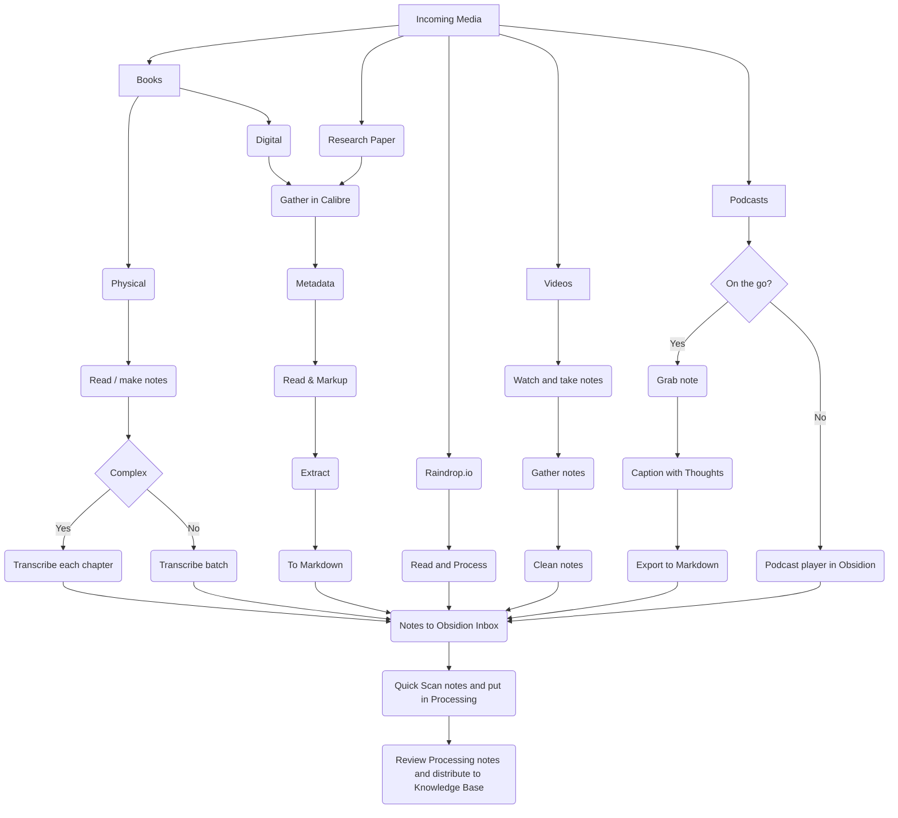

```mermaid  

graph TD; 

 A[Incoming Media] --> B[Books]

 B --> E(Physical)

 E --> I(Read / make notes)
 I --> J{Complex}
 J --> |Yes| K(Transcribe each chapter)
 J --> |No| L(Transcribe batch)
 K --> M(Notes to Obsidion Inbox)
 L --> M

 B --> F(Digital)
 F --> O(Gather in Calibre)
 O --> W(Metadata) --> X(Read & Markup) --> Y(Extract) --> Z(To Markdown) --> M

 A --> G(Research Paper)
 G --> O
 
 A --> H(Raindrop.io)

 H --> N(Read and Process)
 N --> M

 A --> C[Videos]
 
 C --> P(Watch and take notes)
 P --> Q(Gather notes)
 Q --> R(Clean notes)
 R --> M

 A --> D[Podcasts]
 D --> S{On the go?}
 S --> |Yes| T(Grab note) --> U(Caption with Thoughts) --> V(Export to Markdown) --> M
 S --> |No| AA(Podcast player in Obsidion) --> M

 M --> AB(Quick Scan notes and put in Processing) --> AC(Review Processing notes and distribute to Knowledge Base) 
 
```
