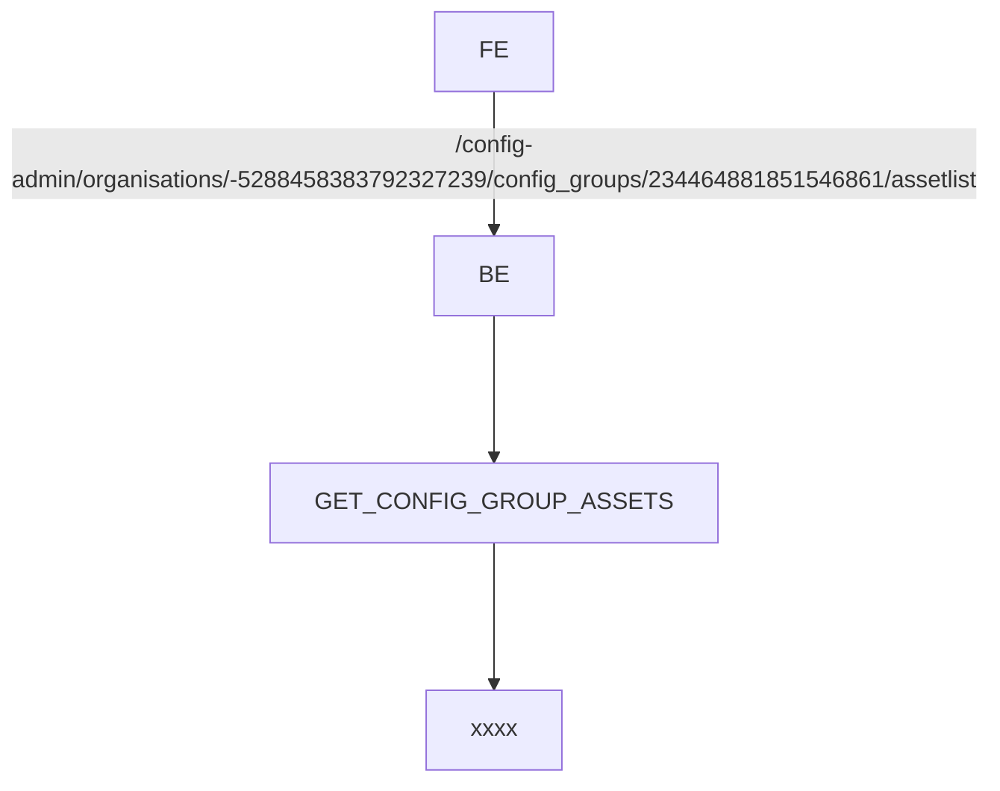

# QA-5723 Config status different

Date: 2023-03-27 Time: 07:36
Parent:: ==xxxx==
Friend:: [[2023-03-27]]
JIRA:QA-5723 Config status different
[QA-5723 MiX Tabs Beacons: Config status differ between config file and config groups - Jira (atlassian.net)](https://csojiramixtelematics.atlassian.net/browse/QA-5723)

## PRs

- DEV: https://dev.azure.com/MiXTelematics/Common/_git/DynaMiX.Backend/pullrequest/81632
- INT: [Pull request 84274: QA-5723: Added logic to change the config status for this report if it is TDI, Beacon or G52 (as per config group logic) - Repos (azure.com)](https://dev.azure.com/MiXTelematics/Common/_git/DynaMiX.Backend/pullrequest/84274)
- UAT: [Pull request 84420: QA-5723: Added logic to change the config status for this report if it is TDI... - Repos (azure.com)](https://dev.azure.com/MiXTelematics/Common/_git/DynaMiX.Backend/pullrequest/84420)


- [x] Message Yanga and Pallavi
Hi there. 
I am trying to get  QA-5723 onto INT in order for UAT to test it.
There was a blocker bug for this on DEV.
I know this was a DEV bug, but should this go to INT ⁠Pallavi Jadhav?
CONFIG-3740
IF NOT, I will just deploy my code and have it tested...
Maybe if you have capacity ⁠Yanga Somdaka?

- [x] Comment this on the issue: 
I had a look at this issue again. I almost thought it went through to UAT without me intending to do so.  
**Please note**: this has only been deployed, tested and passed on DEV.  
Next steps:  
- I will merge it to INT for testing there.  
- We need to ensure [https://csojiramixtelematics.atlassian.net/browse/CONFIG-3740](https://csojiramixtelematics.atlassian.net/browse/CONFIG-3740) has also been merged with INT if this is needed, I am busy talking to the people involved.
Once tested and passed on INT it will go through to UAT.


## Description

- The selected Organisation is QA Live Vehicles
- Navigate to MANAGE > CONFIG ADMIN > Configuration groups
- On Filters, select All
- On the right filter on ‘beacon’
- Note that the Configuration status is Configuration accepted for all assets setup with MiX Tabs Beacon
- Click on the Actions button available on one of these assets
- Select the Asset configuration file option
- Open the created file and inspect the Configuration status displayed
- BUG: The Configuration status on the file reflects “Configuration changed”. This does not correspond with the Configuration status displayed on Configuration groups
- ![[QA-5723 Config status different.png]]

## My notes

- eg. Beame _Apple #72000262
	- Beame _Apple #72000262 > Configuration changed (Excel)
	- ![[QA-5723 Config status different Config GRoup.png]]
- [x] Next steps
	- Check where Grid gets the info from
		- GetMobileUnitSummariesForConfigurationGroupMobileUnitSummary
		- 
		- mu.ConfigurationStatus
	- Check where excel gets the info from
		- GET_MOBILEUNIT_CONFIG_FILE
			- general.ConfigurationStatus
				- assetConfigFile.GeneralSection
					- DeviceConfigClient.MobileUnits.GetAssetConfigFileData
						- [mobileunit].[MobileUnit_GetMobileUnitConfigFileGeneral]
							- Temp Table @configurationStatus might be wrong
							- [x] Double check with other one 
	- Ask PO if Excel should change
- Try with actual data
	- Grid
		- https://uat.mixtelematics.com/DynaMiX.API/config-admin/organisations/-5288458383792327239/config_groups/234464881851546861/assetlist
		- Swagger? / sql
		- MObileUnit
			- groupId/{groupId}/configuration-group/{configurationGroupId}/mobile-units-summary
			- organisations: -5288458383792327239
			- config_groups: 234464881851546861
			- ==Code to overwrite==
				- TDI, Beacon, G52 gets overwritten
				- ConfigurationStatus = ConfigurationAccepted
	- Excel
		- https://uat.mixtelematics.com/DynaMiX.API/config-admin/organisations/-5288458383792327239/asset/781593186608767991/downloadMobileUnitConfigFile?auth=0d67ea4b-33fe-4e15-b131-9225238f7c544
		- Swagger? / sql
		- Asset: 781593186608767991

```sql
CREATE PROCEDURE [mobileunit].[MobileUnit_GetMobileUnitConfigFileGeneral]
  @assetId BIGINT
AS
BEGIN

  --Configuration status
  DECLARE @configurationStatus TABLE (
    StatusId            INT,
    ConfigurationStatus NVARCHAR(50)
  );

  INSERT INTO @configurationStatus VALUES(0, 'Not commissioned');
  INSERT INTO @configurationStatus VALUES(1, 'Configuration changed');
  INSERT INTO @configurationStatus VALUES(2, 'Compile requested');
  INSERT INTO @configurationStatus VALUES(3, 'Compiling');
  INSERT INTO @configurationStatus VALUES(4, 'Compile failed');
  INSERT INTO @configurationStatus VALUES(5, 'Ready for upload');
  INSERT INTO @configurationStatus VALUES(6, 'Upload requested');
  INSERT INTO @configurationStatus VALUES(7, 'Uploading configuration');
  INSERT INTO @configurationStatus VALUES(8, 'Upload success');
  INSERT INTO @configurationStatus VALUES(9, 'Upload failed');
  INSERT INTO @configurationStatus VALUES(10, 'Plug generated');
  INSERT INTO @configurationStatus VALUES(11, 'Configuration accepted');
  INSERT INTO @configurationStatus VALUES(12, 'Configuration rejected');
  INSERT INTO @configurationStatus VALUES(13, 'Unit rollback');
  INSERT INTO @configurationStatus VALUES(14, 'Configuration warning');

  --Get MobileUnit Information needed
  DECLARE @configuration TABLE (
    LegacyVehicleId         INT,
    LegacyOrgId             INT,
    MobileUnitId            BIGINT,
    ConfigurationGroup      NVARCHAR(250),
    DeviceTemplate          NVARCHAR(250),
    EventTemplate           NVARCHAR(250),
    LocationTemplate        NVARCHAR(250),
    ConfigurationStatus     NVARCHAR(50),
    ConfigurationStatusDate DATETIME
   );

  INSERT INTO @configuration
  SELECT
    amu.LegacyVehicleId,
    amu.LegacyOrgId,
    mu.MobileUnitId,
    cg.Name ConfigurationGroup,
    mdt.Name DeviceTemplate,
    et.Name EventTemplate,
    lt.Name LocationTemplate,
    cs.ConfigurationStatus ConfigurationStatus,
    mu.DateUpdated ConfigurationStatusDate
  FROM mobileunit.MobileUnits mu WITH (NOLOCK)
    INNER JOIN mobileunit.AssetMobileUnits amu WITH (NOLOCK)
    ON amu.MobileUnitKey = mu.MobileUnitKey
    INNER JOIN template.ConfigurationGroups cg WITH (NOLOCK)
    ON cg.ConfigurationGroupKey = mu.ConfigurationGroupKey
    LEFT JOIN template.MobileDeviceTemplates mdt WITH (NOLOCK)
    ON mdt.MobileDeviceTemplateKey = cg.MobileDeviceTemplateKey
    LEFT JOIN template.EventTemplates et WITH (NOLOCK)
    ON et.EventTemplateKey = cg.EventTemplateKey
    LEFT JOIN template.LocationTemplates lt WITH (NOLOCK)
    ON lt.LocationTemplateKey = cg.LocationTemplateKey
    LEFT JOIN @configurationStatus cs
    ON cs.StatusId = mu.ConfigurationStatus
  WHERE amu.AssetId = @assetId;
  
  --Legacy info
  DECLARE @legacyVehicleId INT = (SELECT LegacyVehicleId FROM @configuration);
  DECLARE @legacyOrgId INT = (SELECT LegacyOrgId FROM @configuration);

  --Organisation information
  DECLARE @sConnectDatabase NVARCHAR(250);
  SELECT @sConnectDatabase = sConnectDatabase
  FROM [$(Controller)].[dbo].[Organisation]
  WHERE liOrgID = @legacyOrgId;

  --Vehicle information
  IF OBJECT_ID('tempdb..#AssetDetails') IS NOT NULL
      DROP TABLE #AssetDetails

  CREATE TABLE #AssetDetails
  (
    VehicleID      INT,
    VehicleDetails NVARCHAR(200),
    SiteID         INT,
    SiteName       NVARCHAR(200)
  )

  DECLARE @SQL NVARCHAR(MAX) = 'USE [' + @sConnectDatabase + ']
    INSERT INTO #AssetDetails (VehicleID, VehicleDetails, SiteID, SiteName)
    SELECT v.iVehicleID, v.sDesc, s.liSiteID, s.sName
    FROM dbo.Vehicles v WITH (NOLOCK) 
    INNER JOIN dbo.Sites s WITH (NOLOCK) 
      ON v.liSiteID = s.liSiteID
    WHERE v.iVehicleID = '+ CONVERT(VARCHAR(100), @legacyVehicleId);
  execute (@SQL)

  --Return values
  SELECT
    c.MobileUnitId,
    a.VehicleID,
    a.VehicleDetails,
    a.SiteName,
    c.ConfigurationGroup,
    c.DeviceTemplate,
    c.EventTemplate,
    c.LocationTemplate,
    c.ConfigurationStatus,
    c.ConfigurationStatusDate
  FROM @configuration c
    INNER JOIN #AssetDetails a
    ON a.VehicleID = c.LegacyVehicleId

END
```

## TEST

- INT: 

## Chart




