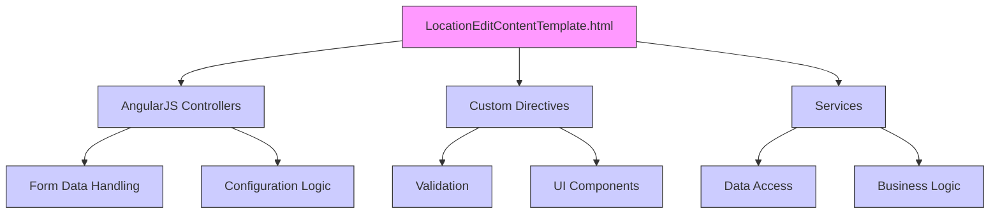

# In-depth Architectural Review and Refactoring Plan for LocationEditContentTemplate.html

## 1. Introduction
This document provides a detailed architectural review and refactoring plan for the LocationEditContentTemplate.html file within the ConfigAdmin/Templates directory of the MiX.Fleet.UI project. The template is used for editing location configurations, including parameters such as name, type, and settings. This review identifies dependencies, structure, and potential improvements to enhance maintainability and reduce technical debt.

## 2. Template Structure Overview
The LocationEditContentTemplate.html file contains a form for configuring location-related settings. Based on the code structure, the key sections include:
- **Form Fields**: Input fields for location details, such as name, type, and configuration parameters.
- **AngularJS Bindings**: ng-model for data binding and dmx-validate for validation.
- **Custom Directives**: Usage of fleet-button and dmx-language-select for UI components.
- **Dependencies**: Connections to AngularJS controllers, services, and validation logic.

## 3. Dependencies and Connections
### AngularJS Bindings
- **ng-model**: Used for two-way data binding between the form fields and the underlying JavaScript controllers. For example, `ng-model="form.name"` binds to a form field.
- **dmx-validate**: Used for validation, indicating integration with a validation service.

### Custom Directives
- **fleet-button**: A custom directive for styled buttons.
- **dmx-language-select**: A directive for language selection, likely tied to translation services.

### JavaScript Components
- **Controllers**: The template interacts with controllers for handling form submissions, data retrieval, and business logic.
- **Services**: Dependencies on services for data access, validation, and configuration management.

### Services
- **Data Access Service**: Handles fetching and saving location data.
- **Validation Service**: Implements dmx-validate attributes for form validation.
- **Translation Service**: Supports multi-language functionality via dmx-translate attributes.

## 4. Detailed Analysis of LocationEditContentTemplate.html
### Functionality
The template allows users to edit location configurations, including:
- **Form Inputs**: Fields for location name, type, and settings like overspeeding thresholds, delay times, and other parameters.
- **Event Handling**: ng-change directives for triggering actions when form values change.
- **Security Features**: Input sanitization and validation to prevent XSS and ensure data integrity.

### Key Dependencies
- **Controllers**: The template relies on controllers to manage form state and data flow.
- **Services**: Services for data persistence, validation, and configuration updates.
- **Directives**: Custom UI components that enhance the user experience.

### Potential Issues
- **Hard-coded Values**: Some strings or parameters may be hard-coded, making maintenance difficult.
- **Security Risks**: Potential for XSS if input sanitization is not robust.
- **Performance**: Heavy use of AngularJS digest cycles could cause performance issues with complex forms.

## 5. Refactoring Plan
### Phase 1: Analysis and Documentation
- **Tasks**: Review the template for hard-coded values, security vulnerabilities, and inconsistent patterns.
- **Timeline**: 1 day.

### Phase 2: Standardization and Cleanup
- **Tasks**:
  - Replace hard-coded values with constants or configuration files.
  - Standardize input fields and naming conventions.
  - Add comments and documentation for clarity.
- **Timeline**: 2 days.

### Phase 3: Dependency Management
- **Tasks**:
  - Refactor custom directives to be modular and reusable.
  - Centralize validation logic to reduce redundancy.
  - Optimize AngularJS bindings for better performance.
- **Timeline**: 3 days.

### Phase 4: Testing and Deployment
- **Tasks**:
  - Add unit tests for form validations and data handling.
  - Perform integration testing to ensure functionality.
  - Deploy to a staging environment for user feedback.
- **Timeline**: 2 days.

## 6. Technical Debt Consideration
- **Hard-coded Values**: Replace with configuration files to improve maintainability.
- **Security Risks**: Implement input sanitization and use AngularJS's built-in sanitization features.
- **Performance**: Optimize AngularJS by minimizing digest cycles and using efficient data binding.
- **Documentation**: Add detailed comments and a README for the template.

## 7. Mermaid Diagram of Dependencies
Here is a visual representation of the dependencies for LocationEditContentTemplate.html:

## 8. Conclusion
This plan provides a comprehensive approach to refactoring LocationEditContentTemplate.html, addressing current issues and leveraging best practices. The template's structure and dependencies have been thoroughly analyzed, and the plan is ready for implementation. Please review and approve this plan or request adjustments.