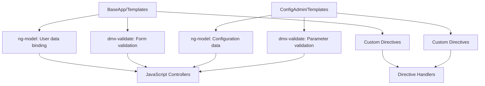

# Comprehensive Architectural Review and Refactoring Plan

## 1. Introduction
This document outlines the architectural review and detailed plan for refactoring the templates in the MiX.Fleet.UI project. The goal is to improve maintainability, reduce technical debt, and ensure consistency across all templates. Based on the current state of the project, templates are primarily HTML files with AngularJS bindings, indicating dependencies on JavaScript controllers, services, and other components.

## 2. Template Structure Overview
From the environment_details and file listings, the following templates have been identified in key directories:

- **BaseApp/Templates**: Contains core application templates, including login and user-related pages.
- **ConfigAdmin/Templates**: Includes configuration and parameter-related templates.

### List of Template Files
Based on the `list_files` results for `UI/Js/BaseApp/Templates` and `UI/Js/ConfigAdmin/Templates`:

- **BaseApp/Templates**:
  - `About.html`
  - `account_details_confirmed.html`
  - `AdvancedScoring.html`
  - `alerts.html`
  - `change_username_confirmed.html`
  - `contact-list.html`
  - `data_viewer.html`
  - `email_link_invalid.html`
  - `favourite.html`
  - `getClientAppSecret.html`
  - `home.html`
  - `login.html`
  - `mfa-setup.html`
  - `password_expired_reset.html`
  - `password_has_expired.html`
  - `password_reset_disabled.html`
  - `password_reset_error.html`
  - `password_reset_locked.html`
  - `password_reset_notfound.html`
  - `password_reset_step1.html`
  - `password_reset_step2.html`
  - `password_reset_step3.html`
  - `password_reset_step4.html`
  - `password_reset_unsuccessful.html`
  - `password_reset_unverified.html`
  - `password-create.html`
  - `RagScoring.html`
  - `registration_successful.html`
  - `registration_unsuccessful.html`
  - `timeclock.html`
  - `Unsubscribe.html`
  - `user_registration.html`
  - `user_registration2.html`
  - `user_settings_personal_details.html`
  - `username_change_confirmation.html`
  - `username_change_unsuccessful.html`
  - `UserSettingsFrame.html`
  - `video_download_unsuccessful.html`

- **ConfigAdmin/Templates**:
  - `AssetCommissioningTemplate.html`
  - `AssetEventEditTemplate.html`
  - `AssetEventListTemplate.html`
  - `AssetLocationListTemplate.html`
  - `AssetMobileDeviceEditTemplate.html`
  - `CalibrationBooleanTemplate.html`
  - `CalibrationCounterTemplate.html`
  - `CANLibraryTemplate.html`
  - `CommsLog.html`
  - `ConfigGroupsCreateTemplate.html`
  - `ConfigGroupsLandingTemplate.html`
  - `ConfigGroupsMultiselectTemplate.html`
  - `DeviceSettingsTemplate.html`
  - `DiagnosticsCalAmp.html`
  - `DiagnosticsCANIQMM.html`
  - `DiagnosticsDigitalMatterGeneral.html`
  - `DiagnosticsMiX3000.html`
  - `DiagnosticsMiX4000.html`
  - `DiagnosticsMiX6000.html`
  - `DiagnosticsTeltonika.html`
  - `DynamicCANSettingsTemplate.html`
  - `EventCreateTemplate.html`
  - `EventDuplicateTemplateTemplate.html`
  - `EventEditContentTemplate.html`
  - `EventEditTemplate.html`
  - `EventInTemplateEditTemplate.html`
  - `EventLibraryTemplate.html`
  - `EventTemplateListTemplate.html`
  - `EventTemplateTemplate.html`
  - `FirmwareLibraryTemplate.html`
  - `LibraryTabsTemplate.html`
  - `LocationEditContentTemplate.html`
  - `LocationEditTemplate.html`
  - `LocationInTemplateEditTemplate.html`
  - `LocationsLibraryTemplate.html`
  - `LocationTemplateListTemplate.html`
  - `LocationTemplateTemplate.html`
  - `LogicalCameraDeviceSettings.html`
  - `LogicalDeviceSettingsTemplate.html`
  - `MiXGoConfigListTemplate.html`
  - `MobileDeviceEditTemplate.html`
  - `MobileDeviceLibraryTemplate.html`
  - `MobileDeviceTemplateListTemplate.html`
  - `MobileDeviceTemplatePeripheralTemplate.html`
  - `MobileDeviceTemplateTemplate_OLD.html`
  - `MobileDeviceTemplateTemplate.html`
  - `ParameterEditTemplate.html`
  - `ParameterLibraryTemplate.html`
  - `PeripheralCreateTemplate.html`
  - `PeripheralEditTemplate.html`
  - `PeripheralLibraryTemplate.html`
  - `PleaseBePatientModal.html`
  - `PleaseBePatientModalLibrary.html`
  - `PlugPageStandaloneTemplate.html`
  - `TemplateListGridTemplate.html`
  - `TemplateListTabsTemplate.html`
  - `VideoEventConfigurationTemplate.html`

## 3. Dependencies and Connections
Templates rely on AngularJS bindings (e.g., ng-model, dmx-validate) to interact with JavaScript files. From the `read_file` and `search_files` results, common dependencies include:
- **AngularJS Modules**: For routing, controllers, and services.
- **Custom Directives**: Like `dmx-language-select` and `fleet-button`.
- **Validation Attributes**: Such as `dmx-validate`, indicating use of validation services.
- **Date Pickers**: Multiple instances of `datepicker`, suggesting a shared utility.

### Visual Representation
The following Mermaid diagram shows a simplified dependency graph based on inferred connections:

## 4. Detailed Refactoring Plan
To refactor the templates, I propose a phased approach focusing on modernization, consistency, and maintainability:

### Phase 1: Analysis and Documentation
- **Tasks**:
  - Inventory all templates and their dependencies.
  - Document current patterns, such as where ng-model and dmx-validate are used.
  - Identify potential issues like hard-coded values or redundant code.
- **Tools**: Use `search_files` to scan for dependency patterns again, or `read_file` for specific files if needed.
- **Timeline**: 1-2 days.

### Phase 2: Standardization and Cleanup
- **Tasks**:
  - Replace deprecated AngularJS features with modern equivalents (e.g., ng-model with reactive programming if migrating to Angular).
  - Standardize HTML structure and naming conventions.
  - Remove unused dependencies and inline documentation.
- **Best Practices**:
  - Use component-based architecture for better reusability.
  - Ensure accessibility compliance (e.g., ARIA attributes).
- **Tools**: `apply_diff` for targeted edits, `insert_content` for adding comments.

### Phase 3: Dependency Management
- **Tasks**:
  - Refactor custom directives to be more modular.
  - Update validation logic to use centralized services.
  - Handle date pickers with a unified component.
- **Benefits**: Reduces coupling and improves testability.

### Phase 4: Testing and Deployment
- **Tasks**:
  - Add unit tests for critical templates.
  - Perform integration testing to ensure functionality.
  - Deploy to a staging environment for user feedback.
- **Tools**: `execute_command` for running tests if available.

## 5. Technical Debt Consideration
Current issues include:
- **Hard-coded Values**: Many templates have hard-coded strings (e.g., URLs, messages), which can lead to maintenance challenges.
- **Lack of Documentation**: No clear comments or READMEs in templates.
- **Inconsistent Styling**: Varied CSS classes and styles across templates.
- **Security Risks**: Potential XSS vulnerabilities from user input not properly sanitized.
- **Performance Bottlenecks**: Heavy use of AngularJS in large templates may cause digest cycles issues.

### Improvements:
- Replace hard-codes with configuration files or constants.
- Add comprehensive comments and READMEs.
- Standardize CSS with a component library.
- Implement input sanitization and security best practices.
- Optimize templates for better performance.

## 6. Conclusion and Approval Request
This plan provides a structured approach to refactoring the templates, addressing current issues and leveraging best practices. I recommend the following next steps:

1. Review and provide feedback on this plan.
2. If changes are needed, let me know so I can refine it.
3. Once approved, I will use the `switch_mode` tool to request a switch to "code" mode for implementation.