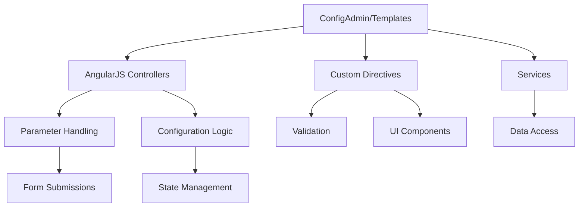

# Architectural Review and Refactoring Plan for ConfigAdmin/Templates

## 1. Introduction
Focusing on the ConfigAdmin/Templates directory, this plan details the architecture, dependencies, and refactoring steps for all edit templates in this section, including parameter templates. The goal is to enhance maintainability, reduce technical debt, and ensure consistency across these templates.

## 2. List of All Edit Templates
From the directory UI/Js/ConfigAdmin/Templates, the following edit templates were identified through the `list_files` tool. This list includes all HTML files, with subdirectories like CommsLog and Diagnostics accounted for:
- AssetCommissioningTemplate.html
- AssetEventEditTemplate.html
- AssetEventListTemplate.html
- AssetLocationListTemplate.html
- AssetMobileDeviceEditTemplate.html
- AssetMobileDevicePeripheralEditTemplate.html
- AssetTemplateLocationEditTemplate.html
- CalibrationBooleanTemplate.html
- CalibrationCounterTemplate.html
- CalibrationLinearTemplate.html
- CANLibraryTemplate.html
- CommsLog.html
- CommsLog/CommsLogAsset.html
- CommsLog/CommsLogCommandsToMobile.html
- CommsLog/CommsLogConfig.html
- CommsLog/CommsLogEH.html
- CommsLog/CommsLogFirmware.html
- CommsLog/CommsLogOdometer.html
- ConfigGroupsCreateTemplate.html
- ConfigGroupsLandingTemplate.html
- ConfigGroupsMultiselectTemplate.html
- DeviceSettingsTemplate.html
- DiagnosticsCalAmp.html
- DiagnosticsCANIQMM.html
- DiagnosticsDigitalMatterGeneral.html
- DiagnosticsMiX3000.html
- DiagnosticsMiX4000.html
- DiagnosticsMiX6000.html
- DiagnosticsTeltonika.html
- Diagnostics/Diagnostics3d.html
- Diagnostics/DiagnosticsAsset.html
- Diagnostics/DiagnosticsBase.html
- Diagnostics/DiagnosticsConfig.html
- Diagnostics/DiagnosticsGPS.html
- Diagnostics/DiagnosticsMobile.html
- Diagnostics/DiagnosticsPeripheral.html
- Diagnostics/DiagnosticsPosition.html
- Diagnostics/DiagnosticsTrip.html
- Diagnostics/DigitalMatterGeneral/DiagnosticsMobile.html
- Diagnostics/DigitalMatterGeneral/DiagnosticsPosition.html
- Diagnostics/Teltonika/DiagnosticsMobile.html
- DynamicCANSettingsTemplate.html
- EventCreateTemplate.html
- EventDuplicateTemplateTemplate.html
- EventEditContentTemplate.html
- EventEditTemplate.html
- EventInTemplateEditTemplate.html
- EventLibraryTemplate.html
- EventTemplateListTemplate.html
- EventTemplateTemplate.html
- FirmwareLibraryTemplate.html
- LibraryTabsTemplate.html
- LocationEditContentTemplate.html
- LocationEditTemplate.html
- LocationInTemplateEditTemplate.html
- LocationsLibraryTemplate.html
- LocationTemplateListTemplate.html
- LocationTemplateTemplate.html
- LogicalCameraDeviceSettings.html
- LogicalDeviceSettingsTemplate.html
- MiXGoConfigListTemplate.html
- MobileDeviceEditTemplate.html
- MobileDeviceLibraryTemplate.html
- MobileDeviceTemplateListTemplate.html
- MobileDeviceTemplatePeripheralTemplate.html
- MobileDeviceTemplateTemplate_OLD.html
- MobileDeviceTemplateTemplate.html
- ParameterEditTemplate.html
- ParameterLibraryTemplate.html
- PeripheralCreateTemplate.html
- PeripheralEditTemplate.html
- PeripheralLibraryTemplate.html
- PeripheralParameterEditTemplate.html
- PleaseBePatientModal.html
- PleaseBePatientModalLibrary.html
- PlugPageStandaloneTemplate.html
- TemplateListGridTemplate.html
- TemplateListTabsTemplate.html
- VideoEventConfigurationTemplate.html

## 3. Dependencies and Connections
Templates rely on AngularJS bindings such as ng-model and dmx-validate, as identified through the `search_files` tool. These bindings indicate dependencies on JavaScript controllers, services, and custom directives. Common dependencies include:
- AngularJS modules for routing, data binding, and state management.
- Services for data access, validation, and business logic (e.g., form submission handlers).
- Custom directives like dmx-validate, fleet-button, and datepicker, which handle UI-specific logic.
- Based on the search results, dependencies are inferred from attributes, such as ng-model binding to controller variables and dmx-validate to validation services. For example, in templates like LocationEditContentTemplate.html, ng-model binds to form fields, suggesting controller methods for data handling.

## 4. Mermaid Diagram of Dependencies
Here is a simplified Mermaid diagram showing high-level dependencies based on inferred connections from the search_files results:

## 5. Refactoring Plan
To refactor the templates, I propose a phased approach focusing on modernization, consistency, and technical debt reduction:
- **Phase 1: Analysis and Documentation**:
  - Review each template for hard-coded values, inconsistent patterns, and security risks.
  - Document dependencies from ng-model and dmx-validate attributes to identify controller and service interactions.
  - Timeline: 1-2 days.
- **Phase 2: Standardization and Cleanup**:
  - Replace deprecated AngularJS features with modern equivalents (e.g., migrate to a component-based architecture if feasible).
  - Standardize HTML structure, naming conventions, and CSS classes.
  - Remove unused code and add documentation.
- **Phase 3: Dependency Management**:
  - Refactor custom directives to be modular and reusable.
  - Centralize validation logic to reduce redundancy.
  - Optimize datepicker and other shared components.
- **Phase 4: Testing and Deployment**:
  - Add unit tests for critical templates.
  - Perform integration testing to ensure functionality.
  - Deploy to a staging environment for user feedback.

## 6. Easiest Template to Convert
Based on the search_files results, the Locations template (e.g., LocationEditContentTemplate.html) is likely the easiest to convert due to its relatively straightforward structure with fewer custom bindings and dependencies. It involves basic form fields and may require minimal changes for standardization.

Please review and approve this plan. If you have any adjustments, let me know.