# ConfigAdmin Template Rewrite Plan

## 1. Objective

Rewrite the AngularJS-based `*template*.html` files located primarily within the `UI/Js/ConfigAdmin/` directory structure of the MiX.Fleet.UI project.

## 2. Scope

*   **In Scope:** All `*.html` template files under `UI/Js/ConfigAdmin/`, including shared templates referenced via `ng:include` (often prefixed with `_cdn/Templates/ConfigAdmin/`) and dynamically included templates (e.g., calibration templates, property-specific templates loaded via `property.templateUrl`).
*   **Out of Scope (for now):** Templates residing in other directories like `UI/Js/Operations/`, `UI/Js/JourneyManagement/`, `UI/Js/Tracking/`, `UI/Js/FleetAdmin/`, unless they are identified as essential shared dependencies for `ConfigAdmin` templates during the rewrite.

## 3. Identified Templates (ConfigAdmin Focus)

### Main Template Files (Examples from initial analysis):
*   `UI/Js/ConfigAdmin/Templates/MobileDeviceTemplateTemplate.html`
*   `UI/Js/ConfigAdmin/Templates/LocationTemplateTemplate.html`
*   `UI/Js/ConfigAdmin/Templates/EventTemplateTemplate.html`
*   `UI/Js/ConfigAdmin/Templates/EventDuplicateTemplateTemplate.html`
*   `UI/Js/ConfigAdmin/Templates/MobileDeviceTemplatePeripheralTemplate.html`
*   `UI/Js/ConfigAdmin/Templates/AssetMobileDevicePeripheralEditTemplate.html`
*   `UI/Js/ConfigAdmin/Templates/LogicalDeviceSettingsTemplate.html`
*   `UI/Js/ConfigAdmin/Templates/LogicalCameraDeviceSettings.html`
*   `UI/Js/ConfigAdmin/Templates/EventCreateTemplate.html`
*   `UI/Js/ConfigAdmin/Templates/EventEditTemplate.html`
*   `UI/Js/ConfigAdmin/Templates/EventInTemplateEditTemplate.html`
*   `UI/Js/ConfigAdmin/Templates/EventLibraryTemplate.html`
*   `UI/Js/ConfigAdmin/Templates/EventTemplateListTemplate.html`
*   `UI/Js/ConfigAdmin/Templates/LocationEditTemplate.html`
*   `UI/Js/ConfigAdmin/Templates/LocationInTemplateEditTemplate.html`
*   `UI/Js/ConfigAdmin/Templates/LocationsLibraryTemplate.html`
*   `UI/Js/ConfigAdmin/Templates/LocationTemplateListTemplate.html`
*   `UI/Js/ConfigAdmin/Templates/MobileDeviceEditTemplate.html`
*   `UI/Js/ConfigAdmin/Templates/MobileDeviceLibraryTemplate.html`
*   `UI/Js/ConfigAdmin/Templates/MobileDeviceTemplateListTemplate.html`
*   `UI/Js/ConfigAdmin/Templates/PeripheralCreateTemplate.html`
*   `UI/Js/ConfigAdmin/Templates/PeripheralEditTemplate.html`
*   `UI/Js/ConfigAdmin/Templates/PeripheralLibraryTemplate.html`
*   `UI/Js/ConfigAdmin/Templates/ParameterEditTemplate.html`
*   `UI/Js/ConfigAdmin/Templates/ParameterLibraryTemplate.html`
*   `UI/Js/ConfigAdmin/Templates/PeripheralParameterEditTemplate.html`
*   `UI/Js/ConfigAdmin/Templates/AssetEventEditTemplate.html`
*   `UI/Js/ConfigAdmin/Templates/AssetTemplateLocationEditTemplate.html`
*   `UI/Js/ConfigAdmin/Templates/CANLibraryTemplate.html`
*   `UI/Js/ConfigAdmin/Templates/FirmwareLibraryTemplate.html`
*   *(Note: This list is based on initial analysis and may not be exhaustive. Further exploration during implementation might reveal more templates.)*

### Shared/Included Templates (within `_cdn/Templates/ConfigAdmin/`):
*   `TemplateListTabsTemplate.html` (Tabs for Template management screens)
*   `LibraryTabsTemplate.html` (Tabs for Library management screens)
*   `PleaseBePatientModal.html` / `PleaseBePatientModalLibrary.html` (Loading modals)
*   `DeviceSettingsTemplate.html` (Common device settings fields)
*   `LogicalDeviceSettingsTemplate.html` (Displays non-camera logical device settings; includes dynamic property templates)
*   `LogicalCameraDeviceSettings.html` (Displays camera settings; includes dynamic property templates)
*   `EventEditContentTemplate.html` (Core form fields for event editing)
*   `LocationEditContentTemplate.html` (Core form fields for location editing)
*   `TemplateListGridTemplate.html` (Grid display for template lists)
*   *(Dynamically included calibration templates)*
*   *(Dynamically included property templates via `property.templateUrl`)*

## 4. Dependency Analysis

The templates exhibit significant reuse through `ng:include`. Core settings, layout components, and editing forms are often encapsulated in shared templates.

```mermaid
graph TD
    subgraph Shared Core Templates
        A[_cdn/.../PleaseBePatientModal*.html]
        B[_cdn/.../DeviceSettingsTemplate.html]
        C[_cdn/.../LogicalDeviceSettingsTemplate.html] --> D{Dynamic Property Templates}
        E[_cdn/.../LogicalCameraDeviceSettings.html] --> D
        F[_cdn/.../EventEditContentTemplate.html]
        G[_cdn/.../LocationEditContentTemplate.html]
    end

    subgraph Shared Navigation/Layout Templates
        H[_cdn/.../TemplateListTabsTemplate.html]
        I[_cdn/.../LibraryTabsTemplate.html]
        J[_cdn/.../TemplateListGridTemplate.html]
    end

    subgraph Main Template Screens
        K[MobileDeviceTemplateTemplate.html] --> H & A
        L[LocationTemplateTemplate.html] --> H
        M[EventTemplateTemplate.html] --> H
        N[EventDuplicateTemplateTemplate.html] --> H
        O[MobileDeviceTemplatePeripheralTemplate.html] --> H & A & B & C & E
        P[...TemplateListTemplate.html] --> H & J
    end

    subgraph Main Library Screens
        Q[MobileDeviceLibraryTemplate.html] --> I & A(PleaseBePatientModalLibrary.html)
        R[LocationLibraryTemplate.html] --> I & A
        S[EventLibraryTemplate.html] --> I & A
        T[PeripheralLibraryTemplate.html] --> I & A
        U[ParameterLibraryTemplate.html] --> I & A
        V[FirmwareLibraryTemplate.html] --> I & A
        W[CANLibraryTemplate.html] --> I
    end

    subgraph Edit Screens
        X[MobileDeviceEditTemplate.html] --> I & B & C
        Y[LocationEditTemplate.html] --> I & G
        Z[EventEditTemplate.html] --> I & F
        AA[PeripheralEditTemplate.html] --> I & B & C & E
        AB[ParameterEditTemplate.html] --> I
        AC[PeripheralParameterEditTemplate.html] --> I
    end

    subgraph Asset Edit Screens
        AD[AssetMobileDevicePeripheralEditTemplate.html] --> A & B & C
        AE[AssetEventEditTemplate.html] --> F
        AF[AssetTemplateLocationEditTemplate.html] --> G
    end

    A & B & C & E & F & G & H & I & J --> K & L & M & N & O & P & Q & R & S & T & U & V & W & X & Y & Z & AA & AB & AC & AD & AE & AF

    style Shared Core Templates fill:#f9f,stroke:#333,stroke-width:2px
    style Shared Navigation/Layout Templates fill:#ccf,stroke:#333,stroke-width:2px
    style Main Template Screens fill:#cfc,stroke:#333,stroke-width:2px
    style Main Library Screens fill:#ffc,stroke:#333,stroke-width:2px
    style Edit Screens fill:#fcc,stroke:#333,stroke-width:2px
    style Asset Edit Screens fill:#cff,stroke:#333,stroke-width:2px
```

## 5. Suggested Rewrite Order

1.  **Core Shared Templates:** Start with the most deeply nested and widely used shared templates under `_cdn/Templates/ConfigAdmin/`:
    *   `PleaseBePatientModal.html` / `PleaseBePatientModalLibrary.html`
    *   `DeviceSettingsTemplate.html`
    *   `LogicalDeviceSettingsTemplate.html` (Requires identifying/rewriting the dynamic property templates it includes)
    *   `LogicalCameraDeviceSettings.html` (Requires identifying/rewriting the dynamic property templates it includes)
    *   `EventEditContentTemplate.html`
    *   `LocationEditContentTemplate.html`
    *   *(Identify and rewrite dynamic calibration templates)*
2.  **Navigation/Layout Shared Templates:**
    *   `TemplateListTabsTemplate.html`
    *   `LibraryTabsTemplate.html`
    *   `TemplateListGridTemplate.html`
3.  **Main Screens (Templates, Libraries, Edits):** Once the shared components are rewritten, tackle the main container templates, following the dependencies outlined in the diagram (e.g., `MobileDeviceTemplateTemplate.html`, `LocationTemplateTemplate.html`, `MobileDeviceLibraryTemplate.html`, etc.).
4.  **Asset-Specific Screens:** Address templates used for editing configurations directly on assets (e.g., `AssetMobileDevicePeripheralEditTemplate.html`).

This order aims to minimize rework by ensuring foundational components are stable before building upon them.