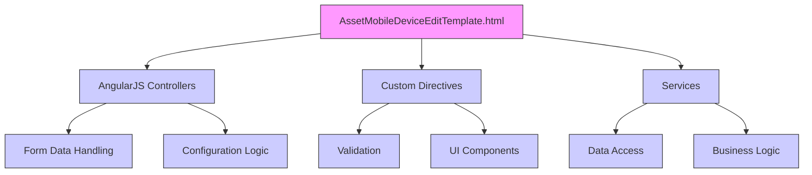

# In-depth Architectural Review and Refactoring Plan for AssetMobileDeviceEditTemplate.html

## 1. Introduction
This document provides a detailed architectural review and refactoring plan for the AssetMobileDeviceEditTemplate.html file within the ConfigAdmin/Templates directory of the MiX.Fleet.UI project. The template is used for editing mobile device configurations, including parameters such as device type, lines, and connections. This review identifies dependencies, structure, and potential improvements to enhance maintainability and reduce technical debt.

## 2. Template Structure Overview
The AssetMobileDeviceEditTemplate.html file contains a form for configuring mobile device-related settings. Based on the code structure, the key sections include:
- **Form Fields**: Input fields for device details, such as template name, lines, and peripheral devices.
- **AngularJS Bindings**: ng-model for data binding and dmx-validate for validation.
- **Custom Directives**: Usage of fleet-button, dmx-language-select, and ng-include for UI components.
- **Dependencies**: Connections to AngularJS controllers, services, and validation logic.

## 3. Dependencies and Connections
### AngularJS Bindings
- **ng-model**: Used for two-way data binding between the form fields and the underlying JavaScript controllers. For example, `ng-model="form.description"` binds to a form field.
- **dmx-validate**: Used for validation, indicating integration with a validation service.

### Custom Directives
- **fleet-button**: A custom directive for styled buttons.
- **dmx-language-select**: A directive for language selection, likely tied to translation services.
- **ng-include**: Used to include other template files, such as LibraryTabsTemplate.html and PleaseBePatientModal.html.

### JavaScript Components
- **Controllers**: The template interacts with controllers for handling form submissions, data retrieval, and business logic.
- **Services**: Dependencies on services for data access, validation, and configuration management.

### Services
- **Data Access Service**: Handles fetching and saving mobile device data.
- **Validation Service**: Implements dmx-validate attributes for form validation.
- **Translation Service**: Supports multi-language functionality via dmx-translate attributes.

## 4. Detailed Analysis of AssetMobileDeviceEditTemplate.html
### Functionality
The template allows users to edit mobile device configurations, including:
- **Form Inputs**: Fields for device name, template description, and line configurations, including VIN match and tacho settings.
- **Event Handling**: ng-change and ng-click directives for triggering actions when form values change or buttons are clicked.
- **Security Features**: Input sanitization and validation to prevent XSS and ensure data integrity.

### Key Dependencies
- **Controllers**: The template relies on controllers to manage form state, data flow, and tab navigation.
- **Services**: Services for data persistence, validation, and configuration updates.
- **Directives**: Custom UI components that enhance the user experience, including tabbed interfaces and modal dialogs.

### Potential Issues
- **Hard-coded Values**: Some strings or parameters may be hard-coded, making maintenance difficult.
- **Security Risks**: Potential for XSS if input sanitization is not robust.
- **Performance**: Heavy use of AngularJS digest cycles could cause performance issues with complex forms and large datasets.

## 5. Refactoring Plan
### Phase 1: Analysis and Documentation
- **Tasks**: Review the template for hard-coded values, security vulnerabilities, and inconsistent patterns.
- **Timeline**: 1 day.

### Phase 2: Standardization and Cleanup
- **Tasks**:
  - Replace hard-coded values with constants or configuration files.
  - Standardize input fields and naming conventions.
  - Add comments and documentation for clarity.
- **Timeline**: 2 days.

### Phase 3: Dependency Management
- **Tasks**:
  - Refactor custom directives to be modular and reusable.
  - Centralize validation logic to reduce redundancy.
  - Optimize AngularJS bindings for better performance.
- **Timeline**: 3 days.

### Phase 4: Testing and Deployment
- **Tasks**:
  - Add unit tests for form validations and data handling.
  - Perform integration testing to ensure functionality.
  - Deploy to a staging environment for user feedback.
- **Timeline**: 2 days.

## 6. Technical Debt Consideration
- **Hard-coded Values**: Replace with configuration files to improve maintainability.
- **Security Risks**: Implement input sanitization and use AngularJS's built-in sanitization features.
- **Performance**: Optimize AngularJS by minimizing digest cycles and using efficient data binding.
- **Documentation**: Add detailed comments and a README for the template.

## 7. Mermaid Diagram of Dependencies
Here is a visual representation of the dependencies for AssetMobileDeviceEditTemplate.html:

## 8. Conclusion
This plan provides a comprehensive approach to refactoring AssetMobileDeviceEditTemplate.html, addressing current issues and leveraging best practices. The template's structure and dependencies have been thoroughly analyzed, and the plan is ready for implementation. Please review and approve this plan or request adjustments.