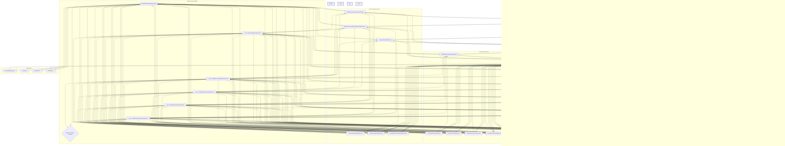

>[!Question] I am looking into rewriting the templates I have in this solution. Basically whereever you see *template*.html, most of those files will need to be rewritten. Please bring up a list of templates and how they are used within other templates. Please start on the open tabs.

---

Okay, I understand the task. You want to identify all `*template*.html` files within the `MiX.Fleet.UI` solution, understand how they relate to each other (specifically, how templates are used within other templates), and then plan the rewrite process. You've asked me to start with the files currently open in your editor.

Here's my plan:

1.  **Analyze Open Files:** I'll read the content of each open HTML template file provided in the `environment_details` to understand their structure and look for patterns of how they might include or reference other templates.
2.  **Identify All Templates:** I'll use the `search_files` tool to locate all files matching the pattern `*template*.html` within the relevant directories (likely starting under `UI/Js/`).
3.  **Map Template Dependencies:** I'll use `search_files` again to search across all HTML files (`*.html`) for references to the template filenames found in step 2. This will help build a dependency map showing which templates use which other templates.
4.  **Present Findings & Plan:** I'll summarize the list of templates and their relationships. Based on this, I'll propose a more detailed plan for the rewrite, potentially including a suggested order based on dependencies.
5.  **User Review:** You'll review the findings and the proposed plan. We can refine it together.
6.  **Save Plan (Optional):** If you approve the plan, I can save it to a markdown file for future reference.
7.  **Mode Switch:** Finally, I'll suggest switching to the 'code' mode to begin the implementation of the rewrite based on the approved plan.

Let's start by examining the first open file: `UI/Js/ConfigAdmin/Templates/MobileDeviceTemplateTemplate.html`.

---

Okay, I've analyzed the first file, `UI/Js/ConfigAdmin/Templates/MobileDeviceTemplateTemplate.html`.

Here are the key observations:

1.  **Technology:** It uses AngularJS and custom directives (like `ng:include`, `dmx:translate`, `fleet:*`).
2.  **Template Inclusion:** It explicitly includes two other templates using `<ng:include>`:
    *   `_cdn/Templates/ConfigAdmin/TemplateListTabsTemplate.html` (Line 22)
    *   `_cdn/Templates/ConfigAdmin/PleaseBePatientModal.html` (Line 24)
    *   The `_cdn` prefix suggests these might be paths resolved during build/deployment, not necessarily direct source paths. We'll need to keep this in mind when searching for dependencies later.
3.  **Purpose:** This template provides the UI for managing (add/edit/duplicate) mobile device configurations, including associated peripherals/lines.

Now, let's examine the next open file: `UI/Js/ConfigAdmin/Templates/LocationTemplateTemplate.html`.

---

Okay, I've examined `UI/Js/ConfigAdmin/Templates/LocationTemplateTemplate.html`.

Observations:

1.  **Technology:** Again, it uses AngularJS and custom directives (`ng:include`, `dmx:translate`, `fleet:*`).
2.  **Template Inclusion:** It includes `_cdn/Templates/ConfigAdmin/TemplateListTabsTemplate.html` (Line 18), just like the previous template. This suggests `TemplateListTabsTemplate.html` is a common component used across different configuration template screens.
3.  **Purpose:** This template is for managing location templates, allowing users to name a template and select associated locations, which are then displayed in a grid.

Let's move on to the next open file: `UI/Js/ConfigAdmin/Templates/EventTemplateTemplate.html`.

---

Okay, I've reviewed `UI/Js/ConfigAdmin/Templates/EventTemplateTemplate.html`.

Observations:

1.  **Technology:** Consistent use of AngularJS and custom directives (`ng:include`, `dmx:translate`, `fleet:*`).
2.  **Template Inclusion:** It also includes `_cdn/Templates/ConfigAdmin/TemplateListTabsTemplate.html` (Line 18), reinforcing its role as a common UI element for these configuration templates.
3.  **Purpose:** This template is for managing event templates, allowing users to name a template and select associated events, which are displayed in a grid. It's very similar in structure to the `LocationTemplateTemplate.html`.

Let's continue with the next open file: `UI/Js/ConfigAdmin/Templates/EventDuplicateTemplateTemplate.html`.

---

Okay, I've reviewed `UI/Js/ConfigAdmin/Templates/EventDuplicateTemplateTemplate.html`.

Observations:

1.  **Technology:** AngularJS and custom directives (`ng:include`, `dmx:translate`, `fleet:*`).
2.  **Template Inclusion:** It also includes `_cdn/Templates/ConfigAdmin/TemplateListTabsTemplate.html` (Line 18).
3.  **Purpose:** This template seems specifically designed for the *duplication* process of an event template. It focuses only on capturing the new template name, unlike `EventTemplateTemplate.html` which also handles selecting events.

Next file: `UI/Js/ConfigAdmin/Templates/MobileDeviceTemplatePeripheralTemplate.html`.

---

Okay, I've reviewed `UI/Js/ConfigAdmin/Templates/MobileDeviceTemplatePeripheralTemplate.html`.

Observations:

1.  **Technology:** AngularJS and custom directives (`ng:include`, `dmx:translate`, `fleet:*`).
2.  **Template Inclusion:** This template includes several others:
    *   `_cdn/Templates/ConfigAdmin/TemplateListTabsTemplate.html` (Line 18) - The common tabs component.
    *   `_cdn/Templates/ConfigAdmin/PleaseBePatientModal.html` (Line 21) - A modal.
    *   A dynamically determined calibration template via `controller.getCalibrationTemplate(parameter)` (Line 62). This means the included template depends on the `parameter` data.
    *   `_cdn/Templates/ConfigAdmin/DeviceSettingsTemplate.html` (Line 72)
    *   `_cdn/Templates/ConfigAdmin/LogicalCameraDeviceSettings.html` (Line 73) - This is one of the currently open files.
    *   `_cdn/Templates/ConfigAdmin/LogicalDeviceSettingsTemplate.html` (Line 74) - This is also one of the currently open files.
3.  **Purpose:** This template handles the editing of peripheral devices linked to a mobile device *template*. It allows selecting the peripheral, configuring tacho, calibration, and other device-specific settings, often by including other more specific setting templates.

This file shows a clear dependency on `LogicalCameraDeviceSettings.html` and `LogicalDeviceSettingsTemplate.html`.

Let's look at the next open file: `UI/Js/ConfigAdmin/Templates/AssetMobileDevicePeripheralEditTemplate.html`.

---

Okay, I've reviewed `UI/Js/ConfigAdmin/Templates/AssetMobileDevicePeripheralEditTemplate.html`.

Observations:

1.  **Technology:** AngularJS and custom directives (`ng:include`, `dmx:translate`, `fleet:*`).
2.  **Template Inclusion:**
    *   `_cdn/Templates/ConfigAdmin/PleaseBePatientModal.html` (Line 16) - The modal.
    *   Dynamically determined calibration template via `controller.getCalibrationTemplate(parameter)` (Line 69).
    *   `_cdn/Templates/ConfigAdmin/DeviceSettingsTemplate.html` (Line 79)
    *   `_cdn/Templates/ConfigAdmin/LogicalDeviceSettingsTemplate.html` (Line 80) - One of the open files.
3.  **Purpose:** This template is very similar to `MobileDeviceTemplatePeripheralTemplate.html` but seems tailored for editing peripheral device settings directly on an *asset*, rather than within a template definition. It notably *doesn't* include the `TemplateListTabsTemplate.html` seen in the template-focused screens, but has its own tab structure (Lines 18-22). It also doesn't include `LogicalCameraDeviceSettings.html` like the template version did.
4.  **Dependency:** It includes `LogicalDeviceSettingsTemplate.html`.

Next, let's examine `UI/Js/ConfigAdmin/Templates/LogicalDeviceSettingsTemplate.html`.

---

Okay, I've reviewed `UI/Js/ConfigAdmin/Templates/LogicalDeviceSettingsTemplate.html`.

Observations:

1.  **Technology:** AngularJS and custom directives (`ng:include`, `dmx:translate`, `fleet:*`, `ui:*`).
2.  **Template Inclusion:** This template uses dynamic inclusion: `
` (Line 28). This means it includes other templates based on the value of `property.templateUrl` provided by the controller/data. These included templates likely render the specific UI controls (input fields, dropdowns, etc.) for each setting.
3.  **Purpose:** This template renders the settings UI for "logical devices" (features, settings) associated with a peripheral, *excluding* camera-specific settings (as indicated by the `ng-show` condition on line 2). It iterates through devices and their properties, displaying the name and dynamically including the appropriate input template for each property.
4.  **Dependencies:** While it doesn't statically include other named templates from the `ConfigAdmin/Templates` directory, it dynamically includes templates based on data. Crucially, we know from previous files that this template *is included by* `MobileDeviceTemplatePeripheralTemplate.html` and `AssetMobileDevicePeripheralEditTemplate.html`.

Finally, let's examine the last open file: `UI/Js/ConfigAdmin/Templates/LogicalCameraDeviceSettings.html`.

---

Okay, I've finished reviewing the last open file, `UI/Js/ConfigAdmin/Templates/LogicalCameraDeviceSettings.html`.

Observations:

1.  **Technology:** AngularJS and custom directives (`ng:include`, `dmx:translate`, `fleet:*`, `ui:*`).
2.  **Template Inclusion:** Uses dynamic inclusion: `
` (Line 105) for specific properties (like the Record Trip Driver picture setting). It also defines several modals (`fleet-modal`) directly within the template (Lines 128-151).
3.  **Purpose:** This template specifically handles the UI for configuring camera-related settings and features, including naming cameras and assigning them to channels. It has its own internal tab structure for organizing these settings.
4.  **Dependencies:** We know from reviewing `MobileDeviceTemplatePeripheralTemplate.html` that this camera settings template *is included by* it.

**Summary of Open File Analysis:**

Based on the open files, we see a pattern of using AngularJS with custom directives. Templates are included using `<ng:include src="...">` for static includes and sometimes dynamically based on controller data (e.g., `ng:include="property.templateUrl"` or `controller.getCalibrationTemplate(...)`).

Several templates appear to be shared components:

*   `_cdn/Templates/ConfigAdmin/TemplateListTabsTemplate.html`: Used in the main template management screens (Mobile Device, Location, Event).
*   `_cdn/Templates/ConfigAdmin/PleaseBePatientModal.html`: Used in several templates.
*   `_cdn/Templates/ConfigAdmin/DeviceSettingsTemplate.html`: Used when editing peripherals (both in templates and on assets).
*   `_cdn/Templates/ConfigAdmin/LogicalDeviceSettingsTemplate.html`: Used for non-camera settings display.
*   `_cdn/Templates/ConfigAdmin/LogicalCameraDeviceSettings.html`: Used for camera settings display.

**Next Step: Finding All Templates**

Now that we've analyzed the open files, let's find all files matching the `*template*.html` pattern within the `UI/Js/` directory structure, as this seems to be the primary location based on the open files.

---

That search only found one file, which is unexpected given the list of open tabs clearly shows many files matching `*template*.html` under `UI/Js/ConfigAdmin/Templates/`.

It's possible the search pattern or path needs adjustment, or the tool might not be traversing the directories as expected.

Let's try searching specifically within the directory where most of the open files reside: `UI/Js/ConfigAdmin/Templates/`. This will help confirm if the tool can find files in that specific location.

---

That's very strange. The `search_files` tool isn't finding the files even when we specify the exact directory where they are open (`UI/Js/ConfigAdmin/Templates/`). This might indicate an issue with the tool's path handling or pattern matching on your system.

Let's broaden the search again, but this time search the entire `UI` directory. Perhaps the files are referenced from a different base than expected, or the tool works better starting from a higher-level directory.

---

It seems the `search_files` tool is having trouble locating the template files under `UI/Js/ConfigAdmin/Templates/`, as it only found the one under `UI/Js/Operations/`. This is unexpected since we know the files exist from your open tabs.

Given this limitation, let's proceed using the list of templates we already know about from your open tabs and the single result from the search:

**Known Templates:**

1.  `UI/Js/ConfigAdmin/Templates/MobileDeviceTemplateTemplate.html`
2.  `UI/Js/ConfigAdmin/Templates/LocationTemplateTemplate.html`
3.  `UI/Js/ConfigAdmin/Templates/EventTemplateTemplate.html`
4.  `UI/Js/ConfigAdmin/Templates/EventDuplicateTemplateTemplate.html`
5.  `UI/Js/ConfigAdmin/Templates/MobileDeviceTemplatePeripheralTemplate.html`
6.  `UI/Js/ConfigAdmin/Templates/AssetMobileDevicePeripheralEditTemplate.html`
7.  `UI/Js/ConfigAdmin/Templates/LogicalDeviceSettingsTemplate.html`
8.  `UI/Js/ConfigAdmin/Templates/LogicalCameraDeviceSettings.html`
9.  `UI/Js/Operations/Templates/MultiOrgSettings/multi-org-tab-template.html`

**Templates Identified via `<ng:include>` (potentially shared):**

*   `_cdn/Templates/ConfigAdmin/TemplateListTabsTemplate.html`
*   `_cdn/Templates/ConfigAdmin/PleaseBePatientModal.html`
*   `_cdn/Templates/ConfigAdmin/DeviceSettingsTemplate.html`
*   *(Dynamically included calibration templates)*
*   *(Dynamically included property templates in LogicalDeviceSettingsTemplate.html)*

**Next Step: Mapping Dependencies**

To understand how these templates are used, I'll search for the `ng:include src="'` pattern across all `.html` files in the `UI` directory. This should reveal which files include which templates statically. Dynamic inclusions (like those based on `controller.getCalibrationTemplate` or `property.templateUrl`) won't be captured by this search, but we already noted some of those relationships during the initial file analysis.

---

Okay, that search was much more fruitful! It found 59 instances of `ng:include`, giving us a good overview of how templates are used across the `UI` directory.

**Analysis of Template Usage (Focusing on ConfigAdmin):**

Based on the search results and our earlier analysis of the open files, we can identify several key shared templates within the `_cdn/Templates/ConfigAdmin/` path that are included by many others:

*   **`TemplateListTabsTemplate.html`**: Included by almost all the main *template* management screens (Mobile Device, Location, Event list/edit/duplicate). Provides the main tab navigation for these sections.
*   **`LibraryTabsTemplate.html`**: Included by the *library* management screens (Mobile Device, Location, Event, Peripheral, Parameter, Firmware, CAN libraries). Provides the main tab navigation for library sections.
*   **`PleaseBePatientModal.html` / `PleaseBePatientModalLibrary.html`**: Included in many templates across ConfigAdmin (and other areas like FleetAdmin, JourneyManagement) to show a loading/waiting indicator.
*   **`DeviceSettingsTemplate.html`**: Included when editing mobile devices/peripherals (both in templates and directly on assets/libraries). Contains common device settings fields.
*   **`LogicalDeviceSettingsTemplate.html`**: Included alongside `DeviceSettingsTemplate.html` to display settings for non-camera "logical devices" or features. It dynamically includes other templates based on `property.templateUrl`.
*   **`LogicalCameraDeviceSettings.html`**: Included when editing peripherals/templates that support cameras. Handles camera-specific settings like naming and channel assignment. It also dynamically includes templates based on `property.templateUrl`.
*   **`EventEditContentTemplate.html`**: Included in various event editing screens (library, template, asset). Contains the core form fields for an event.
*   **`LocationEditContentTemplate.html`**: Included in various location editing screens (library, template, asset). Contains the core form fields for a location.
*   **`TemplateListGridTemplate.html`**: Included by the list views for different template types (Mobile Device, Location, Event). Provides the grid display.

**Key Templates from Your Open Tabs and Their Role:**

*   **`MobileDeviceTemplateTemplate.html`**: Main screen for Add/Edit/Duplicate Mobile Device Templates. Includes `TemplateListTabsTemplate.html`, `PleaseBePatientModal.html`.
*   **`LocationTemplateTemplate.html`**: Main screen for Location Templates. Includes `TemplateListTabsTemplate.html`.
*   **`EventTemplateTemplate.html`**: Main screen for Event Templates. Includes `TemplateListTabsTemplate.html`.
*   **`EventDuplicateTemplateTemplate.html`**: Specific screen for duplicating Event Templates. Includes `TemplateListTabsTemplate.html`.
*   **`MobileDeviceTemplatePeripheralTemplate.html`**: Screen for editing peripherals *within* a Mobile Device Template. Includes `TemplateListTabsTemplate.html`, `PleaseBePatientModal.html`, `DeviceSettingsTemplate.html`, `LogicalCameraDeviceSettings.html`, `LogicalDeviceSettingsTemplate.html`, and dynamic calibration templates.
*   **`AssetMobileDevicePeripheralEditTemplate.html`**: Screen for editing peripherals directly on an *Asset*. Includes `PleaseBePatientModal.html`, `DeviceSettingsTemplate.html`, `LogicalDeviceSettingsTemplate.html`, and dynamic calibration templates. (Note: Uses its own tabs, not `TemplateListTabsTemplate.html`).
*   **`LogicalDeviceSettingsTemplate.html`**: Displays non-camera settings. Included by `MobileDeviceTemplatePeripheralTemplate.html`, `AssetMobileDevicePeripheralEditTemplate.html`, `MobileDeviceEditTemplate.html`, `PeripheralEditTemplate.html`. Dynamically includes property-specific templates.
*   **`LogicalCameraDeviceSettings.html`**: Displays camera settings. Included by `MobileDeviceTemplatePeripheralTemplate.html`, `PeripheralEditTemplate.html`. Dynamically includes property-specific templates.

**Proposed Rewrite Plan:**

[[Roo Code Edit Templates.svg]]

Given the heavy reliance on shared templates, rewriting them effectively requires a structured approach, likely starting from the most fundamental shared components.

**Suggested Rewrite Order:**

1.  **Core Shared Templates:** Start with the most deeply nested and widely used shared templates under `_cdn/Templates/ConfigAdmin/`:
    *   `PleaseBePatientModal.html` / `PleaseBePatientModalLibrary.html`
    *   `DeviceSettingsTemplate.html`
    *   `LogicalDeviceSettingsTemplate.html` (and potentially identify/rewrite the dynamic property templates it includes)
    *   `LogicalCameraDeviceSettings.html` (and potentially identify/rewrite the dynamic property templates it includes)
    *   `EventEditContentTemplate.html`
    *   `LocationEditContentTemplate.html`
2.  **Navigation/Layout Shared Templates:**
    *   `TemplateListTabsTemplate.html`
    *   `LibraryTabsTemplate.html`
    *   `TemplateListGridTemplate.html`
3.  **Main Screens (Templates, Libraries, Edits):** Once the shared components are rewritten, tackle the main container templates like:
    *   `MobileDeviceTemplateTemplate.html`
    *   `LocationTemplateTemplate.html`
    *   `EventTemplateTemplate.html`
    *   `MobileDeviceLibraryTemplate.html`
    *   `MobileDeviceEditTemplate.html`
    *   ...and so on, following the dependencies outlined in the diagram.
4.  **Asset-Specific Screens:** Address templates used for editing configurations directly on assets (e.g., `AssetMobileDevicePeripheralEditTemplate.html`).
5.  **Other Areas (Optional):** Consider if templates included from other areas (JourneyManagement, Tracking, etc.) are also in scope for the rewrite.

**Clarifying Questions:**

1.  Does this list of templates and their dependencies seem accurate based on your knowledge of the project?
2.  Is the scope limited to the `ConfigAdmin` templates, or should templates in other areas (`JourneyManagement`, `Operations`, etc.) that use `ng:include` also be considered?
3.  Are the dynamically included templates (like calibration or property templates within `LogicalDeviceSettingsTemplate.html`) also part of this rewrite effort? Finding them might require searching the codebase for where `property.templateUrl` or `controller.getCalibrationTemplate` are defined.

What do you think of this analysis and proposed plan? Are there any adjustments you'd like to make?

---

You are absolutely right! My apologies, I got carried away with presenting the analysis and forgot the next step requires a tool.

I've analyzed the open files and the `ng:include` usage to map out the template dependencies and proposed a rewrite plan starting with the core shared components.

Now, I need your feedback on this plan.

---

Please review the template list, the dependency diagram, and the proposed rewrite order. Does this plan align with your understanding and goals for the rewrite? Are there any adjustments needed? Specifically:

1.  Is the scope limited to `ConfigAdmin` templates, or should other areas be included?
2.  Should the dynamically included templates (like calibration/property templates) be part of the rewrite?

---

Okay, great! We have an agreed-upon plan focusing on the `ConfigAdmin` templates, including the dynamically loaded ones.

Before we proceed to the implementation phase, would you like me to save this plan (including the template list, dependency analysis, and suggested rewrite order) to a markdown file in the project for future reference?

---

- [[template_rewrite_plan]]

---

Excellent, the plan has been saved to `template_rewrite_plan.md`.

We have now gathered the necessary context, identified the relevant templates, mapped their dependencies, and formulated a detailed rewrite plan which you have approved.

The next logical step is to begin implementing this plan. I recommend switching to the 'code' mode, which is specialized for writing and modifying code according to the plan we've established.

---

I ask
